# Alignment Metrics

## Getting Started

### Introduction

The Alignment Metrics Tools can be used to assess sequencing data quality and coverage.
It provides metrics for read-level statistics, accuracy, and coverage including error and coverage statistics for
homopolymer regions,
which makes it suitable for both quality control and analysis of sequencing data.

It can be used with various SBX chemistries, including v9.2, duplex, and simplex.
It supports both demuxed and post-consensus aligned reads.

The Alignment Metrics tool can produce the following 3 categories of metrics:

- Read Metrics: Metrics on the number of reads and alignments (including count of mapped, duplicate, secondary,
  supplementary alignments, and unmapped reads) as well as read length distribution.
  - (optional) Targeted Enrichment Read Metrics: For targeted enrichment datasets, we provide additional metrics on
    the number of on-target reads and alignments.
- Coverage: Metrics on the depth of coverage. For duplex datasets, we also provide metrics on the concordant duplex
  coverage.
  - (optional) Homopolymer Coverage: Coverage metrics for regions of the reference that are homopolymers.
  - (optional) Coverage Uniformity: For targeted enrichment datasets, we provide additional metrics on the
    coverage uniformity across target regions.
- Accuracy: Accuracy and error rates at the base level, including error rates for substitutions, insertions, and
  deletions.
  For intermolecular consensus data, we provide additional metrics on the base-level accuracy categorized by the
  size and type of the read cluster from which the consensus read was generated.
  - (optional) Homopolymer Accuracy: Accuracy metrics for regions of the reference that are homopolymers.

The tool can optionally identify homopolymer regions from reference regions and calculate the coverage and accuracy
metrics for those regions.
These are particularly useful for assessing the quality of sequencing data in homopolymer regions.

The overall workflow of the Alignment Metrics tool is summarized in the following diagram:



### Recommended system requirements

|        | Requirements                                                                                 |
|--------|----------------------------------------------------------------------------------------------|
| CPU    | Utilization scales well up to 8 cores on a modern (4th Gen Intel Xeon or 4th Gen AMD EPYC) CPU |
| Memory | At least 16 GiB with 8 threads, memory usage scales with region size and coverage depth      |

## Usage

Alignment Metrics can compute each type of the metrics outlined in the [Introduction](#introduction) individually or
perform a full analysis that includes all metrics.

### Coverage Metrics Usage

#### Coverage Metrics Example Command

If you don't need coverage metrics for homopolymer regions, you can run the following command to compute coverage
metrics.

```bash
alignment_metrics coverage \
  --bam-input INPUT.bam \
  --bed-input TARGET.bed \
  --output-dir /PATH/TO/OUTPUT_DIR \
  --min-baseq 38 \
  --threads 8
```

If you need coverage metrics for homopolymer regions, simply add the `--enable-hp-metrics` flag to the command.

```bash
alignment_metrics coverage \
  --bam-input INPUT.bam \
  --bed-input TARGET.bed \
  --output-dir /PATH/TO/OUTPUT_DIR \
  --enable-hp-metrics \
  --min-baseq 38 \
  --threads 8
```

To calculate coverage for duplex dataset (SBX-D or SBX-FAST), set the `--min-base-type` flag to `concordant` to filter out simplex and discordant duplex bases.

```bash
alignment_metrics coverage \
  --bam-input INPUT.bam \
  --bed-input TARGET.bed \
  --output-dir /PATH/TO/OUTPUT_DIR \
  --min-base-type concordant \
  --min-baseq 38 \
  --threads 8
```

The `--min-baseq` and `--min-base-type` flags are optional and can be adjusted based on your dataset and analysis requirements.

#### Coverage Metrics Input

- Position sorted BAM file with an associated index file (`.bai`)
- Optional BED file to specify regions of interest (e.g., for TE samples or high-confidence regions)
- Reference FASTA file with an associated index file (`.fai`) if homopolymer coverage is requested

#### Coverage Metrics Output

Coverage metrics are written to a directory named `coverage` under the specified output directory.

| Output Name                       | Description                                                                                                                                                                                                                                                                                                |
|-----------------------------------|------------------------------------------------------------------------------------------------------------------------------------------------------------------------------------------------------------------------------------------------------------------------------------------------------------|
| coverage_histograms.tsv           | A histogram where the bins are depths of coverage and the values in each bin are the number of positions with the given coverage. For duplex datasets, the histogram contains two column, one for overall coverage and one for concordant duplex coverage.                                                 |
| coverage_stats.tsv                | Summary information about the coverage, including mean, median, and percentiles. An additional column with summary information on concordant duplex coverage is produced for duplex datasets.                                                                                                              |
| coverage_distribution_summary.tsv | Summary information describing the number of positions with coverage greater than or equal to a set of cutoff thresholds, as well as the total number of positions with and without coverage. An additional column with summary information on concordant duplex coverage is produced for duplex datasets. |

If `--enable-hp-metrics` is specified, the same metrics described above are also generated for homopolymer regions,
resulting in the following additional files:

- `coverage_histograms_hp.tsv`: A histogram of coverage depths for homopolymer regions.
- `coverage_stats_hp.tsv`: Summary statistics for coverage in homopolymer regions.
- `coverage_distribution_summary_hp.tsv`: Summary information about the number of positions with coverage greater than
  or equal to a set of cutoff thresholds in homopolymer regions.

If `--enable-te-metrics` is enabled, these two additional files are generated:

| Output Name                     | Description                                                                                                                                                                                                                                                         |
|---------------------------------|---------------------------------------------------------------------------------------------------------------------------------------------------------------------------------------------------------------------------------------------------------------------|
| mean_coverage_histogram.tsv     | A histogram where the bins are mean coverage values and the values in each bin are the number of target regions with the given mean coverage. This histogram can be used to assess the overall coverage distribution across target regions and coverage uniformity. |
| coverage_uniformity_summary.tsv | Summary information describing the coverage uniformity across target regions, including metrics like the fold-80 base penalty, positions with 0.5x-2x mean coverage.                                                                                                |

#### Coverage Metrics Definitions

Note: Unless otherwise specified, metrics in this section only consider reads that intersect with regions in the provided BED file (if any) and pass the read-level filters (`min-mapq` and `exclude-flags`).
Moreover, only positions that are part of the regions specified in the provided BED file (if any) are considered when calculating coverage histogram.

##### coverage_histograms.tsv

This file contains a histogram of coverage depths, with the following columns:

duplex (SBX-D or SBX-FAST) datasets

```text
coverage    position_count    post_filter_position_count    concordant_duplex_position_count
```

non-duplex datasets

```text
coverage    position_count    post_filter_position_count
```

Note that `concordant_duplex_position_count` is only present for duplex datasets.
Post-filter position count is present for both duplex and non-duplex datasets, representing the number of positions that pass user-specified base-level filters (`min-baseq` and `min-base-type`) at the given coverage depth.

| Metric name                      | Definition                                                                                          |
|----------------------------------|-----------------------------------------------------------------------------------------------------|
| coverage                         | The number of reads covering a given position                                                       |
| position_count                   | The number of positions with the given coverage depth                                               |
| concordant_duplex_position_count | The number of positions with the given concordant duplex coverage depth                             |
| post_filter_position_count       | The number of positions with the given coverage depth that passes user-specified base-level filters |

##### coverage_stats.tsv

This file contains summary statistics for coverage, with the following columns:

duplex (SBX-D or SBX-FAST) datasets

```text
metric_name    any_coverage    post_filter_coverage    concordant_duplex_coverage
```

non duplex datasets

```text
metric_name    any_coverage    post_filter_coverage
```

The metrics included are as follows:

| Metric name             | Definition                                                                                                                                                                                                                                                                        |
|-------------------------|-----------------------------------------------------------------------------------------------------------------------------------------------------------------------------------------------------------------------------------------------------------------------------------|
| median                  | Median coverage (or median concordant duplex coverage for the `concordant_duplex_coverage` column, median coverage after filtering by user-specified `min-baseq` and `min-base-type` for the `post_filter_coverage` column)                                                       |
| mean                    | Mean coverage (or mean concordant duplex coverage for the `concordant_duplex_coverage` column, mean coverage after filtering by user-specified `min-baseq` and `min-base-type` for the `post_filter_coverage` column)                                                             |
| min                     | Minimum coverage (or minimum concordant duplex coverage for the `concordant_duplex_coverage` column, minimum coverage after filtering by user-specified `min-baseq` and `min-base-type` for the `post_filter_coverage` column)                                                    |
| max                     | Maximum coverage (or maximum concordant duplex coverage for the `concordant_duplex_coverage` column, maximum coverage after filtering by user-specified `min-baseq` and `min-base-type` for the `post_filter_coverage` column)                                                    |
| percentile_X            | The coverage (or concordant duplex coverage for the `concordant_duplex_coverage` column, coverage after filtering by user-specified `min-baseq` and `min-base-type` for the `post_filter_coverage` column) such that X% of all positions have a coverage less than or equal to it |
| ratio_X_to_Y_percentile | The ratio of the Xth percentile to the Yth percentile coverage (or concordant duplex coverage for the `concordant_duplex_coverage` column, minimum coverage after filtering by user-specified `min-baseq` and `min-base-type` for the `post_filter_coverage` column)              |

Notes:

- `concordant_duplex_coverage` is only present for duplex datasets.
- `post_filter_coverage` is the coverage after filtering out bases that do not pass the base-level filtering (base quality and base type filters).
- Zero coverage positions are excluded from the calculation of mean, median, percentiles, and ratio metrics unless `--enable-te-metrics` is enabled.
- If all positions have zero coverage (e.g. if all bases are filtered out), the summary will contain "NA" for all metrics.

##### coverage_distribution_summary.tsv

This file contains summary information about the number of positions with coverage greater than or equal to a set of
cutoff thresholds, as well as the total number of positions with and without coverage, with the following columns:

duplex (SBX-D or SBX-FAST) datasets

```text
metric_name   any_coverage    post_filter_coverage    concordant_duplex_coverage
```

non-duplex datasets

```text
metric_name   any_coverage    post_filter_coverage
```

Notes:

- `concordant_duplex_coverage` is only present for duplex datasets.
- `post_filter_coverage` is the coverage after filtering out bases that do not pass the base-level filtering (base quality and base type filters).

| Metric name                                       | Definition                                                                                                                                                                                                                                                                                 | Denominator     |
|---------------------------------------------------|--------------------------------------------------------------------------------------------------------------------------------------------------------------------------------------------------------------------------------------------------------------------------------------------|-----------------|
| total_positions                                   | The total number of reference positions considered. This should be equal to the number of reference bases (if no BED file is provided) or the number of positions covered by the provided BED file.                                                                                        | N/A             |
| positions_with_no_coverage                        | The total number of reference positions with 0 coverage (or 0 concordance duplex coverage for the `concordant_duplex_coverage` column, 0 coverage after filtering by user-specified `min-baseq` and `min-base-type` for the `post_filter_coverage` column).                                | N/A             |
| percentage_of_positions_with_no_coverage          | The percentage of reference positions with 0 coverage (or 0 concordance duplex coverage for the `concordant_duplex_coverage` column, 0 coverage after filtering by user-specified `min-baseq` and `min-base-type` for the `post_filter_coverage` column).                                  | total_positions |
| positions_with_coverage                           | The total number of reference positions with coverage of at least 1x (or at least 1x concordant duplex coverage for the `concordant_duplex_coverage` column, at least 1x coverage after filtering by user-specified `min-baseq` and `min-base-type` for the `post_filter_coverage` column) | N/A             |
| percentage_of_positions_with_coverage             | The percentage of reference positions with coverage of at least 1x (or at least 1x concordant duplex coverage for the `concordant_duplex_coverage` column, at least 1x coverage after filtering by user-specified `min-baseq` and `min-base-type` for the `post_filter_coverage` column)   | total_positions |
| positions_with_at_least_Xx_coverage               | The total number of reference positions with at least X coverage (or X concordance duplex coverage for the `concordant_duplex_coverage` column, X coverage after filtering by user-specified `min-baseq` and `min-base-type` for the `post_filter_coverage` column).                       | N/A             |
| percentage_of_positions_with_at_least_Xx_coverage | The percentage of reference positions with at least X coverage (or X concordance duplex coverage for the `concordant_duplex_coverage` column, X coverage after filtering by user-specified `min-baseq` and `min-base-type` for the `post_filter_coverage` column).                         | total_positions |

Metrics in `coverage_distribution_summary.tsv` satisfy the following constraints:

- total_positions = positions_with_no_coverage + positions_with_coverage

##### mean_coverage_histogram.tsv

This file contains a histogram of mean coverage values across target regions, with the following columns:

```text
mean_coverage    target_region_count
```

| Metric name         | Definition                                                |
|---------------------|-----------------------------------------------------------|
| mean_coverage       | The mean coverage across a target region                  |
| target_region_count | The number of target regions with the given mean coverage |

##### coverage_uniformity_summary.tsv

This file contains summary information about the coverage uniformity across target regions, with the following columns:

```text
metric_name    value
```

The metrics included are as follows:

| Metric name                           | Definition                                                                                                                                                                                                                                                       |
|---------------------------------------|------------------------------------------------------------------------------------------------------------------------------------------------------------------------------------------------------------------------------------------------------------------|
| fold_80_base_penalty                  | The mean target coverage divided by the 20th percentile coverage. This describes the fold of additional sequencing required to ensure that 80% of the targeted bases achieve at least the mean coverage. Reported as NA if the 20th percentile coverage is zero. |
| pct_bases_at_0.5x_to_2x_mean_coverage | Percentage of targeted positions that are observed within 50–200% of the mean target coverage.                                                                                                                                                                   |
| mean_coverage                         | Mean coverage across all target regions, including positions with no coverage.                                                                                                                                                                                   |
| median_coverage                       | Median coverage across all target regions, including positions with no coverage.                                                                                                                                                                                 |
| target_region_count                   | Total number of target regions as specified in the input BED file.                                                                                                                                                                                               |
| target_regions_with_no_coverage       | Number of target regions with zero mean coverage.                                                                                                                                                                                                                |

### Accuracy Metrics Usage

#### Accuracy Metrics Example Command

If you don't need accuracy metrics for homopolymer regions, you can run the following command to compute accuracy
metrics.

```bash
alignment_metrics accuracy \
  --bam-input INPUT.bam \
  --bed-input TARGET.bed \
  --reference REFERENCE_GENOME.fa \
  --output-dir /PATH/TO/OUTPUT_DIR \
  --min-baseq 38 \
  --threads 8
```

If you need accuracy metrics for homopolymer regions, simply add the `--enable-hp-metrics` flag to the command.

```bash
alignment_metrics accuracy \
  --bam-input INPUT.bam \
  --bed-input TARGET.bed \
  --reference REFERENCE_GENOME.fa \
  --output-dir /PATH/TO/OUTPUT_DIR \
  --enable-hp-metrics \
  --min-baseq 38 \
  --threads 8
```

To calculate accuracy for duplex dataset (SBX-D or SBX-FAST), set the `--min-base-type` flag to `concordant` to filter out simplex and discordant duplex bases.

```bash
alignment_metrics accuracy \
  --bam-input INPUT.bam \
  --bed-input TARGET.bed \
  --reference REFERENCE_GENOME.fa \
  --output-dir /PATH/TO/OUTPUT_DIR \
  --min-base-type concordant \
  --min-baseq 38 \
  --threads 8
```

The `--min-baseq` and `--min-base-type` flags are optional and can be adjusted based on your dataset and analysis requirements.

#### Accuracy Metrics Input

- Position sorted BAM file with an associated index file (`.bai`)
- Optional BED file to specify regions of interest (e.g., for TE samples or high-confidence regions)
- Reference FASTA file with an associated index file (`.fai`)

#### Accuracy Metrics Output

Accuracy metrics are written to a directory named `accuracy` under the specified output directory.

The following metrics are generated for all datasets.

| Output Name                     | Description                                                                                                                             |
|---------------------------------|-----------------------------------------------------------------------------------------------------------------------------------------|
| base_level_accuracy_summary.tsv | Total count of errors of each type (substitution, insertion, and deletion) and their corresponding Phred scores.                        |
| errors_by_substitution_type.tsv | Total count of substitution errors categorized by the type of substitution and the read type (forward/reverse, full/partial).           |

For datasets that has read type (partial/full) and/or strand information (forward/reverse), the following additional metrics are generated:

| Output Name                     | Description                                                                                                                             |
|---------------------------------|-----------------------------------------------------------------------------------------------------------------------------------------|
| errors_by_read_type.tsv         | Total count of errors of each type (substitution, insertion, and deletion) categorized by the read type (forward/reverse, full/partial) |

Note: `errors_by_read_type` is not produced for intermolecular consensus data because intermolecular consensus datasets contains consensus reads that no longer have individual read type or strand information.
The error counts for intermolecular consensus reads are instead categorized by the cluster type information in the `errors_by_cluster_size.tsv` file.
Additionally, error counts by partial/full read type are not applicable for duplex datasets, as partial-length duplex reads are always discarded during demultiplexing.

For intermolecular consensus datasets (produced by Read Collapser consensus and re-aligned to the reference), the following additional metrics are generated:

| Output Name                | Description                                                                                                                                                                     |
|----------------------------|---------------------------------------------------------------------------------------------------------------------------------------------------------------------------------|
| errors_by_cluster_size.tsv | Total count of errors of each type (substitution, insertion, and deletion) categorized by the size and characteristics of the read cluster used to generate the consensus read. |

If `--enable-hp-metrics` is specified, the following additional metrics are generated for homopolymer regions:

| Output Name   | Description                                                                                                                                                                                                                        |
|---------------|------------------------------------------------------------------------------------------------------------------------------------------------------------------------------------------------------------------------------------|
| hp_errors.tsv | Counts of reads supporting each type of homopolymer and the number of homopolymer spanning reads that have errors categorized by the type of homopolymer (base and length) and the error type (substitution, insertion, deletion). |

#### Accuracy Metrics Definitions

Note: Unless otherwise specified, metrics in this section only consider bases that:

- intersect with regions in the provided BED file (if any)
- are from reads that pass the read-level filters (`min-mapq` and `exclude-flags`)
- pass the base-level filters (`min-baseq` and `min-base-type`).

##### base_level_accuracy_summary.tsv

This file contains the total count of errors of each type (substitution, insertion, and deletion) and their
corresponding Phred scores.
The columns in this file are as follows:

```text
type    count    denominator    phred    percentage
```

where `type` is one of the following: `total_aligned_bases`, `substitutions`, `insertion_events`, `inserted_bases`, `deletion_events`, `deleted_bases`, `indel_events`, `indel_bases`, `all_errors_with_indel_events`, or `all_errors_with_indel_bases`.

`denominator` specifies the denominator used to calculate the percentage and Phred-scale accuracy for each error type.

| Metric name                  | Definition                                                                                     |
|------------------------------|------------------------------------------------------------------------------------------------|
| total_aligned_bases          | Total number of aligned bases                                                                  |
| substitutions                | Total number of substitution errors                                                            |
| insertion_events             | Total number of insertion events (a continuous stretch of inserted bases counted as one event) |
| inserted_bases               | Total number of inserted bases (each inserted base counted individually)                       |
| deletion_events              | Total number of deletion events (a continuous stretch of deleted bases counted as one event)   |
| deleted_bases                | Total number of deleted bases (each deleted base counted individually)                         |
| indel_events                 | The sum of total insertion and total deletion events                                           |
| indel_bases                  | The sum of total inserted and total deleted bases                                              |
| all_errors_with_indel_events | The sum of substitutions and indel events                                                      |
| all_errors_with_indel_bases  | The sum of substitutions and indel bases                                                       |

For `insertion_events`, `deletion_events`, and `indel_events`, insertions and deletions of any length are each counted as a single event,
whereas for `inserted_bases`, `deleted_bases`, and `indel_bases`, each base involved in an insertion or deletion is counted as a separate error.

We don't distinguish between `substitution_bases` and `substitution_events` because we consider each base mismatch (substitution) as an independent event.
In the metric output, there are two duplicate rows for `substitutions`, one with `denominator` as `total_aligned_bases + indel_events` and the other with `denominator` as `total_aligned_bases + indel_bases`.
The two rows have identical `count`s, but the `percentage` and `phred` values differ slightly due to the different denominators used.

For each type of error, we also provide the Phred-scale accuracy for errors of that type, which is calculated as follows:

$$\min \{ 93, -10 \times \log_{10}\frac{\text{number of errors}}{\text{total bases + indels}} \}$$

Additionally, we report the total number of positions being considered for accuracy metrics, as well as positions skipped due to low depth
or high alt allele fraction (e.g. a potential variant site).

| Metric name                                       | Definition                                                                                                                                                                                          |
|---------------------------------------------------|-----------------------------------------------------------------------------------------------------------------------------------------------------------------------------------------------------|
| total_positions                                   | The total number of reference positions considered. This should be equal to the number of reference bases (if no BED file is provided) or the number of positions covered by the provided BED file. |
| positions_skipped_due_to_low_depth                | The total number of reference positions skipped due to low depth. The depth threshold is specified by `--min-depth`.                                                                                |
| positions_skipped_due_to_high_alt_allele_fraction | The total number of reference positions skipped due to high alt allele fraction (e.g. a potential variant site). The alt allele fraction threshold is specified by `--max-alt-allele-fraction`.     |

Metrics in `base_level_accuracy_summary.tsv` satisfy the following constraints:

- all_errors_with_indel_events = substitutions + indel_events
- all_errors_with_indel_bases = substitutions + indel_bases
- indel_events = insertion_events + deletion_events
- indel_bases = inserted_bases + deleted_bases

##### errors_by_substitution_type.tsv

This file contains the total count of substitution errors categorized by the type of substitution, the read type (
forward/reverse, full/partial),
as well as the cluster type information if applicable.

For reads without read type information (full/partial) or cluster type information, the following columns are present:

```text
substitution_type       substitutions_total     substitutions_forward_strand    substitutions_reverse_strand
```

For reads with read type information (full/partial), the following columns are present:

```text
substitution_type       substitutions_total     substitutions_full_read        substitutions_partial_read     substitutions_forward_strand    substitutions_reverse_strand
```

For reads with cluster type information (mixed strand, forward, reverse, full, mixed full and partial, partial), the
following columns are present:

```text
substitution_type       substitutions_total     substitutions_mixed_strand_cluster    substitutions_forward_cluster    substitutions_reverse_cluster    substitutions_full_cluster    substitutions_mixed_full_and_partial_cluster    substitutions_partial_cluster     substitutions_forward_strand    substitutions_reverse_strand
```

The rows are the substitution types: A->C, A->G, A->T, C->A, C->G, C->T, G->A, G->C, G->T, T->A, T->C, T->G.

| Metric Name                                  | Applicable Scenarios                | Definition                                                                                                                |
|----------------------------------------------|-------------------------------------|---------------------------------------------------------------------------------------------------------------------------|
| substitution_type                            | All                                 | Type of substitution (A->C, A->G, A->T, C->A, C->G, C->T, G->A, G->C, G->T, T->A, T->C, T->G)                             |
| substitutions_total                          | All                                 | Number of substitution errors of a given type                                                                             |
| substitutions_mixed_strand_cluster           | Intermolecular-consensus            | Number of substitution errors of a given type in [mixed strand cluster reads](#definitions-for-consensus-reads)           |
| substitutions_forward_cluster                | Intermolecular-consensus            | Number of substitution errors of a given type in [forward cluster reads](#definitions-for-consensus-reads)                |
| substitutions_reverse_cluster                | Intermolecular-consensus            | Number of substitution errors of a given type in [reverse cluster reads](#definitions-for-consensus-reads)                |
| substitutions_full_cluster                   | Intermolecular-consensus            | Number of substitution errors of a given type in [full cluster reads](#definitions-for-consensus-reads)                   |
| substitutions_mixed_full_and_partial_cluster | Intermolecular-consensus            | Number of substitution errors of a given type in [mixed full and partial cluster reads](#definitions-for-consensus-reads) |
| substitutions_partial_cluster                | Intermolecular-consensus            | Number of substitution errors of a given type in [partial cluster reads](#definitions-for-consensus-reads)                |
| substitutions_forward_strand                 | All                                 | Number of substitution errors of a given type in forward reads                                                            |
| substitutions_reverse_strand                 | All                                 | Number of substitution errors of a given type in reverse reads                                                            |
| substitutions_full_read                      | Datasets with read type information | Number of substitution errors of a given type in full reads                                                               |
| substitutions_partial_read                   | Datasets with read type information | Number of substitution errors of a given type in partial reads                                                            |

Metrics in `errors_by_substitution_type.tsv` satisfy the following constraints:

for each substitution type:

- substitutions_total = substitutions_forward_strand + substitutions_reverse_strand
- substitutions_total = substitutions_full_read + substitutions_partial_read (if read type information is available)
- substitutions_total = substitutions_mixed_strand_cluster + substitutions_forward_cluster + substitutions_reverse_cluster (if cluster information is available)
- substitutions_total = substitutions_full_cluster + substitutions_mixed_full_and_partial_cluster + substitutions_partial_cluster (if cluster information is available)

##### errors_by_read_type.tsv

This file contains the total count of errors of each type (substitution, insertion, and deletion) categorized by the
read type (forward/reverse, full/partial).
The columns in this file are as follows:

```text
type    count    denominator    percentage
```

| Metric Name                  | Definition                                       | Denominator for percentage |
|------------------------------|--------------------------------------------------|----------------------------|
| substitutions_total          | Total number of substitution errors              | N/A                        |
| substitutions_forward_strand | Number of substitution errors from forward reads | substitutions_total        |
| substitutions_reverse_strand | Number of substitution errors from reverse reads | substitutions_total        |
| substitutions_full_read      | Number of substitution errors from full reads    | substitutions_total        |
| substitutions_partial_read   | Number of substitution errors from partial reads | substitutions_total        |
| insertions_total             | Total number of insertion errors                 | N/A                        |
| insertions_forward_strand    | Number of insertion errors from forward reads    | insertions_total           |
| insertions_reverse_strand    | Number of insertion errors from reverse reads    | insertions_total           |
| insertions_full_read         | Number of insertion errors from full reads       | insertions_total           |
| insertions_partial_read      | Number of insertion errors from partial reads    | insertions_total           |
| deletions_total              | Total number of deletion errors                  | N/A                        |
| deletions_forward_strand     | Number of deletion errors from forward reads     | deletions_total            |
| deletions_reverse_strand     | Number of deletion errors from reverse reads     | deletions_total            |
| deletions_full_read          | Number of deletion errors from full reads        | deletions_total            |
| deletions_partial_read       | Number of deletion errors from partial reads     | deletions_total            |

##### errors_by_cluster_size.tsv

This file contains the total count of errors of each type (substitution, insertion, and deletion) categorized by the
size and characteristics of the read cluster used to generate the consensus read.
The rows are the cluster sizes, up to the max cluster size specified in the command line, and the columns are as
follows:

| Metric Name                                  | Definition                                                                                                                          |
|----------------------------------------------|-------------------------------------------------------------------------------------------------------------------------------------|
| cluster_size                                 | Number of reads in the cluster used to generate the consensus read                                                                  |
| total_bases                                  | Number of bases in consensus reads of the given cluster size                                                                        |
| total_bases_mixed_strand_cluster             | Number of bases in [mixed strand cluster reads](#definitions-for-consensus-reads) of the given cluster size                         |
| total_bases_forward_cluster                  | Number of bases in [forward cluster reads](#definitions-for-consensus-reads) of the given cluster size                              |
| total_bases_reverse_cluster                  | Number of bases in [reverse cluster reads](#definitions-for-consensus-reads) of the given cluster size                              |
| total_bases_full_cluster                     | Number of bases in [full cluster reads](#definitions-for-consensus-reads) of the given cluster size                                 |
| total_bases_mixed_full_and_partial_cluster   | Number of bases in [mixed full and partial cluster reads](#definitions-for-consensus-reads) of the given cluster size               |
| total_bases_partial_cluster                  | Number of bases in [partial cluster reads](#definitions-for-consensus-reads) of the given cluster size                              |
| overall_phred                                | Overall Phred score for consensus reads of the given cluster size                                                                   |
| substitutions_total                          | Number of substitution errors in consensus reads of the given cluster size                                                          |
| substitution_phred                           | Phred score for consensus reads of the given cluster size considering only substitution errors                                      |
| substitutions_mixed_strand_cluster           | Number of substitution errors in [mixed strand cluster reads](#definitions-for-consensus-reads) of the given cluster size           |
| substitutions_forward_cluster                | Number of substitution errors in [forward cluster reads](#definitions-for-consensus-reads) of the given cluster size                |
| substitutions_reverse_cluster                | Number of substitution errors in [reverse cluster reads](#definitions-for-consensus-reads) of the given cluster size                |
| substitutions_full_cluster                   | Number of substitution errors in [full cluster reads](#definitions-for-consensus-reads) of the given cluster size                   |
| substitutions_mixed_full_and_partial_cluster | Number of substitution errors in [mixed full and partial cluster reads](#definitions-for-consensus-reads) of the given cluster size |
| substitutions_partial_cluster                | Number of substitution errors in [partial cluster reads](#definitions-for-consensus-reads) of the given cluster size                |
| insertions_total                             | Number of insertion errors in consensus reads of the given cluster size                                                             |
| insertion_phred                              | Phred score for consensus reads of the given cluster size considering only insertion errors                                         |
| insertions_mixed_strand_cluster              | Number of insertion errors in [mixed strand cluster reads](#definitions-for-consensus-reads) of the given cluster size              |
| insertions_forward_cluster                   | Number of insertion errors in [forward cluster reads](#definitions-for-consensus-reads) of the given cluster size                   |
| insertions_reverse_cluster                   | Number of insertion errors in [reverse cluster reads](#definitions-for-consensus-reads) of the given cluster size                   |
| insertions_full_cluster                      | Number of insertion errors in [full cluster reads](#definitions-for-consensus-reads) of the given cluster size                      |
| insertions_mixed_full_and_partial_cluster    | Number of insertion errors in [mixed full and partial cluster reads](#definitions-for-consensus-reads) of the given cluster size    |
| insertions_partial_cluster                   | Number of insertion errors in [partial cluster reads](#definitions-for-consensus-reads) of the given cluster size                   |
| deletions_total                              | Number of deletion errors in consensus reads of the given cluster size                                                              |
| deletion_phred                               | Phred score for consensus reads of the given cluster size considering only deletion errors                                          |
| deletions_mixed_strand_cluster               | Number of deletion errors in [mixed strand cluster reads](#definitions-for-consensus-reads) of the given cluster size               |
| deletions_forward_cluster                    | Number of deletion errors in [forward cluster reads](#definitions-for-consensus-reads) of the given cluster size                    |
| deletions_reverse_cluster                    | Number of deletion errors in [reverse cluster reads](#definitions-for-consensus-reads) of the given cluster size                    |
| deletions_full_cluster                       | Number of deletion errors in [full cluster reads](#definitions-for-consensus-reads) of the given cluster size                       |
| deletions_mixed_full_and_partial_cluster     | Number of deletion errors in [mixed full and partial cluster reads](#definitions-for-consensus-reads) of the given cluster size     |
| deletions_partial_cluster                    | Number of deletion errors in [partial cluster reads](#definitions-for-consensus-reads) of the given cluster size                    |

##### hp_errors.tsv

This file contains counts of reads supporting each type of homopolymer and the number of homopolymer spanning reads that
have errors within the homopolymer region categorized by the type of homopolymer (base and length) and the error type (
substitution, insertion, deletion).

For more information on homopolymer metrics, see
the [Definitions for Homopolymer Accuracy](#definitions-for-homopolymer-accuracy) section below.

| Metric Name                       | Definition                                                                                                                                                                                                                                                | Denominator     |
|-----------------------------------|-----------------------------------------------------------------------------------------------------------------------------------------------------------------------------------------------------------------------------------------------------------|-----------------|
| hp_base                           | Base of the homopolymer; or "any" indicating all homopolymers of a given length                                                                                                                                                                           | N/A             |
| hp_length                         | Length of the homopolymer; this along with hp_base defines the homopolymer type for the metrics below                                                                                                                                                     | N/A             |
| hp_count                          | Total number of homopolymers of the given type found in the reference sequence.                                                                                                                                                                           | N/A             |
| total_reads                       | Number of reads passing filter that covers the first base of a homopolymer of the given type                                                                                                                                                              | N/A             |
| spanning_reads                    | Number of reads passing filter that covers a homopolymer of the given type with at least one flanking bases on both ends                                                                                                                                  | N/A             |
| percentage_spanning               | Percentage of spanning reads that cover a homopolymer of the given type                                                                                                                                                                                   | total_reads     |
| mean_spanning_coverage            | Mean spanning coverage for homopolymers of the given type. Equivalent to `spanning_reads` divided by `hp_count`                                                                                                                                           | N/A             |
| discordant_reads                  | Number of spanning reads that covers a homopolymer of the given type with at least one discordant duplex or 0-quality base in the homopolymer region                                                                                                      | N/A             |
| percentage_discordant             | Percentage of discordant reads that cover a homopolymer of the given type                                                                                                                                                                                 | total_reads     |
| low_quality_reads                 | Number of spanning reads that covers a homopolymer of the given type with at least one base not passing the base quality filter                                                                                                                           | N/A             |
| percentage_low_quality            | Percentage of low-quality reads that cover a homopolymer of the given type                                                                                                                                                                                | total_reads     |
| effective_reads                   | Number of spanning reads that covers any HPs of this type such that bases aligned to the HP region (1) all pass the base quality filter; (2) has only insertions of the same base as the HP base unless `--hp-allow-heterogeneous-insertions` is enabled. | N/A             |
| percentage_effective              | Percentage of effective reads that cover a homopolymer of the given type                                                                                                                                                                                  | total_reads     |
| mean_effective_coverage           | Mean effective coverage for homopolymers of the given type. Equivalent to `effective_reads` divided by `hp_count`                                                                                                                                         | N/A             |
| effective_reads_with_insertion    | Number of effective reads covering an HP of this type that has at least one insertion within the HP region after filtering                                                                                                                                | N/A             |
| effective_reads_with_deletion     | Number of effective reads covering an HP of this type that has at least one deletion within the HP region after filtering                                                                                                                                 | N/A             |
| effective_reads_with_substitution | Number of effective reads covering an HP of this type that has at least one substitution within the HP region after filtering                                                                                                                             | N/A             |
| insertion_error_rate              | Percentage of effective reads covering an HP of this type that have at least one insertion within the HP region                                                                                                                                           | effective_reads |
| deletion_error_rate               | Percentage of effective reads covering an HP of this type that have at least one deletion within the HP region                                                                                                                                            | effective_reads |
| phred                             | Phred scale accuracy for HP of this type considering only insertions and deletions                                                                                                                                                                        | effective_reads |

##### qscore_stats.tsv

This file contains information about the distribution of base quality scores and their correlation with empirical error
rates.
This metric is useful for evaluating the accuracy of predicted base quality scores in relation to the actual observed
error rates in the dataset.

The columns in this file are as follows:

| Metric Name           | Definition                                                                                                                               |
|-----------------------|------------------------------------------------------------------------------------------------------------------------------------------|
| q_score               | The predicted base quality score                                                                                                         |
| matches               | The number of bases with the given predicted base quality score that match the reference base                                            |
| mismatches            | The number of bases with the given predicted base quality score that do not match the reference base                                     |
| empirical_phred_score | The empirical Phred score calculated based on the number of matches and mismatches for bases with the given predicted base quality score |

The following additional columns are present if the dataset contains cluster information (i.e. the dataset is a
intermolecular consensus dataset):

| Metric Name                                | Definition                                                                                                                                                                                                |
|--------------------------------------------|-----------------------------------------------------------------------------------------------------------------------------------------------------------------------------------------------------------|
| forward_cluster_matches                    | The number of bases with the given predicted base quality score that match the reference base from [forward cluster consensus reads](#definitions-for-duplex-reads)                                       |
| forward_cluster_mismatches                 | The number of bases with the given predicted base quality score that do not match the reference base from [forward cluster reads](#definitions-for-duplex-reads)                                          |
| forward_cluster_empirical_phred_score      | The empirical Phred score calculated based on the number of matches and mismatches for bases with the given predicted base quality score from [forward cluster reads](#definitions-for-duplex-reads)      |
| reverse_cluster_matches                    | The number of bases with the given predicted base quality score that match the reference base from [reverse cluster reads](#definitions-for-duplex-reads)                                                 |
| reverse_cluster_mismatches                 | The number of bases with the given predicted base quality score that do not match the reference base from [reverse cluster reads](#definitions-for-duplex-reads)                                          |
| reverse_cluster_empirical_phred_score      | The empirical Phred score calculated based on the number of matches and mismatches for bases with the given predicted base quality score from [reverse cluster reads](#definitions-for-duplex-reads)      |
| mixed_strand_cluster_matches               | The number of bases with the given predicted base quality score that match the reference base from [mixed strand cluster reads](#definitions-for-duplex-reads)                                            |
| mixed_strand_cluster_mismatches            | The number of bases with the given predicted base quality score that do not match the reference base from [mixed strand cluster reads](#definitions-for-duplex-reads)                                     |
| mixed_strand_cluster_empirical_phred_score | The empirical Phred score calculated based on the number of matches and mismatches for bases with the given predicted base quality score from [mixed strand cluster reads](#definitions-for-duplex-reads) |

### Read Metrics Usage

#### Read Metrics Example Command

```bash
alignment_metrics read \
  --bam-input INPUT.bam \
  --bed-input TARGET.bed \
  --output-dir /PATH/TO/OUTPUT_DIR \
  --threads 8
```

#### Read Metrics Input

- Position sorted BAM file with an associated index file (`.bai`)
- Optional BED file to specify regions of interest (e.g., for TE samples or high-confidence regions)

#### Read Metrics Output

Read metrics are written to a directory named `read` under the specified output directory.

| Output Name                | Description                                                                                                                                                                                                                                        |
|----------------------------|----------------------------------------------------------------------------------------------------------------------------------------------------------------------------------------------------------------------------------------------------|
| read_metrics_summary.tsv   | Counts and percentage of mapped, unmapped, duplicate, supplementary, secondary reads as well as reads with mapping quality 0 and reads that did not pass the quality filter.                                                                       |
| read_length_histograms.tsv | A histogram where the bins are read lengths and the values in each bin are the number of reads of that length. For datasets with read type information (full/partial), we also output the number of full and partial reads for each histogram bin. |
| read_length_summary.tsv    | Summary information about the read length, including mean, median, standard deviation, and percentiles. Additional columns for the full and partial read lengths are produced for dataset with read type information (full/partial).               |

For intermolecular consensus datasets, the following additional metrics are generated:

| Output Name                     | Description                                                                                            |
|---------------------------------|--------------------------------------------------------------------------------------------------------|
| read_counts_by_cluster_size.tsv | The number of mapped reads passing filter categorized by the cluster size and cluster characteristics. |

If `--enable-te-metrics` is enabled, the following additional metric is generated:

| Output Name              | Description                                                                                     |
|--------------------------|-------------------------------------------------------------------------------------------------|
| read_metrics_te.tsv      | On target read and alignment counts and percentages for targeted enrichment datasets.           |

#### Read Metrics Definitions

Notes:

- Unless otherwise specified, metrics in this section only consider reads that intersect with regions in the provided BED file (if any).
If no BED file is provided, all reads in the BAM file are considered.
- Unlike coverage and accuracy metrics, base counts reported as part of read-level metrics are calculated based on the entire read, not just the portion that overlaps with the target region.
This means that bases that are outside the target region can be included in the base counts as long as they are part of a read that intersects with the target region.
- Base-level filters are not applied to read-level metrics.
Metrics such as `aligned_bases_passing_filter`, `soft_clipped_bases_passing_filter`, `gc_bases_passing_filter` refer to bases from reads that pass read-level filters, not base-level filters.
For detailed base-level metrics with base-level filter, use `base_level_accuracy_summary.tsv` from accuracy metrics.

##### read_metrics_summary.tsv

This file contains a summary of read counts and percentages for various read types.
The columns in this file are as follows:

```text
metric_name    count    denominator    percentage
```

Note: This metric file contains information on both alignments and reads. Alignments and reads are related but distinct concepts. See [here](#general-definitions) for more details.

The rows are the following metrics:

| Metric Name                       | Definition                                                                                                                                                                                                                                                     | Denominator for percentage     |
|-----------------------------------|----------------------------------------------------------------------------------------------------------------------------------------------------------------------------------------------------------------------------------------------------------------|--------------------------------|
| alignments_plus_unmapped_reads    | The total number of alignment records including primary, secondary, supplementary alignments plus the number unmapped reads. A read can have multiple alignment records associated with it.                                                                    | N/A                            |
| secondary_alignments              | The number of secondary alignment records (BAM flag 256).                                                                                                                                                                                                      | alignments_plus_unmapped_reads |
| supplementary_alignments          | The number of supplementary alignment records (BAM flag 2048).                                                                                                                                                                                                 | alignments_plus_unmapped_reads |
| total_reads                       | The total number of reads. This is the same as the number of primary alignment records plus the number of unmapped reads.                                                                                                                                      | N/A                            |
| unmapped_reads                    | The total number of unmapped reads including both unplaced unmapped and placed unmapped reads intersecting with a region in the provided BED file. Unplaced unmapped reads are always included even though they do not intersect with any regions of interest. | total_reads                    |
| mapped_reads                      | The total number of mapped reads.                                                                                                                                                                                                                              | total_reads                    |
| forward_reads                     | The number of forward mapped reads.                                                                                                                                                                                                                            | mapped_reads                   |
| reverse_reads                     | The number of reverse mapped reads.                                                                                                                                                                                                                            | mapped_reads                   |
| duplicate_reads                   | The number of duplicate reads (BAM flag 1024).                                                                                                                                                                                                                 | mapped_reads                   |
| mapq_zero_reads                   | The number of mapped reads with mapping quality 0.                                                                                                                                                                                                             | mapped_reads                   |
| reads_passing_filter              | The number of reads that pass the mapping quality and flag filters.                                                                                                                                                                                            | total_reads                    |
| forward_reads_passing_filter      | The number of forward mapped reads that pass the mapping quality and flag filters.                                                                                                                                                                             | reads_passing_filter           |
| reverse_reads_passing_filter      | The number of reverse mapped reads that pass the mapping quality and flag filters.                                                                                                                                                                             | reads_passing_filter           |
| total_bases                       | Total number of bases in all reads including soft-clipped bases, inserted bases, and bases from unmapped reads.                                                                                                                                                | N/A                            |
| unmapped_bases                    | The number of bases in unmapped reads.                                                                                                                                                                                                                         | total_bases                    |
| aligned_bases                     | The number of aligned bases in mapped reads that pass the mapping quality and flag filters. This count excludes insertions and soft-clipped bases.                                                                                                             | total_bases                    |
| soft_clipped_bases                | The number of soft-clipped bases in mapped reads that pass the mapping quality and flag filters.                                                                                                                                                               | total_bases                    |
| gc_bases                          | The number of G or C bases in all reads. This can be used to estimate the GC content of a sample.                                                                                                                                                              | total_bases                    |
| total_bases_passing_filter        | The number of bases in reads that pass the mapping quality and flag filters.                                                                                                                                                                                   | total_bases                    |
| aligned_bases_passing_filter      | The total number of bases in mapped reads that pass the mapping quality and flag filters.                                                                                                                                                                      | total_bases_passing_filter     |
| soft_clipped_bases_passing_filter | The total number of soft-clipped bases in mapped reads that pass the mapping quality and flag filters.                                                                                                                                                         | total_bases_passing_filter     |
| gc_bases_passing_filter           | The total number of G or C bases in reads that pass the mapping quality and flag filters.                                                                                                                                                                      | total_bases_passing_filter     |

If the dataset contains read type information (full/partial), the following metrics are present:

| Metric Name                         | Definition                                                                         | Denominator for percentage |
|-------------------------------------|------------------------------------------------------------------------------------|----------------------------|
| full_length_reads                   | The number of full-length reads.                                                  | reads_passing_filter       |
| partial_length_reads                | The number of partial-length reads.                                               | reads_passing_filter       |
| full_length_reads_passing_filter    | The number of full-length reads that pass the mapping quality and flag filters.   | reads_passing_filter       |
| partial_length_reads_passing_filter | The number of partial-length reads that pass the mapping quality and flag filters.| reads_passing_filter       |

If the dataset contains intermolecular consensus reads, the following metrics are present:

| Metric Name                                         | Definition                                                                                                                      | Denominator for percentage |
|-----------------------------------------------------|---------------------------------------------------------------------------------------------------------------------------------|----------------------------|
| mixed_strand_cluster_reads                          | The number of [mixed strand cluster reads](#definitions-for-duplex-reads).                                                      | total_reads                |
| forward_cluster_reads                               | The number of [forward cluster reads](#definitions-for-duplex-reads).                                                           | total_reads                |
| reverse_cluster_reads                               | The number of [reverse cluster reads](#definitions-for-duplex-reads).                                                           | total_reads                |
| full_cluster_reads                                  | The number of [full cluster reads](#definitions-for-duplex-reads).                                                              | total_reads                |
| mixed_full_and_partial_cluster_reads                | The number of [mixed full and partial cluster reads](#definitions-for-duplex-reads).                                            | total_reads                |
| partial_cluster_reads                               | The number of [partial cluster reads](#definitions-for-duplex-reads).                                                           | total_reads                |
| mixed_strand_cluster_reads_passing_filter           | The number of [mixed strand cluster reads](#definitions-for-duplex-reads) that pass mapping quality and flag filters.           | reads_passing_filter       |
| forward_cluster_reads_passing_filter                | The number of [forward cluster reads](#definitions-for-duplex-reads) that pass mapping quality and flag filters.                | reads_passing_filter       |
| reverse_cluster_reads_passing_filter                | The number of [reverse cluster reads](#definitions-for-duplex-reads) that pass mapping quality and flag filters.                | reads_passing_filter       |
| full_cluster_reads_passing_filter                   | The number of [full cluster reads](#definitions-for-duplex-reads) that pass mapping quality and flag filters.                   | reads_passing_filter       |
| mixed_full_and_partial_cluster_reads_passing_filter | The number of [mixed full and partial cluster reads](#definitions-for-duplex-reads) that pass mapping quality and flag filters. | reads_passing_filter       |
| partial_cluster_reads_passing_filter                | The number of [partial cluster reads](#definitions-for-duplex-reads) that pass mapping quality and flag filters.                | reads_passing_filter       |

Metrics in `read_metrics_summary.tsv` satisfy the following constraints:

- alignments_plus_unmapped_reads = total_reads + supplementary_alignments + secondary_alignments
- total_reads = mapped_reads + unmapped_reads
- total_reads = full_length_reads + partial_length_reads (if read type information is available)
- total_reads = full_cluster_reads + mixed_full_and_partial_cluster_reads + partial_cluster_reads (if cluster information is available)
- total_reads = mixed_strand_cluster_reads + forward_cluster_reads + reverse_cluster_reads (if cluster information is available)
- mapped_reads = forward_reads + reverse_reads
- reads_passing_filter = forward_reads_passing_filter + reverse_reads_passing_filter (if unmapped reads are filtered which is the default behavior)
- reads_passing_filter = full_length_reads_passing_filter + reverse_reads_passing_filter (if read type information is available)
- reads_passing_filter = full_cluster_reads_passing_filter + mixed_full_and_partial_cluster_reads_passing_filter + partial_cluster_reads_passing_filter (if cluster information is available)
- reads_passing_filter = mixed_strand_cluster_reads_passing_filter + forward_cluster_reads_passing_filter + reverse_cluster_reads_passing_filter (if cluster information is available)

Some metrics in `read_metrics_summary.tsv` are equivalent to metrics generated by `samtools flagstat`. These equivalencies are outlined below:

| `read_metrics_summary.tsv` metric | `samtools flagstat` metric |
|-----------------------------------|----------------------------|
| total_reads                       | primary                    |
| mapped_reads                      | primary mapped             |
| secondary_alignments              | secondary                  |
| supplementary_alignments          | supplementary              |
| duplicate_reads                   | duplicates                 |

##### read_metrics_te.tsv

This file contains read metrics specific to targeted enrichment (TE) datasets.

Notes:

- This metric file contains information on both alignments and reads. Alignments and reads are related but distinct concepts. See [here](#general-definitions) for more details.
- Unlike `read_metrics_summary.tsv` and other metrics files, which only consider reads that intersect with regions in the provided BED file (if any),
`total_mapped_alignments_in_bam` in `read_metrics_te.tsv` considers all mapped alignments in the BAM file, regardless of whether they intersect with the BED regions.
- `total_mapped_alignments_in_bam` is calculated from the BAM index and includes primary, secondary, and supplementary alignments. This may lead to a slightly lower on-target rate when compared to calculations based solely on primary alignments.

The columns in this file are as follows:

```text
metric_name    count    denominator    percentage
```

The rows are the following metrics:

| Metric Name                    | Definition                                                                                                                                                                                                    | Denominator for percentage     |
|--------------------------------|---------------------------------------------------------------------------------------------------------------------------------------------------------------------------------------------------------------|--------------------------------|
| total_mapped_alignments_in_bam | The total number of mapped [alignments](#general-definitions) in the BAM file. A read can have multiple alignment records associated with it.                                                                 | N/A                            |
| on_target_alignments           | The number of [alignments](#general-definitions) that intersect with at least one region in the provided BED file. This includes any supplementary and secondary alignments that align to the target regions. | total_mapped_alignments_in_bam |
| on_target_reads_passing_filter | The number of [reads](#general-definitions) that intersect with at least one region in the provided BED file and pass the read filters.                                                                       | total_mapped_alignments_in_bam |

`on_target_alignments` in this file should be sum of `mapped_reads`, `secondary_alignments`, and `supplementary_alignments` from `read_metrics_summary.tsv`.

##### read_length_histograms.tsv

This file contains a histogram of read lengths, where the bins are read lengths and the values in each bin are the
number of reads of that length.
The columns in this file are as follows:

```text
read_length_excluding_soft_clipped_bases    post_filter_read_count    post_filter_full_read_count    post_filter_partial_read_count
```

defined as follows:

| Metric Name                              | Definition                                                                                           |
|------------------------------------------|------------------------------------------------------------------------------------------------------|
| read_length_excluding_soft_clipped_bases | The length of the read in bases excluding soft-clipped bases.                                        |
| post_filter_read_count                   | The number of mapped reads of the given length that passed the mapping quality and flag filters.     |
| post_filter_full_read_count              | The number of full mapped reads of the given length that passed mapping quality and flag filters.    |
| post_filter_partial_read_count           | The number of partial mapped reads of the given length that passed mapping quality and flag filters. |

Notes:

- `full_read_count` and `partial_read_count` columns are only present if the dataset has read type information (full/partial).
- Read length distribution and summary are calculated based on mapped primary alignments. Unmapped reads, secondary, and supplementary alignments are not included in read length metrics regardless of the filter settings.
- Unmapped reads are excluded from read length metrics because we report the length without soft-clipped bases which is determined by the alignment and CIGAR string. Unmapped reads are not aligned and do not have CIGAR strings.
- Supplementary and secondary alignments are excluded from read-length metrics to avoid double counting since each read can have multiple secondary and supplementary alignment records.

Metrics in `read_length_histograms.tsv` satisfy the following constraint:

for each read length:

- post_filter_read_count = post_filter_full_read_count + post_filter_partial_read_count (if read type information is available)

##### read_length_summary.tsv

This file contains summary information about the read length, including mean, median, standard deviation, and percentiles.

```text
metric_name    post_filter_read_length_excluding_soft_clipped_bases   post_filter_full_read_length_excluding_soft_clipped_bases   post_filter_partial_read_length_excluding_soft_clipped_bases
```

and the rows are the following metrics:

| Metric Name  | Definition                                                                                                |
|--------------|-----------------------------------------------------------------------------------------------------------|
| mean         | The mean read length excluding soft-clipped bases (all reads/full reads/partial reads).                   |
| median       | The median read length excluding soft-clipped bases (all reads/full reads/partial reads).                 |
| stddev       | The standard deviation of read lengths excluding soft-clipped bases (all reads/full reads/partial reads). |
| min          | The minimum read length excluding soft-clipped bases (all reads/full reads/partial reads).                |
| max          | The maximum read length excluding soft-clipped bases (all reads/full reads/partial reads).                |
| percentile_X | The read length at the Xth percentile excluding soft-clipped bases (all reads/full reads/partial reads).  |

##### read_counts_by_cluster_size.tsv

This file contains the number of mapped reads passing filter categorized by the cluster size and cluster
characteristics.
The rows are the cluster sizes, up to the max cluster size specified in the command line, and the columns are as
follows:

| Metric Name                                         | Definition                                                                                                                   |
|-----------------------------------------------------|------------------------------------------------------------------------------------------------------------------------------|
| cluster_size                                        | Number of reads in the cluster used to generate the consensus read                                                           |
| mixed_strand_cluster_reads_passing_filter           | Number of [mixed strand cluster reads](#definitions-for-duplex-reads) that passed mapping quality and flag filters.   |
| forward_cluster_reads_passing_filter                | Number of [forward cluster reads](#definitions-for-duplex-reads) that passed mapping quality and flag filters.        |
| reverse_cluster_reads_passing_filter                | Number of [reverse cluster reads](#definitions-for-duplex-reads) that passed mapping quality and flag filters.        |
| full_cluster_reads_passing_filter                   | Number of [full cluster reads](#definitions-for-duplex-reads) that passed mapping quality and flag filters.           |
| mixed_full_and_partial_cluster_reads_passing_filter | Number of [mixed full and partial reads](#definitions-for-duplex-reads) that passed mapping quality and flag filters. |
| partial_cluster_reads_passing_filter                | Number of [partial cluster reads](#definitions-for-duplex-reads) that passed mapping quality and flag filters.        |

### All Metrics Usage

To compute all metrics, including coverage, accuracy, and read metrics, you can use the `all` command.

```bash
alignment_metrics all \
  --bam-input INPUT.bam \
  --reference REFERENCE_GENOME.fa \
  --bed-input TARGET.bed \
  --output-dir /PATH/TO/OUTPUT_DIR \
  --min-baseq 38 \
  --threads 8
```

If you also wish to include homopolymer accuracy and coverage metrics, you can add the `--enable-hp-metrics` flag.

```bash
alignment_metrics all \
  --bam-input INPUT.bam \
  --reference REFERENCE_GENOME.fa \
  --bed-input TARGET.bed \
  --output-dir /PATH/TO/OUTPUT_DIR \
  --min-baseq 38 \
  --enable-hp-metrics \
  --threads 8
```

For duplex datasets, you may want to set the `--min-base-type` flag to `concordant` to filter out simplex and discordant duplex bases.

```bash
alignment_metrics all \
  --bam-input INPUT.bam \
  --reference REFERENCE_GENOME.fa \
  --bed-input TARGET.bed \
  --output-dir /PATH/TO/OUTPUT_DIR \
  --min-base-type concordant \
  --min-baseq 38 \
  --threads 8
```

The `--min-baseq` and `--min-base-type` flags are optional and can be adjusted based on your dataset and analysis requirements.

#### All Metrics Input

- Position sorted BAM file with an associated index file (`.bai`)
- Reference FASTA file with an associated index file (`.fai`)
- Optional BED file to specify regions of interest (e.g., for TE samples or high-confidence regions)

#### All Metrics Output

Metrics are written to their respective directories under the specified output directory. For more details on the output
files, see the sections on [Coverage Metrics](#coverage-metrics-usage), [Accuracy Metrics](#accuracy-metrics-usage),
and [Read Metrics](#read-metrics-usage).

## Overview and CLI options

### Design Summary

- A BAM file is taken as input, along with an optional BED file and a reference FASTA file.
- Large regions are partitioned into smaller regions while small regions that are close to or overlapping with each
  other are merged.
- Each thread processes a region, calculating metrics for each region. The calculated metrics are stored in a metrics
  container owned by the thread.
  - For each region, we fetch the reads overlapping with the region.
  - If homopolymer accuracy is requested, homopolymer regions in the reference are identified.
  - We create a pileup entry for each reference position in the region that is covered by a read. Information such as
      error count and depth of coverage is stored in the pileup entry.
  - The reads are processed in sorted order, and for each read, we calculate metrics based on the CIGAR string and
      store the collected information in the pileup entry.
  - We collect metrics and erase the pileup entries once they are no longer needed.
- The per-thread metrics containers are merged into a final metrics container, which is used to produce the output
  files.

This describes the high-level algorithm used to generate the metrics.



Each thread is associated with a metrics worker that processes super regions assigned to it.
The metrics worker fetches reads overlapping with the sub-regions within the super region and processes each read to
update the metrics.

Each metrics worker has its own metrics container to store the metrics calculated for the regions it processes.
The per-thread metrics are merged into the final metrics at the end.



#### Discordant Homopolymer Masking in Duplex Reads

By default, when extracting qualities from regions in duplex reads, we look for homopolymers within the individual reads
and set the quality to discordant if any of the bases within the homopolymer is discordant.
These modified duplex base types are used for calculating accuracy metrics.
This behavior can be disabled with a flag or if the read is not a duplex read.

### Command-line Options

Required parameters are highlighted in **bold**.

#### Input Options

##### Input Options for All Subcommands

| Parameter          | Description                                                                                                                                                                                                                                                                                                                    | Value(s)                                |
|--------------------|--------------------------------------------------------------------------------------------------------------------------------------------------------------------------------------------------------------------------------------------------------------------------------------------------------------------------------|-----------------------------------------|
| **-b/--bam-input** | Path to the BAM file which the metrics are to be calculated. The BAM file must be coordinate-sorted and indexed.                                                                                                                                                                                                               | Path to a sorted and indexed BAM file   |
| -i/--bed-input     | Path to a BED file which specifies regions of interest for the metrics calculation. If specified, only reads overlapping with a region of interest and positions contained within a region of interest will contribute to the metrics. If not specified, all contigs present in the BAM header will contribute to the metrics. | Path to a BED file or empty if not used |

##### Additional Input Options for Accuracy and Coverage Metrics

| Parameter                | Description                                                                                                                                                                                                       | Value(s)                                |
|--------------------------|-------------------------------------------------------------------------------------------------------------------------------------------------------------------------------------------------------------------|-----------------------------------------|
| **-r/--reference**       | Path to the reference FASTA file used to compare the reads against. The FASTA file must be indexed with a `.fai` file. This is required for calculating accuracy metrics as well as homopolymer coverage metrics. | Path to an indexed reference FASTA file |

Note: `--reference` is only required for accuracy and homopolymer coverage metrics. If only overall coverage metrics are
needed, it can be omitted.

#### Output Options

| Parameter    | Description                                                        | Value(s)                            |
|--------------|--------------------------------------------------------------------|-------------------------------------|
| --output-dir | Path to the output directory where the metrics will be written to. | Path to a directory. [default: `.`] |

#### Read-level Filter Options

The following parameters are used to filter reads based on their mapping quality and flags.
Reads that do not pass these filters will not contribute to the coverage metrics, accuracy metrics, and post-filter read
metrics (e.g. `reads_passing_filter`, etc.). These filters are not applied for read-level metrics that are calculated before filtering such as `total_reads`.

| Parameter          | Description                                                                                                                                                                                                                                              | Value(s)                                                                        |
|--------------------|----------------------------------------------------------------------------------------------------------------------------------------------------------------------------------------------------------------------------------------------------------|---------------------------------------------------------------------------------|
| -e/--exclude-flags | Exclude alignments from coverage metrics, accuracy metrics, and post-filter read metrics if any bits in their FLAG field match the specified decimal integer. Refer to <https://broadinstitute.github.io/picard/explain-flags.html> for flag generation. | Integer [default: 3332, i.e. supplementary, secondary, unmapped, and duplicate] |
| -Q/--min-mapq      | Minimum mapping quality. Reads with a mapping quality less than the threshold are not considered for coverage metrics, accuracy metrics, and post-filter read metrics.                                                                                   | Integer from 0 to 255 [default: 0]                                              |

#### Read Trimming Options

Alignment Metrics allows trimming of bases from the start and/or end of each read before calculating metrics.

Bases trimmed from the read will not contribute to coverage metrics, accuracy metrics, and read length metrics.
Trimming may cause some reads to have zero length after trimming; such reads will be excluded from all metrics calculations.
Additionally, if trimming results in a read alignment that no longer overlaps with a region of interest specified in the BED file,
that read will be excluded from all metrics calculations.

| Parameter             | Description                                          | Value(s)                          |
|-----------------------|------------------------------------------------------|-----------------------------------|
| --trim-leading-bases  | Number of bases to trim from the start of each read. | Integer from 0 to 50 [default: 0] |
| --trim-trailing-bases | Number of bases to trim from the end of each read.   | Integer from 0 to 50 [default: 0] |

#### Base-level Filter Options

The following parameters are used to filter bases based on their quality and depth. Bases that do not pass these filters
will not contribute to accuracy metrics and post-filter coverage metrics, but they still contribute to overall coverage and read metrics.

| Parameter                    | Description                                                                                                                                                                                                                  | Value(s)                                                        |
|------------------------------|------------------------------------------------------------------------------------------------------------------------------------------------------------------------------------------------------------------------------|-----------------------------------------------------------------|
| -q/--min-baseq               | Minimum base quality. Bases with a base quality less than the threshold are not considered for accuracy and post-filter coverage metrics.                                                                                    | Integer from 0 to 255 [default: 0]                              |
| --min-base-type              | Minimum duplex base type. For duplex datasets, bases with a base type worse than the threshold are not considered for accuracy and post-filter coverage metrics. For simplex datasets, it should always be set to `simplex`. | One of `{discordant, simplex, concordant}` [default: `simplex`] |
| --disable-base-type-decoding | Skip decoding of duplex base types from YC tags in the BAM file. When this flag is set, all bases are treated as simplex bases.                                                                                              | Flag [default: false]                                           |

The base type filter and base quality filter work conjunctively.
A base passes base-level filter only if it passes both base type and base quality filters.
Base types are not numeric values but they do have an intrinsic ordering. Concordant duplex bases are more reliable than simplex bases, and simplex bases are more reliable than discordant duplex bases (so `discordant < simplex < concordant`). See [Definitions for Duplex Reads](#definitions-for-duplex-reads) for more details.
A base passes the base type filter if it has a base type "at least as good as" (i.e. greater than or equal) the specified threshold.

The [YC tag](#definitions-for-duplex-reads) is a BAM tag that encodes the base type information for duplex reads.
If the BAM file does not contain YC tags, all bases will be treated as simplex bases.
If you wish to fully disable filtering by base type and YC tag decoding, set the flag `--disable-base-type-decoding` to treat all bases as simplex bases.
This will effectively disable base type filtering with the default `--min-base-type simplex` setting.

When `--disable-base-type-decoding` is set, `--min-base-type` cannot be set to `concordant` because all bases will be treated as simplex bases and no bases will pass the filter.

#### Coverage Metrics Options

The following options are used to control the calculation of coverage metrics and are only applicable for the `coverage`
and `all` subcommands.

| Parameter                     | Description                                                                                                                                                                                                                       | Value(s)                                    |
|-------------------------------|-----------------------------------------------------------------------------------------------------------------------------------------------------------------------------------------------------------------------------------|---------------------------------------------|
| --coverage-cutoffs            | A list of cutoff coverage values to be included in the coverage distribution summary metric.                                                                                                                                      | List of integers >= 0 [default: [10,20,30]] |
| --exclude-uncovered-positions | Exclude positions with no coverage when calculating coverage metrics and histograms. If this flag is turned on, the 0 bin in coverage histogram will only include reference positions where all supporting reads have a deletion. | Flag [default: false]                       |
| --max-coverage-bin            | Maximum coverage for coverage histograms. Positions with depth greater than the threshold will only contribute to the `max-coverage+` bin.                                                                                        | Integer > 0 [default 10000]                 |

#### Accuracy Metrics Options

The following options are used to control the calculation of accuracy metrics and are only applicable for the `accuracy`
and `all` subcommands.

| Parameter                 | Description                                                                                                                                                                                                                                     | Value(s)                   |
|---------------------------|-------------------------------------------------------------------------------------------------------------------------------------------------------------------------------------------------------------------------------------------------|----------------------------|
| --min-depth               | Minimum depth. Positions with a total depth below the threshold do not contribute to accuracy metrics. For HP metrics, positions with depth less than the threshold are not filtered out but are not considered for alt allele fraction filter. | Integer >= 0 [default: 10] |
| --max-alt-allele-fraction | Maximum alt allele fraction to consider an error a sequencing error instead of a germline variant. For each position, errors with an alt allele fraction greater than the threshold at a given position do not contribute to accuracy metrics.  | Float [default: 0.3]       |
| --max-cluster-size-bin    | Maximum cluster size for computing errors by cluster size. Errors originating in a consensus read generated from a cluster of size larger than the threshold will be put into the `max-cluster-size+` bin.                                      | Integer > 0 [default 50]   |

#### Homopolymer Accuracy and Coverage Options

The following options are used to control the calculation of homopolymer accuracy and coverage metrics and are only
applicable for the `coverage`, `accuracy`, and `all` subcommands.

| Parameter                           | Description                                                                                                                     | Value(s)                                        |
|-------------------------------------|---------------------------------------------------------------------------------------------------------------------------------|-------------------------------------------------|
| --enable-hp-metrics                 | Enable calculation of homopolymer metrics.                                                                                      | Flag [default: false]                           |
| --min-hp-length                     | Minimum homopolymer length to consider for homopolymer metrics.                                                                 | Integer from 2 to 30 [default: 2]               |
| --max-hp-length                     | Maximum homopolymer length to consider for homopolymer metrics.                                                                 | Integer from `min-hp-length` to 30 [default 30] |
| --hp-allow-heterogeneous-insertions | Allow insertions that are heterogeneous (e.g. an insertion of T into an AAAAAA homopolymer) when evaluating homopolymer errors. | Flag [default: false]                           |
| --hp-subsampling-fraction           | Consider only a specified fraction of all reference homopolymer regions to reduce runtime and memory usage.                     | Float between 0 and 1 [default: 1.0]            |
| --hp-subsampling-seed               | The seed used for subsampling homopolymer regions.                                                                              | Integer                                         |

#### Target Enrichment Metrics Options

The following options are used to control the calculation of target enrichment metrics (read-level and coverage). They are only applicable for the `coverage`, `read`, and `all` subcommands.

| Parameter              | Description                                                                                                                                                                                                                      | Value(s)                           |
|------------------------|----------------------------------------------------------------------------------------------------------------------------------------------------------------------------------------------------------------------------------|------------------------------------|
| --enable-te-metrics    | Enable calculation of target enrichment metrics. Requires a BED file specifying target regions. When enabled, region partitioning is disabled and positions with no coverage are included when calculating coverage statistics.  | Flag [default: false]              |

Note: To accurately count the number of target regions and calculate the mean coverage per target region, `--enable-te-metrics` disables region partitioning.
This can lead to increased memory usage if the target regions are large. You will receive a warning if any region exceeds the recommended maximum region size of 2 million bases.
This shouldn't be an issue for most target panels. If you receive this warning, please double-check that the provided BED file is indeed a target panel BED file.

#### Read Metrics Options

The following options are used to control the calculation of read metrics and are only applicable for the `read` and
`all` subcommands.

| Parameter             | Description                                                                                                                         | Value(s)                    |
|-----------------------|-------------------------------------------------------------------------------------------------------------------------------------|-----------------------------|
| --max-read-length-bin | Maximum read length for read length histograms. Reads longer than the threshold will only contribute to the `max-read-length+` bin. | Integer > 0 [default: 1000] |

#### Summary Statistics Options

The following options are used to control the calculation of summary statistics, so they are only applicable to
subcommands that also produce histogram outputs (i.e. `coverage`, `read`, and `all`).

| Parameter                   | Description                                                                       | Value(s)                                             |
|-----------------------------|-----------------------------------------------------------------------------------|------------------------------------------------------|
| --summary-stats-percentiles | A list of percentiles to compute for coverage and read length summary statistics. | List of integers > 0 [default: [10, 25, 50, 75, 90]] |

#### Performance Parameters

These parameters are used to control the performance of the tool, such as the number of threads used and the size of
regions processed.

| Parameter           | Description                                                                                                                                                                                    | Value(s)                                                       |
|---------------------|------------------------------------------------------------------------------------------------------------------------------------------------------------------------------------------------|----------------------------------------------------------------|
| --region-size       | The size of each region that are processed in parallel.                                                                                                                                        | Integer > 0 [default: 10000]                                   |
| --threads           | The number of threads used to compute metrics.                                                                                                                                                 | Integer from 1 to the number of threads available [default: 1] |
| --reference-padding | The number of extra reference bases to fetch on the 3' side of the region. This is to ensure all alignments that are fetched have the necessary context even if they extend beyond the region. | Integer >= 0 [default 1000]                                    |

#### Discordant Homopolymer Masking Options

By default, when extracting base qualities and base types from a read, we look for homopolymers within the read and set the quality to discordant if any of the bases within the homopolymer is discordant.
These modified duplex base types and qualities are used for calculating accuracy metrics and post-filter coverage metrics.
If a read is a duplex read with YC tag, we use the YC tag to identify discordant duplex bases unless `--disable-base-type-decoding` is enabled. If the read does not have a YC tag (e.g. is a simplex read or intermolecular consensus read), we consider a base to be discordant if the base quality is less than or equal to 5.

The following options are used to control the behavior of discordant homopolymer masking and are only applicable for the
`coverage`, `accuracy`, and `all` subcommands.

| Parameter                       | Description                                                                                                                                                                         | Value(s)                           |
|---------------------------------|-------------------------------------------------------------------------------------------------------------------------------------------------------------------------------------|------------------------------------|
| --disable-discordant-hp-masking | Disable discordant homopolymer masking in duplex reads. When enabled, bases within homopolymers are considered discordant if any of the bases within the homopolymer is discordant. | Flag [default: false]              |
| --min-baseq-for-hp-masking      | Base quality threshold for masking homopolymers for non-duplex dataset or when `--disable-base-type-decoding` is set                                                                | Integer from 0 to 255 [default: 5] |

## Troubleshooting

Table of known bugs or other information to share:

| Issue                                                                             | Description of Issue                                                                                                                                                                                                                                                                                                                                        | Resolution/Workaround                                                                                                                                                                                                                                                                                                                                                                                                                                    |
|-----------------------------------------------------------------------------------|-------------------------------------------------------------------------------------------------------------------------------------------------------------------------------------------------------------------------------------------------------------------------------------------------------------------------------------------------------------|----------------------------------------------------------------------------------------------------------------------------------------------------------------------------------------------------------------------------------------------------------------------------------------------------------------------------------------------------------------------------------------------------------------------------------------------------------|
| Crashing due to excessive memory usage                                            | The Alignment Metrics tool processes metrics by region. It may crash with a `std::bad_alloc` error message if the region size is too large and exceeds the available memory.                                                                                                                                                                                | Consider reducing the region size with the `--region-size` option or increasing the available memory.                                                                                                                                                                                                                                                                                                                                                    |
| Crashing due to excessive memory usage when calculating target enrichment metrics | When calculating target enrichment metrics, region partitioning is disabled to ensure accurate counting of target regions and mean coverage per target region. Large regions in the BED file are not partitioned even if they exceed the region size. This may lead to high memory usage if the target regions are large.                                   | Ensure that the provided BED file is indeed a target panel BED file as regions in a typical target panel BED file should be small and well-defined. If the target regions are large, consider running the tool with fewer threads or increasing the available memory. You may also manually partition the large target region into smaller regions by editing the BED file, but note that this may affect the accuracy of the target enrichment metrics. |
| Post-filter coverage is higher than concordant duplex coverage for duplex reads   | A common misconception is that post-filter coverage implies high-quality coverage. This is not necessarily true, as post-filter coverage simply refers to the coverage after applying base-level filters (base quality and base type filters).                                                                                                              | Check `--min-base-type` and `--min-baseq` settings. The recommended `min-base-type` is `concordant` and the recommended `min-baseq` is 38 for duplex datasets.                                                                                                                                                                                                                                                                                           |
| Post-filter coverage is 0 or N/A                                                  | For simplex datasets and intermolecular consensus datasets, all bases are considered simplex bases. If the dataset is duplex but does not have a YC tag, all bases will also be treated as simplex bases. In these cases, if `--min-base-type` is set to `concordant`, no bases will pass the base type filter, resulting in 0 or N/A post-filter coverage. | For simplex datasets, intermolecular consensus datasets, and any dataset without YC tags, set `--min-base-type` to `simplex`.                                                                                                                                                                                                                                                                                                                            |
| Crashing due to malformed YC tag in BAM record                                    | If a BAM record has a malformed YC tag, the tool may crash when attempting to deserialize the YC tag.                                                                                                                                                                                                                                                       | Check the error message for the read name of the BAM record with the malformed YC tag. This usually indicates a problem with upstream tools. Alternatively, you can bypass YC tag deserialization by enabling `--disable-base-type-decoding`.                                                                                                                                                                                                               |

## Appendix

### Concepts and Terminology

#### General Definitions

| Term          | Definition                                                                                                                                                                                                                          |
|---------------|-------------------------------------------------------------------------------------------------------------------------------------------------------------------------------------------------------------------------------------|
| Read          | A single sequencing read from the BAM file.                                                                                                                                                                                         |
| Alignment     | A single alignment of a read to the reference genome. A read may have multiple alignments, including primary, secondary, and supplementary alignments.                                                                              |
| Mapped read   | A read that has at least one alignment to the reference genome.                                                                                                                                                                     |
| Unmapped read | A read that is not aligned to the reference genome. Includes both placed and unplaced unmapped reads.                                                                                                                               |
| Forward read  | A read that is aligned in the forward direction relative to the reference genome.                                                                                                                                                   |
| Reverse read  | A read that is aligned in the reverse direction relative to the reference genome.                                                                                                                                                   |
| Full read     | Reads with a complete insert. We currently use UMIs as a proxy for determining full reads by considering any read that contains both expected UMIs (e.g., both 5' and 3' UMIs are present) as full.                                 |
| Partial read  | A read with an incomplete insert. We currently use UMIs as a proxy for determining partial reads by considering any read that is missing one of the two expected UMIs (e.g., only a 5' UMI or only a 3' UMI is present) as partial. |

#### Definitions for Consensus Reads

| Term                                | Definition                                                                                  |
|-------------------------------------|---------------------------------------------------------------------------------------------|
| Cluster size                        | The cluster size of the cluster from which the consensus read is generated.                 |
| Forward cluster read                | A consensus read that is produced from a cluster containing only forward reads.             |
| Reverse cluster read                | A consensus read that is produced from a cluster containing only reverse reads.             |
| Mixed-strand cluster read           | A consensus read that is produced from a cluster containing both forward and reverse reads. |
| Full cluster read                   | A consensus read that is produced from a cluster containing only full reads.                |
| Mixed-full-and-partial cluster read | A consensus read that is produced from a cluster containing both full and partial reads.    |
| Partial cluster read                | A consensus read that is produced from a cluster containing only partial reads.             |

#### Definitions for Duplex Reads

| Term                   | Definition                                                                                   |
|------------------------|----------------------------------------------------------------------------------------------|
| R1                     | The region of a duplex read between the start adapter and the mid adapter.                   |
| R2                     | The region of a duplex read between the mid adapter and the end adapter.                     |
| Concordant duplex base | A base that is concordant in R1 and R2. In other words, R1 and R2 agree on the base call.    |
| Discordant duplex base | A base that is discordant in R1 and R2. In other words, R1 and R2 disagree on the base call. |
| Simplex base           | A base that is present in either R1 or R2, but not both.                                     |
| YC tag                 | Encoding of the two constituent reads (R1, R2) of a duplex consensus read.                   |

Structure of a duplex read:



Examples of concordant, discordant, and simplex bases:

```text
  simplex bases
    ┌─┴──┐
R1: AAGTCGACGTACTTGAAATGT
          |||||x|||||||||
R2:       ACGTATTTGAAATGT
               ↑
        discordant base
```

#### Definitions for Homopolymer Accuracy

| Term                    | Definition                                                                                                                                                                                                       |
|-------------------------|------------------------------------------------------------------------------------------------------------------------------------------------------------------------------------------------------------------|
| Homopolymer             | A stretch of repeating identical bases of length greater than or equal to 2.                                                                                                                                     |
| Homopolymer region      | A region in the reference genome that contains a homopolymer.                                                                                                                                                    |
| Spanning read           | A read that covers a homopolymer region with at least one extra base on both sides of the region.                                                                                                                |
| Effective read          | A spanning read where all bases aligned to the homopolymer region pass the quality and base type filter. Unless otherwise specified, all homopolymer insertions in an effective read should also be homogeneous. |
| Homogeneous insertion   | An insertion in a homopolymer region of the same base as the homopolymer base. For example, an insertion of A in a homopolymer of AAAAA.                                                                         |
| Heterogeneous insertion | An insertion in a homopolymer region of a different base from the homopolymer base. For example, an insertion of T in a homopolymer of AAAAA.                                                                    |

### Contributing

For contribution guidelines, please refer to [CONTRIBUTING.md](../CONTRIBUTING.md).
