# Read Collapser

## Getting started

### Introduction

The Read Collapser module processes sequencing reads to either mark duplicates or generate consensus reads. Both of these primary operations depend on an initial, crucial clustering step to group similar reads.

Read Collapser is designed as a post-alignment processing tool. It requires position-sorted aligned reads in BAM format as its input, typically the output from an aligner like bwa-mem2 or Giraffe followed by `samtools sort`. This input data can originate from various sequencing applications, including Whole Genome Sequencing (WGS) and Targeted Enrichment (TE). The purpose of the Read Collapser tool is to improve the accuracy and reliability of sequencing data analysis by reducing noise and correcting sequencing errors.

Reads are clustered based on their genomic alignment positions, specifically their start and end coordinates, and can be further separated by strand. If Unique Molecular Identifiers (UMIs) are present in the reads, this information can also be used to refine the clustering process.

#### High level diagram



#### Mark duplicates

The `markdup` subcommand identifies, marks, and optionally removes duplicate reads. Duplicate reads can arise in sequencing data from several sources, such as PCR amplification during the library preparation process. In the case of PCR, some molecules are amplified more efficiently or more times than others, leading to multiple copies of the same original molecule in the sequence data. Relying on these redundant copies can inflate read counts and bias downstream analyses.

To address this, the `markdup` subcommand considers all reads within each cluster as duplicates, except for the single highest-quality read of that cluster. These duplicate reads are then marked in the output BAM file's flag field, or they can be removed entirely.

Some [example applications](#example-applications) of duplicate marking are described below.

#### Consensus

The `consensus` subcommand generates high-quality consensus sequences. Consensus leverages redundant information from multiple reads that originate from the same original molecule or genomic region to create a more accurate, "true" representation of that sequence. Random sequencing errors, DNA damage artifacts, or low-frequency variants can lead to false positive variant calls or an underestimation of true biological signals due to noise.

To address this, the `consensus` subcommand leverages evidence from all reads in a given cluster through a matrix-based approach. This method considers base calls and quality scores at each position across all aligned reads within the cluster to construct a robust and accurate final sequence. This significantly increases the confidence in variant calls and enhances the overall quality and reliability of sequencing data.

Some [example applications](#example-applications) of consensus are described below.

#### Example applications

| Application            | Data Type       | Objective                                                                                                                                                                                            | Clustering Technique | Subcommand & Preset          |
|:-----------------------|:----------------|:-----------------------------------------------------------------------------------------------------------------------------------------------------------------------------------------------------|:---------------------|:-----------------------------|
| Germline WGS           | SBX-D, SBX-Fast | To prevent artificial inflation of sequencing depth and ensure accurate quantification of inherited variants by marking system duplicates and any residual amplification duplicates (if applicable). | Position + strand    | `markdup --preset wgs-duplex` |
| Somatic WGS TN (Normal)| SBX-D FFPE      | To accurately quantify tumor allele frequencies and avoid biased read counts by marking duplicates from bulk sequencing.                                                                             | Position + strand    | `markdup --preset wgs-duplex` |
| Somatic WGS TN (Tumor) | SBX-D FFPE      | To increase variant calling accuracy by correcting sequencing errors and chemical damage artifacts (e.g., C>T transitions) inherent to FFPE DNA.                                                     | Position + strand    | `consensus --preset wgs-duplex` |
| MRD WGS                | SBX-D ctDNA     | To achieve ultra-high sensitivity for the detection of minimal residual disease (low-frequency ctDNA) by correcting sequencing and linear amplification errors at the single-molecule level.         | Position + strand    | `consensus --preset wgs-duplex-mrd` |
| cfDNA WGS              | SBX-D cfDNA     | To achieve ultra-high sensitivity for the comprehensive profiling of cell-free DNA by correcting sequencing errors and chemical artifacts at the single-molecule level.                              | Position + strand    | `consensus --preset wgs-duplex-cfdna` |
| Somatic TE             | SBX YSU TE ctDNA| To increase the accuracy and sensitivity of somatic variant detection by correcting PCR and sequencing errors from reads of the same original molecule.                                              | Position + UMI       | `consensus --preset te-simplex` |

#### Recommended system requirements

|           | Requirement                                   |
|:----------|:---------------------------------------------|
| CPU       | Modern Processor with at least 6 cores.      |
| Memory    | At least 16 GiB.                             |
| Software  | Docker or equivalent containerization environment must be installed. |

***

## Usage

### Mark duplicates usage

The `markdup` subcommand identifies, marks, and optionally removes duplicate reads.

#### Mark duplicates example command

Mark duplicates with positional clustering for Germline WGS:

```bash
# input bam file must be indexed
read_collapser markdup \
  --preset wgs-duplex \
  --bam-input HG001.bam
```

This produces multiple output BAM files, one per thread. These BAM files are position-sorted and indexed, and they can be used directly in downstream analysis.

Additional common options:

- `--cluster-by-umi`: Enables UMI clustering.
- `--remove-duplicates`: Removes duplicate reads from the output BAM files instead of marking them.
- `--merge-output`: Merges output BAM files into a single position-sorted BAM file. Suitable for downstream tools that do not support multiple BAM files.

For more details on the available command line options, see [Mark duplicates CLI options](#mark-duplicates-cli-options).

#### Mark duplicates input

- Position sorted BAM (and its index)
- Optional BED file

BED files must conform to the [BEDv1 specification](https://samtools.github.io/hts-specs/BEDv1.pdf). When a BED file is specified, Read Collapser utilizes the BAM index file (BAI) to efficiently find and process mapped reads that overlap one or more regions in the BED file. If the BAI file is not present when a BED file is provided, an error is thrown.

When `--cluster-by-umi` is enabled, UMIs are parsed from the read name. Read Collapser `markdup` assumes two UMIs (for the 5' and 3' ends) are present at the end of the read name, separated by `:` (legacy input delimits by `|`). The special character `*` is used to indicate a missing UMI. If the chemistry does not support UMIs, the UMI fields are omitted entirely from the query name. UMIs may be either alphabetic (the true UMI sequence, e.g., `AGCT`) or numeric (a UMI ID, e.g. `12`). All alphabetic UMI sequences must be in uppercase.

The input BAM may contain unmapped reads, which are treated as singleton clusters and not processed for duplicate marking. The unmapped reads are retained at the end of the last output BAM file.

#### Mark duplicates output

Files are written to an `output` folder in the current working directory by default. The output folder can be specified with `--output-dir`. If the output folder already exists, any content with the same file name(s) will be overwritten.

| Default Name                                 | Description                                                                                                                                                                                                                                                                                                                                                                                 |
|:---------------------------------------------|:--------------------------------------------------------------------------------------------------------------------------------------------------------------------------------------------------------------------------------------------------------------------------------------------------------------------------------------------------------------------------------------------|
| *output.0000.bam* ... *output.N.bam*         | A number of N position-sorted BAM files where N is the number of threads specified by `--threads`. Each BAM file contains a subset of the non-discarded input reads with either duplicates marked or removed as specified by `--remove-duplicates`. All BAM files follow this four-digit numeric prefix convention (e.g. *0000*), and no more than 10 000 output BAM files can be produced. |
| *output.0000.bam.bai* ... *output.N.bam.bai* | A number of N BAI files where N is the number of threads specified by `--threads`. Each BAI file is the index of the correspondingly numbered BAM file.                                                                                                                                                                                                                                     |
| *summary_stats.tsv*                          | Primary metric file containing statistics on clustering. Metrics irrelevant to the specified CLI command will have a value and percentage of `NA`.                                                                                                                                                                                                                                          |
| *cluster_size_distribution_summary.tsv*      | Summary metrics of the cluster size distributions as indicated by each column header. These metrics are after clustering (and duplex decoding, if applicable).                                                                                                                                                                                                                              |
| *cluster_size_distributions.tsv*             | The cluster size distributions as indicated by each column header. These metrics are after clustering (and duplex decoding, if applicable).                                                                                                                                                                                                                                                 |

If a BED file is provided, the output only contains reads that overlap one or more regions in the BED file.

If `--merge-output` is specified, the output will be a single position-sorted BAM file named *output.bam* with its index *output.bam.bai* instead of *output.0000.bam, ..., output.N.bam* and their respective BAI files.

Duplicates are either marked or removed from the output by specifying `--remove-duplicates`. Marking duplicates modifies the read record flag with the `BAM_FDUP` bit (0x400).

By default, each read (that was assigned to a cluster) will have 2 auxiliary tags added:

| Tag     | Type        | Definition                                                                                                     |
|:--------|:------------|:---------------------------------------------------------------------------------------------------------------|
| DI      | string `Z`  | A unique cluster ID. The numerical value is arbitrary and only serves to distinguish one cluster from another. |
| DS      | integer `i` | The number of reads in the cluster.                                                                            |

To disable this feature, use `--exclude-cluster-tags`.

#### Mark duplicates tips for analysis

##### Concatenating and indexing output BAM files

By default, `markdup` produces one BAM file per thread. Unmapped reads can be found at the end of the last BAM file. If your downstream analysis tool does not support multiple input BAM files, you can specify `--merge-output` when running `markdup` to produce a single position-sorted and indexed BAM file as output. Note that this will increase runtime and memory usage.

If you forget to use `--merge-output`, the output BAM files can also be merged with `samtools cat` and indexed with `samtools index`. The output BAM files must be provided to `samtools cat` in the correct order or `samtools index` will fail.

Example: Combining and indexing output BAM files

```bash
# the resulting BAM files are sorted and can be combined and indexed
# NOTE: BAM files must be provided in the correct order
samtools cat \
    output/output.0000.bam \
    output/output.0001.bam \
    ... \
    output/output.N.bam \
    -o output/output.merged.bam
samtools index output/output.merged.bam
```

Note: This is only necessary if your downstream analysis tool does not support multiple BAM files and you did not use `--merge-output` when running `markdup`.

##### Duplicate marking supplementary alignments

By default, supplementary alignments (with flag 0x800) are excluded from the duplicate marking logic but are retained in the output BAM(s). As a result, a supplementary alignment will not be marked as a duplicate, even if its corresponding primary alignment is marked as one.
Some downstream bioinformatics tools expect that if a primary read is marked duplicate, its supplementary mates should also be marked. If this behavior is required for your analysis, you can use the provided Python utility script, `markdup-supplementary.py`, available in the `scripts` folder.

Usage notes for `markdup-supplementary.py`:

- Dependency: This script requires the `pysam` Python library to run.
- Conditional use: This script is only necessary if your downstream analysis tool explicitly requires supplementary alignments to be marked as duplicates.
- Check downstream tools: Some tools, such as Gridss, automatically handle this tag synchronization. Please check the documentation of your downstream tool before using this script.

Example:

```bash
python3 scripts/markdup-supplementary.py --threads N_THREADS input.bam output.bam
```

Parameters in **bold** are required. The input and output BAM files are specified as positional arguments, where the input BAM must be provided before the output BAM.

| Argument       | Description                                                                                                                                              | Value(s)                      |
|:---------------|:---------------------------------------------------------------------------------------------------------------------------------------------------------|:------------------------------|
| **input_bam**  | A single position-sorted and indexed BAM file produced by `read_collapser markdup`.                                                                      | Path to input BAM file        |
| **output_bam** | Path to write the output BAM file with supplementary alignments marked as duplicates if their corresponding primary alignments are marked as duplicates. | Path to output BAM file       |
| --threads      | Number of threads to use for processing.                                                                                                                 | Positive integer [default: 1] |

This script essentially does the following:

1. Call `samtools collate` to group reads by read name. This ensures that primary and supplementary alignments are adjacent in the BAM file.
2. Iterate through the collated BAM file, and for each read name, perform the following steps:
    - If the primary alignment in the group is marked as a duplicate, mark all supplementary alignments of that read as duplicates.
      We determine if a supplementary alignment is associated with a primary alignment by checking if they share the same read name and if the SA tag in the primary alignment contains the reference name and position of the supplementary alignment.
    - Otherwise, leave the supplementary alignments unchanged.
3. Re-sort the BAM file by coordinate using `samtools sort`.
4. Index the final BAM file using `samtools index`.

#### Mark duplicates performance and cost notes

Read Collapser `markdup` leverages Taskflow for parallelization and efficient resource utilization:

- Workload Distribution: The genomic data is split into independent super regions. The number of super regions corresponds to the number of `--threads`. This allows the workload to be distributed across multiple CPU cores or threads. Instead of processing the entire BAM file sequentially, multiple parts are handled simultaneously. Each super region can be further split into sub regions for better parallelism. The sub-region size (in base pairs) can be set with `--region-size`.
- Increased Throughput: By processing multiple super regions concurrently, the overall time to complete the duplicate marking operation is significantly reduced. This is particularly beneficial for large BAM files.
- Efficient Resource Management: Taskflow's `tf::Executor` efficiently manages the threads, allocating tasks to available cores and handling the underlying complexities of parallel execution. The number of threads can be specified with `--threads`.
- Scalability: The architecture is designed to scale with the number of available CPU cores. Increasing `--threads` (up to a reasonable limit dictated by hardware and I/O) can further reduce execution time.
- I/O Parallelization: Each super region gets its own reader and writer, meaning I/O operations (reading from the input BAM and writing to output BAMs) can happen in parallel, reducing I/O bottlenecks. This is why the number of output BAM files is equal to the number of `--threads`.
- Batching: Certain datasets may have extremely high coverage in certain regions of the genome due to over-enrichment or erroneous mapping during alignment. To address this issue, within each sub-region, we group alignments into batches to limit the amount of alignments processed simultaneously. This can be specified using the `--batch-size` option. A smaller batch size will reduce memory usage but may decrease the accuracy of the clusters. With a small batch size, reads that would have otherwise been clustered together may be split into separate batches and thus separate clusters. On the other hand, a larger batch size will result in more accurate clusters and duplicate marked reads at the cost of increased memory usage. The recommended batch size is 300 000 reads, but this can be adjusted based on the available memory and the sequencing depth.

### Consensus usage

The `consensus` subcommand generates high-quality consensus sequences.

#### Consensus example command

Consensus with positional and strand clustering for whole-genome based MRD detection:

```bash
# input bam file must be indexed
read_collapser consensus \
  --preset wgs-duplex-mrd \
  --bam-input HG001.bam
```

An additional common option:

- `--cluster-by-umi`: enables UMI clustering.

For more details on the available command line options, see [Consensus CLI options](#consensus-cli-options).

#### Consensus input

- Position sorted BAM (and its index)
- Optional BED file

BED files must conform to the [BEDv1 specification](https://samtools.github.io/hts-specs/BEDv1.pdf). When a BED file is specified, Read Collapser utilizes the BAM index file (BAI) to efficiently find and process mapped reads that overlap one or more regions in the BED file. If the BAI file is not present when a BED file is provided, an error is thrown.

When `--cluster-by-umi` is enabled, UMIs are parsed from the read name. Read Collapser `consensus` assumes two UMIs (for the 5' and 3' ends) are present at the end of the read name, separated by `:` (legacy input delimits by `|`). The special character `*` is used to indicate a missing UMI. If the chemistry does not support UMIs, the UMI fields are omitted entirely from the query name. UMIs may be either alphabetic (the true UMI sequence, e.g., `AGCT`) or numeric (a UMI ID, e.g. `12`). All alphabetic UMI sequences must be in uppercase.

The input BAM may contain unmapped reads, which are treated as singleton clusters for consensus. Placed unmapped reads (reads that have the unmapped flag `0x4` set but also a mapping position) are not supported and will be discarded.

#### Consensus output

Files are written to an `output` folder in the current working directory by default. The output folder can be specified with `--output-dir`. If the output folder already exists, any content with the same file name(s) will be overwritten.

| Default Name                                   | Description                                                                                                                                                                                                                                                                                                                                                                                                                       |
|:-----------------------------------------------|:----------------------------------------------------------------------------------------------------------------------------------------------------------------------------------------------------------------------------------------------------------------------------------------------------------------------------------------------------------------------------------------------------------------------------------|
| *output.0000.fastq.gz* ... *output.N.fastq.gz* | A number of N FASTQ files where N is the number of threads specified by `--threads`. Each FASTQ file contains a subset of the non-discarded input reads that have been transformed into consensus reads. All FASTQ files follow this four-digit numeric prefix convention (e.g. *0000*), and no more than 10 000 output FASTQ files can be produced.                                                                              |
| *output.0000.bam* ... *output.N.bam*           | A number of N unsorted BAM files where N is the number of threads specified by `--threads`. Each BAM file contains a subset of the non-discarded input reads with clustering information if assigned to a cluster. All BAM files follow this four-digit numeric prefix convention (e.g. *0000*), and no more than 10 000 output BAM files can be produced. This BAM output is only produced if `--output-cluster-bam` is enabled. |
| *summary_stats.tsv*                            | Primary metric file containing statistics on clustering and consensus. Metrics irrelevant to the specified CLI command will have a value and percentage of `NA`.                                                                                                                                                                                                                                                                  |
| *cluster_size_distribution_summary.tsv*        | Summary metrics of the cluster size distributions as indicated by each column header. These metrics are after clustering (and duplex decoding, if applicable) and before cluster size filtering and consensus.                                                                                                                                                                                                                    |
| *cluster_size_distributions.tsv*               | The cluster size distributions as indicated by each column header. These metrics are after clustering (and duplex decoding, if applicable) and before cluster size filtering and consensus.                                                                                                                                                                                                                                       |

If a BED file is provided, the output only contains reads that overlap one or more regions in the BED file.

If `--output-cluster-bam` is enabled, each read (that was assigned to a cluster) will have 2 auxiliary tags added:

| Tag | Type       | Definition                                                                                                     |
|:----|:-----------|:--------------------------------------------------------------------------------------------------------------|
| DI  | string `Z` | A unique cluster ID. The numerical value is arbitrary and only serves to distinguish one cluster from another. |
| DS  | integer `i`| The number of reads in the cluster.                                                                            |

Each consensus read is represented in the FASTQ output file as follows:

```text
@read_name
consensus_sequence (e.g. CACTGA)
+
base_qualities (e.g. III!II)
```

The `read_name` follows the format `[cluster_id]-[num_partial_fwd]-[num_partial_rev]-[num_full_fwd]-[num_full_rev]-[effective_cluster_size]`, where `-` is the delimiter. The `base_qualities` are ASCII encoded Phred quality scores.

Cluster size vs effective cluster size:

| Concept                  | Definition                                                                                               | Used for                                                                                                   |
|:-------------------------|:---------------------------------------------------------------------------------------------------------|:-----------------------------------------------------------------------------------------------------------|
| Cluster size             | Count of reads assigned to a cluster during clustering (pre-consensus).                                   | Cluster size distributions and filtering (`--min-cluster-size`, `--max-cluster-size`).                      |
| Effective cluster size   | Average read support per consensus position (total bases in consensus matrix / covered positions). This can be lower than the raw cluster size when coverage is uneven. | Consensus read name annotation and strand-aware filtering (`--min-same-strand-cluster-size`, `--min-mixed-strand-cluster-size`). |

Why this distinction matters: cluster size tells you how many reads were grouped, while effective cluster size tells you how much support each consensus base actually had. Using both lets you tune clustering and consensus quality independently and interpret metrics correctly.

| Read name component    | Definition                                                                                                                        |
|:-----------------------|:----------------------------------------------------------------------------------------------------------------------------------|
| cluster_id             | The consensus read's unique cluster ID. The numerical value is arbitrary and only serves to distinguish one cluster from another. |
| num_partial_fwd        | The number of partial forward reads in the cluster used to generate the consensus read.                                           |
| num_partial_rev        | The number of partial reverse reads in the cluster used to generate the consensus read.                                           |
| num_full_fwd           | The number of full forward reads in the cluster used to generate the consensus read.                                              |
| num_full_rev           | The number of full reverse reads in the cluster used to generate the consensus read.                                              |
| effective_cluster_size | Average read support per consensus position (total bases in consensus matrix / covered positions). |

Since direction is unable to be determined for unmapped reads, the `read_name` will always follow the format `cluster_id-0-0-0-0-effective_cluster_size`, where `effective_cluster_size` is 1 unless `--duplex-library-type` is set to `parent-parent` or `parent-daughter`, in which case `effective_cluster_size` is approximated with `1 + round(concordant bases / (concordant bases + simplex bases + discordant bases))`.

All consensus reads are reported as forward strand (`+`) because Read Collapser assumes the aligner which mapped the reads in the input BAM would have taken the reverse complement of any reads mapping to the reverse strand. Under this assumption, Read Collapser only considers sequences based on the forward strand.

##### Per-base Read Support and Majority Count Tags

This information can be useful for debugging and understanding the consensus generation process, as it provides insight into how many reads contributed to each base in the consensus sequence and how many agreed with the final call.

If `--include-per-base-read-support-tags` is enabled, each consensus read will have 2 auxiliary tags added to the read name:

| Tag | Type       | Definition                                                                                                                       |
|-----|------------|----------------------------------------------------------------------------------------------------------------------------------|
| ad  | string `Z` | An ASCII string that encodes the number of bases from forward reads that participated in majority voting at each position. |
| bd  | string `Z` | An ASCII string that encodes the number of bases from reverse reads that participated in majority voting at each position. |

If `--include-per-base-majority-count-tags` is enabled, each consensus read will have 2 auxiliary tags added to the read name:

| Tag | Type       | Definition                                                                                                               |
|-----|------------|--------------------------------------------------------------------------------------------------------------------------|
| am  | string `Z` | An ASCII string that encodes the number of bases from forward reads that agree with the consensus base at each position. |
| bm  | string `Z` | An ASCII string that encodes the number of bases from reverse reads that agree with the consensus base at each position. |

For compactness, per-base read support and majority counts are encoded as ASCII strings similar to base qualities.
The auxiliary tags are separated from the read name and from each other by tab characters (`\t`).

The ASCII value of each character minus 33 gives the count at that position.
For example, if the first character of the `ad` tag is `I`, then the number of bases from forward reads that participated in majority voting at the first position is `40` (ASCII value of `I` is `73`, and `73 - 33 = 40`).
The length of each tag is equal to the length of the consensus sequence.

The read name with these tags would follow this format:

```text
[cluster_id]-[num_partial_fwd]-[num_partial_rev]-[num_full_fwd]-[num_full_rev]-[effective_cluster_size]   ad:Z:[ad_tag]   bd:Z:[bd_tag]   am:Z:[am_tag]   bm:Z:[bm_tag]
```

#### Consensus tips for analysis

For downstream analysis, the output FASTQ files can be combined with `cat` and piped into the next step, or processed individually.

Example:

```bash
# the resulting FASTQ files can be combined
cat output/output.*.fastq.gz | [NEXT STEP]
```

#### Consensus performance and cost notes

Read Collapser `consensus` leverages Taskflow for parallelization and efficient resource utilization:

- Workload Distribution: The genomic data is split into independent super regions. The number of super regions corresponds to the number of `--threads`. This allows the workload to be distributed across multiple CPU cores or threads. Instead of processing the entire BAM file sequentially, multiple parts are handled simultaneously. Each super region can be further split into sub regions for better parallelism. The sub-region size (in base pairs) can be set with `--region-size`.
- Increased Throughput: By processing multiple super regions concurrently, the overall time to complete the duplicate marking operation is significantly reduced. This is particularly beneficial for large BAM files.
- Efficient Resource Management: Taskflow's `tf::Executor` efficiently manages the threads, allocating tasks to available cores and handling the underlying complexities of parallel execution. The number of threads can be specified with `--threads`.
- Scalability: The architecture is designed to scale with the number of available CPU cores. Increasing `--threads` (up to a reasonable limit dictated by hardware and I/O) can further reduce execution time.
- I/O Parallelization: Each super region gets its own reader and writer, meaning I/O operations (reading from the input BAM and writing to output FASTQs) can happen in parallel, reducing I/O bottlenecks. This is why the number of output FASTQ files is equal to the number of `--threads`.
- Batching: Certain datasets may have extremely high coverage in certain regions of the genome due to over-enrichment or erroneous mapping during alignment. To address this issue, within each sub-region, we group alignments into batches to limit the amount of alignments processed simultaneously. This can be specified using the `--batch-size` option. A smaller batch size will reduce memory usage but may decrease the accuracy of the consensus reads. With a small batch size, reads that would have otherwise been clustered together may be split into separate batches and thus separate clusters. On the other hand, a larger batch size will result in more accurate consensus reads at the cost of increased memory usage. The recommended batch size is 300 000 reads, but this can be adjusted based on the available memory and the sequencing depth.

### Metrics

#### summary_stats.tsv

*summary_stats.tsv* is the primary metric file containing statistics on clustering and consensus (if applicable). Metrics irrelevant to the specified CLI command (e.g. consensus metrics when running duplicate marking) will have a value and percentage of `NA`.

The first line of the TSV file is the following header:

```text
metric_name value   percentage  denominator
```

The percentage is calculated by taking the value, dividing it by the value of the denominator metric, and multiplying by 100.

| Metric name                                            | Denominator            | Definition                                                                                                                                                                                                                                                                                                                 | Constraints                                                                                                                                                                                                                                                            |
|:-------------------------------------------------------|:-----------------------|:---------------------------------------------------------------------------------------------------------------------------------------------------------------------------------------------------------------------------------------------------------------------------------------------------------------------------|:-----------------------------------------------------------------------------------------------------------------------------------------------------------------------------------------------------------------------------------------------------------------------|
| input_reads                                            | NA                     | Number of input reads processed in the whole BAM or region(s).                                                                                                                                                                                                                                                             | clustering_input_reads + unmapped_reads + unclustered_supplementary_reads + unclustered_secondary_reads + unclustered_partial_reads + discarded_total_reads                                                                                                            |
| discarded_missing_umi_reads                            | input_reads            | Number of input reads discarded due to no detectable UMI.                                                                                                                                                                                                                                                                  |                                                                                                                                                                                                                                                                        |
| discarded_low_mapq_reads                               | input_reads            | Number of input reads discarded due to primary alignment mapping quality lower than threshold default at 0 (<0).                                                                                                                                                                                                           |                                                                                                                                                                                                                                                                        |
| discarded_by_flags_reads                               | input_reads            | Number of input reads discarded due to the exclude flags filtering settings (i.e., any flags specified in `--exclude-flags`). Secondary alignments are excluded by default for `markdup`. Secondary and supplementary alignments are excluded by default for `consensus`.                                                  |                                                                                                                                                                                                                                                                        |
| discarded_high_discordant_duplex_percentage_reads      | input_reads            | Number of input reads discarded due to having too many discordant duplex bases (i.e. greater than the percentage specified by `--max-discordant-duplex-error-percentage`, which is 10% by default).                                                                                                                        |                                                                                                                                                                                                                                                                        |
| discarded_total_reads                                  | input_reads            | Number of input reads discarded in total. These reads are not included in the output.                                                                                                                                                                                                                                      | discarded_total_reads <= discarded_missing_umi_reads + discarded_low_mapq_reads + discarded_by_flags_reads + discarded_high_discordant_duplex_percentage_reads (these discarded metrics may double count the same read, but discarded_total_reads counts unique reads) |
| unmapped_reads                                         | input_reads            | Number of input reads that are unmapped and not discarded by user settings like `--exclude-flags` and `--min-mapq` filters. These reads are not used for clustering and/or consensus, but are passed through to the BAM and/or FASTQ output. They are treated as special singleton clusters. | input_reads - discarded_total_reads - unclustered_supplementary_reads - unclustered_secondary_reads - unclustered_partial_reads - clustering_input_reads                                                                                                               |
| unclustered_partial_reads                              | input_reads            | Number of input reads that are unclustered and partial. These reads are not used for clustering and/or consensus, but are passed through to any BAM output (when `--exclude-partial-reads` is enabled).                                                                                                                    |                                                                                                                                                                                                                                                                        |
| unclustered_supplementary_reads                        | input_reads            | Number of input reads that are unclustered and supplementary. These reads are not used for clustering and/or consensus, but are passed through to any BAM output (when not excluded by `--exclude-flags`).                                                                                                                 |                                                                                                                                                                                                                                                                        |
| unclustered_secondary_reads                            | input_reads            | Number of input reads that are unclustered and secondary. These reads are not used for clustering and/or consensus, but are passed through to any BAM output (when not excluded by `--exclude-flags`).                                                                                                                     |                                                                                                                                                                                                                                                                        |
| clustering_input_reads                                 | input_reads            | Number of reads used for clustering after initial filtering of the input reads (excludes any discarded reads, unmapped reads, secondary reads, supplementary reads, or partial reads, if applicable) and before decoding of duplex reads (when `--duplex-library-type` is not `none`).                                     | input_reads - discarded_total_reads - unmapped_reads - unclustered_supplementary_reads - unclustered_secondary_reads - unclustered_partial_reads                                                                                                                       |
| clustering_reads                                       | NA                     | Number of reads used for clustering after initial filtering of the input reads (excludes any discarded reads, unmapped reads, secondary reads, supplementary reads, or partial reads, if applicable) and after decoding of duplex reads (when `--duplex-library-type` is not `none`).                                      | clustering_reads >= clustering_input_reads; clustering_full_reads + clustering_partial_reads                                                                                                                                                                           |
| clustering_full_reads                                  | clustering_reads       | Number of full UMI reads used for clustering.                                                                                                                                                                                                                                                                              | clustering_reads - clustering_partial_reads                                                                                                                                                                                                                            |
| clustering_partial_reads                               | clustering_reads       | Number of partial UMI reads used for clustering.                                                                                                                                                                                                                                                                           | clustering_reads - clustering_full_reads                                                                                                                                                                                                                               |
| clustering_unclustered_partial_reads                   | clustering_reads       | Number of partial UMI reads used for clustering that were unable to be assigned to a cluster. These reads are not used for clustering and/or consensus, but are passed through to any BAM output.                                                                                                                          | clustering_unclustered_partial_reads < clustering_partial_reads                                                                                                                                                                                                        |
| duplicate_reads                                        | clustering_input_reads | Number of reads identified as duplicates.                                                                                                                                                                                                                                                                                  |                                                                                                                                                                                                                                                                        |
| total_clusters                                         | NA                     | Total number of clusters generated during clustering.                                                                                                                                                                                                                                                                      | full_read_clusters + full_and_partial_read_clusters + partial_read_clusters; same_strand_clusters + forward_strand_clusters + reverse_strand_clusters                                                                                                                  |
| singleton_clusters                                     | total_clusters         | Number of singleton clusters (clusters containing a single read) generated during clustering.                                                                                                                                                                                                                              |                                                                                                                                                                                                                                                                        |
| full_read_clusters                                     | total_clusters         | Number of clusters that contain full reads only generated during clustering.                                                                                                                                                                                                                                               | total_clusters - full_and_partial_read_clusters - partial_read_clusters                                                                                                                                                                                                |
| full_and_partial_read_clusters                         | total_clusters         | Number of clusters that contain full and partial UMI reads generated during clustering.                                                                                                                                                                                                                                    | total_clusters - full_read_clusters - partial_read_clusters                                                                                                                                                                                                            |
| partial_read_clusters                                  | total_clusters         | Number of clusters that contain partial UMI reads only generated during clustering.                                                                                                                                                                                                                                        | total_clusters - full_read_clusters - full_and_partial_read_clusters                                                                                                                                                                                                   |
| forward_strand_clusters                                | total_clusters         | Number of clusters with all forward reads generated during clustering.                                                                                                                                                                                                                                                     | total_clusters - mixed_strand_clusters - reverse_strand_clusters                                                                                                                                                                                                       |
| reverse_strand_clusters                                | total_clusters         | Number of clusters with all reverse reads generated during clustering.                                                                                                                                                                                                                                                     | total_clusters - mixed_strand_clusters - forward_strand_clusters                                                                                                                                                                                                       |
| mixed_strand_clusters                                  | total_clusters         | Number of clusters with both forward and reverse reads generated during clustering.                                                                                                                                                                                                                                        | total_clusters - forward_strand_clusters - reverse_strand_clusters                                                                                                                                                                                                     |
| consensus_discarded_by_size_clusters                   | total_clusters         | Number of clusters discarded after clustering but before consensus due to cluster size filtering (specified by `--min-cluster-size`).                                                                                                                                                                                      |                                                                                                                                                                                                                                                                        |
| consensus_discarded_by_subsampling_reads               | clustering_reads       | Number of reads discarded after clustering but before consensus due to subsampling from large cluster size (specified by `--max-cluster-size`).                                                                                                                                                                            |                                                                                                                                                                                                                                                                        |
| consensus_input_reads                                  | NA                     | Number of reads used for consensus, i.e. post cluster size filtering and decoding of duplex reads (when `--duplex-library-type` is not `none`).                                                                                                                                                                            | consensus_input_full_reads + consensus_input_partial_reads                                                                                                                                                                                                             |
| consensus_input_full_reads                             | consensus_input_reads  | Number of full UMI reads used for consensus, i.e. post cluster size filtering and decoding of duplex reads (when `--duplex-library-type` is not `none`).                                                                                                                                                                   | consensus_input_reads - consensus_input_partial_reads                                                                                                                                                                                                                  |
| consensus_input_partial_reads                          | consensus_input_reads  | Number of partial UMI reads used for consensus, i.e. post cluster size filtering and decoding of duplex reads (when `--duplex-library-type` is not `none`).                                                                                                                                                                | consensus_input_reads - consensus_input_full_reads                                                                                                                                                                                                                     |
| consensus_clusters                                     | NA                     | Number of clusters used for consensus, i.e. post cluster size filtering.                                                                                                                                                                                                                                                   | consensus_full_read_clusters + consensus_full_and_partial_read_clusters + consensus_partial_read_clusters; consensus_same_strand_clusters + consensus_mixed_strand_clusters                                                                                            |
| consensus_median_cluster_size                          | NA                     | Median size of all clusters used for consensus, i.e. post cluster size filtering.                                                                                                                                                                                                                                          |                                                                                                                                                                                                                                                                        |
| consensus_full_read_clusters                           | consensus_clusters     | Number of clusters that contain full UMI reads only used for consensus, i.e. post cluster size filtering.                                                                                                                                                                                                                  | consensus_clusters - consensus_full_and_partial_read_clusters - consensus_partial_read_clusters                                                                                                                                                                        |
| consensus_full_and_partial_read_clusters               | consensus_clusters     | Number of clusters that contain full and partial UMI reads used for consensus, i.e. post cluster size filtering.                                                                                                                                                                                                           | consensus_clusters - consensus_full_read_clusters - consensus_partial_read_clusters                                                                                                                                                                                    |
| consensus_partial_read_clusters                        | consensus_clusters     | Number of clusters that contain partial UMI reads only used for consensus, i.e. post cluster size filtering.                                                                                                                                                                                                               | consensus_clusters - consensus_full_read_clusters - consensus_full_and_partial_read_clusters                                                                                                                                                                           |
| consensus_forward_strand_clusters                      | consensus_clusters     | Number of clusters with all forward reads used for consensus, i.e. post cluster size filtering.                                                                                                                                                                                                                            | consensus_clusters - consensus_mixed_strand_clusters - consensus_reverse_strand_clusters                                                                                                                                                                               |
| consensus_reverse_strand_clusters                      | consensus_clusters     | Number of clusters with all reverse reads used for consensus, i.e. post cluster size filtering.                                                                                                                                                                                                                            | consensus_clusters - consensus_mixed_strand_clusters - consensus_forward_strand_clusters                                                                                                                                                                               |
| consensus_mixed_strand_clusters                        | consensus_clusters     | Number of clusters with both forward and reverse reads used for consensus, i.e. post cluster size filtering.                                                                                                                                                                                                               | consensus_clusters - consensus_forward_strand_clusters - consensus_reverse_strand_clusters                                                                                                                                                                             |
| consensus_discarded_by_length_reads                    | NA                     | Total number of consensus reads discarded by consensus read length filtering (specified by `--min-consensus-read-length`).                                                                                                                                                                                                 |                                                                                                                                                                                                                                                                        |
| consensus_discarded_by_same_strand_cluster_size_reads  | NA                     | Total number of consensus reads generated from same-strand clusters that are discarded due to having an effective cluster size smaller than the threshold specified by `--min-same-strand-cluster-size`.                                                                                                                   |                                                                                                                                                                                                                                                                        |
| consensus_discarded_by_mixed_strand_cluster_size_reads | NA                     | Total number of consensus reads generated from mixed-strand clusters that are discarded due to having an effective cluster size smaller than the threshold specified by `--min-mixed-strand-cluster-size`.                                                                                                                 |                                                                                                                                                                                                                                                                        |
| total_consensus_reads                                  | NA                     | Total number of consensus reads generated during consensus.                                                                                                                                                                                                                                                                | consensus_clusters - consensus_discarded_by_length_reads - consensus_discarded_by_same_strand_cluster_size_reads - consensus_discarded_by_mixed_strand_cluster_size_reads                                                                                              |

Note: Each cluster results in a single consensus read, unless the cluster is discarded due to size filtering prior to consensus, or the consensus read is discarded due to length filtering after consensus.

#### cluster_size_distribution_summary.tsv

*cluster_size_distribution_summary.tsv* is a metric file containing summary statistics of the cluster size distributions as indicated by each column header. These metrics are calculated after clustering (and duplex decoding, if applicable) and before cluster size filtering and consensus, if applicable.

All distributions in this file use raw cluster size (read counts), not effective cluster size.

The first line of the TSV file is the following header:

```text
metric_name total_clusters  forward_strand_clusters reverse_strand_clusters mixed_strand_clusters   full_read_clusters  full_and_partial_read_clusters  partial_read_clusters
```

The distributions are defined below:

| Distribution Name                | Definition                                                 |
|:---------------------------------|:-----------------------------------------------------------|
| total_clusters                   | Number of total clusters.                                  |
| forward_strand_clusters          | Number of clusters with all forward reads.                 |
| reverse_strand_clusters          | Number of clusters with all reverse reads.                 |
| mixed_strand_clusters            | Number of clusters with both forward and reverse reads.    |
| full_read_clusters               | Number of full read clusters.                              |
| full_and_partial_read_clusters   | Number of full and partial read clusters.                  |
| partial_read_clusters            | Number of partial read clusters.                           |

For each distribution, the following metrics are computed:

| Metric name    | Definition                                                 |
|:---------------|:-----------------------------------------------------------|
| count          | Number of data points in the given distribution (column).  |
| median         | Median cluster size of the given distribution (column).    |
| mean           | Mean cluster size of the given distribution (column).      |
| min            | Min cluster size of the given distribution (column).       |
| max            | Max cluster size of the given distribution (column).       |
| percentile_10  | The cluster size that 10% of clusters are at or below.     |
| percentile_25  | The cluster size that 25% of clusters are at or below.     |
| percentile_50  | The cluster size that 50% of clusters are at or below.     |
| percentile_75  | The cluster size that 75% of clusters are at or below.     |
| percentile_90  | The cluster size that 90% of clusters are at or below.     |

#### cluster_size_distributions.tsv

*cluster_size_distributions.tsv* is a metric file containing the cluster size distributions as indicated by each column header. These metrics are calculated after clustering (and duplex decoding, if applicable) and before cluster size filtering and consensus, if applicable.

All distributions in this file use raw cluster size (read counts), not effective cluster size.

The first line of the TSV file is the following header:

```text
cluster_size  total_clusters forward_strand_clusters reverse_strand_clusters  mixed_strand_clusters pct_mixed_strand_clusters pct_forward_strand_reads full_read_clusters full_and_partial_read_clusters partial_read_clusters
```

The distributions are defined below:

| Metric Name                    | Definition                                                                         |
|:-------------------------------|:-----------------------------------------------------------------------------------|
| cluster_size                   | Number of reads in the cluster.                                                    |
| total_clusters                 | Number of clusters at the given cluster_size.                                      |
| forward_strand_clusters        | Number of clusters with all forward reads at the given cluster_size.               |
| reverse_strand_clusters        | Number of clusters with all reverse reads at the given cluster_size.               |
| mixed_strand_clusters          | Number of clusters with both forward and reverse reads at the given cluster_size.  |
| pct_mixed_strand_clusters      | Percent of clusters with both forward and reverse reads at the given cluster_size. |
| pct_forward_strand_reads       | Percent of reads that are forward across clusters at the given cluster_size.       |
| full_read_clusters             | Number of full read clusters at the given cluster_size.                            |
| full_and_partial_read_clusters | Number of full and partial read clusters at the given cluster_size.                |
| partial_read_clusters          | Number of partial read clusters at the given cluster_size.                         |

Note that `pct_mixed_strand_clusters` and `pct_forward_strand_reads` are not actual distributions but percentages. The `cluster_size` histogram bins range from 1-50+, where all values exceeding a cluster size of 50 are added to the last bin (50+).

***

## Overview and CLI options

### Mark duplicates overview and CLI options

#### Mark duplicates design summary

Mark duplicates identifies, marks, and optionally removes duplicate reads, leveraging parallelization for performance.

1. Preparation & Parallelization
    - Input BAM/BED is divided into **super regions** (including special region for unmapped reads). The number of super regions is equal to the number of threads specified by `--threads`.
    - Separate readers/writers are initialized for each super region.
    - Taskflow orchestrates parallel processing of these super regions.
2. Per-Super Region Processing (Parallel)
    - Reads within a super region are read and filtered.
    - **Clustering** groups reads: either **positional** or **positional + UMI-based**.
        - In **Positional Clustering**, reads are primarily grouped by their **genomic start and end positions**. This method incorporates a configurable "wiggle room" (positional tolerance), allowing reads with slightly different but overlapping alignment coordinates to be considered part of the same cluster. This accounts for minor variations in read alignment. Overlapping clusters are recursively merged using a depth-first search to ensure comprehensive grouping within the specified `--wiggle-room` and `--cluster-by-strand` settings.
        - In **Positional + UMI-based Clustering**, when UMIs are present, reads are first clustered by their **UMIs** and then *further refined* by position (as described above). UMI clustering allows for more precise grouping of reads originating from the same original DNA/RNA molecule. It also specifically handles **partial UMI alignments** (reads missing one of the UMIs) by assigning them to existing, full UMI alignment clusters based on nearest position and matching available UMI information. Any remaining, unassigned partial reads can be clustered together if `--make-clusters-of-partial-reads-only` is specified.
    - **Duplicate Identification**: Within each cluster, all reads are designated as duplicates *except* for the single read possessing the **highest mean base quality**. In the case of a tie, the first read in the cluster with the tied mean base quality is chosen.
    - Output Writing: Processed alignments are written to output BAM files. Duplicates are either flagged with the `BAM_FDUP` bit (0x400) or entirely removed if `--remove-duplicates` is enabled. Cluster information (cluster ID and size) is added to the BAM record but can be removed by `--exclude-cluster-tags`.
3. Finalization & Metrics
    - Global metrics from all tasks are aggregated.
    - Detailed statistics are written to TSV files.
    - Output BAM files are merged and indexed if `--merge-output` is specified.

Note: Supplementary and secondary alignments are not clustered regardless of the flags specified in `--exclude-flags`.

#### Mark duplicates design diagram



#### Mark duplicates CLI options

Parameters in **bold** are required. For parameters that control an on/off setting, such as `--cluster-by-strand`, Read Collapser uses a strict flag-only convention (i.e., providing the value `true` or `false` will fail).

##### Preset options (markdup)

| Argument                             | Description                                                                                                                                                                                                 | Value(s)                                                                           |
|:-------------------------------------|:-----------------------------------------------------------------------------------------------------------------------------------------------------------------------------------------------------------|:-----------------------------------------------------------------------------------|
| --preset                             | A preset parameter configuration for specified applications. To see application-specific defaults, run the desired preset with `--help`, or see the table below. Any parameters provided that conflict with the preset configurations will take precedence over the preset defaults.                                            | wgs-duplex, wgs-simplex, rna-bulk, none [default: none]                                         |

| Preset       | Configurations                                                                                                     |
|:-------------|:------------------------------------------------------------------------------------------------------------------|
| wgs-duplex   | `--cluster-by-strand`, `--wiggle-room=0`                                                                     |
| wgs-simplex  | `--cluster-by-strand`, `--cluster-by-umi`, `--make-clusters-of-partial-reads-only`, `--wiggle-room=0`, `--wiggle-room-partial=2` |
| rna-bulk     | `--cluster-by-strand`, `--wiggle-room=0`                                                                     |

**Any parameters explicitly provided on the command line, even those conflicting with the active preset, will override the preset configurations.** For example, `--preset wgs-duplex --wiggle-room 5` will set the wiggle room to 5 instead of 0 (the `--preset wgs-duplex` default). Note that there is no command-line syntax to explicitly disable a boolean flag and override a preset that enables it.

If you need to disable a boolean flag that is enabled by a preset, you must not use the preset and manually specify all the desired parameters.

##### Input options (markdup)

| Argument                             | Description                                                                                                                                                                                                 | Value(s)                                                                           |
|:-------------------------------------|:-----------------------------------------------------------------------------------------------------------------------------------------------------------------------------------------------------------|:-----------------------------------------------------------------------------------|
| **--bam-input**                      | Aligned and sorted BAM input. Duplex data must have reads with YC tag containing encoded differences between duplex R1 and R2.                                                                 | File path (must have `.bam` extension)                                             |
| --bed-input                          | Path to a BED file specifying target regions for processing.                                                                                                                                               | File path to BED (must exist)                                                      |
| --padding                            | Number of bases of padding to apply to the regions specified by `--bed-input`.                                                                                                                             | Non-negative integer [default: 200]                                        |

##### Output options (markdup)

| Argument               | Description                                                                                              | Value(s)                                          |
|:-----------------------|:---------------------------------------------------------------------------------------------------------|:--------------------------------------------------|
| --output-dir           | The output directory for metrics and mark duplicate BAMs. Must be a valid path to an existing directory. | Directory path [default: output]                  |
| --remove-duplicates    | Remove duplicate reads from the output BAM file(s).                                                      | No value (omit to set false; include to set true) |
| --exclude-cluster-tags | If enabled, excludes cluster ID and size information auxiliary tags in the output BAM file(s).           | No value (omit to set false; include to set true) |
| --merge-output         | If enabled, produces a single position-sorted and indexed BAM file as output.                            | No value (omit to set false; include to set true) |

##### Read-level filter options (markdup)

| Argument                                 | Description                                                                                                                                                                                                                              | Value(s)                                          |
|:-----------------------------------------|:-----------------------------------------------------------------------------------------------------------------------------------------------------------------------------------------------------------------------------------------|:--------------------------------------------------|
| --min-mapq                               | Discards reads that have a mapping quality below this threshold.                                                                                                                                                                         | Integer from 0 to 255 [default: 0]                |
| --max-discordant-duplex-error-percentage | Maximum percentage of discordant duplex bases allowed in a duplex read before the read is discarded.                                                                                                                                     | Integer from 1 to 100                             |
| --exclude-flags                          | Exclude alignments if any bits in their FLAG field match the specified decimal integer. Reads are discarded before clustering and are not included in the output. Refer to <https://broadinstitute.github.io/picard/explain-flags.html>. | Integer [default: 256, secondary alignments]      |
| --exclude-partial-reads                  | Excludes partial reads during the clustering step.                                                                                                                                                                                       | No value (omit to set false; include to set true) |

Note:

- The default `--exclude-flags` is 256 (secondary) for markdup. This is different from the default of 2304 (secondary and supplementary) for consensus.
- Setting `--min-mapq` to 1 or higher will exclude unmapped reads from the output as they always have a mapping quality of 0.

Supplementary and secondary alignments are not clustered regardless of the flags specified in `--exclude-flags`. By default, supplementary alignments are passed through to the markdup output BAM unmodified, while secondary alignments are excluded from the output.
To include unclustered and unmodified secondary alignments in the output BAM, set `--exclude-flags` to 0 or a value that does not include the secondary alignment bit (0x100).

##### Cluster options (markdup)

| Argument                             | Description                                                                                                                                                                                                 | Value(s)                                                                           |
|:-------------------------------------|:-----------------------------------------------------------------------------------------------------------------------------------------------------------------------------------------------------------|:-----------------------------------------------------------------------------------|
| --cluster-by-umi                     | If enabled, clusters will be split by UMI (Unique Molecular Identifier) during the clustering step.                                                                                                        | No value (omit to set false; include to set true)                                                       |
| --cluster-by-strand                  | If enabled, clusters will be split into two based on strand (forward and reverse) during the clustering step.                                                                                              | No value (omit to set false; include to set true)                                                       |
| --make-clusters-of-partial-reads-only | If enabled, creates clusters from remaining unassigned partial reads (i.e., partial-only read clusters).                                                                                                   | No value (omit to set false; include to set true)                                                       |
| --wiggle-room                        | The maximum base pair distance to search for full reads to cluster at a given position.                                                                                                                    | Integer from 0 to 255 [default: 4]                                                 |
| --wiggle-room-partial                | The maximum base pair distance to search for partial reads to cluster at a given position.                                                                                                                 | Integer from 0 to 255 [default: 2]                                                 |

##### Performance options (markdup)

| Argument                             | Description                                                                                                                                                                                                 | Value(s)                                                                           |
|:-------------------------------------|:-----------------------------------------------------------------------------------------------------------------------------------------------------------------------------------------------------------|:-----------------------------------------------------------------------------------|
| --region-size                        | The region size in base pairs of sub regions (within a super region) for processing and clustering.                                                                                                         | Positive integer [default: 10 000]                                                 |
| --batch-size                         | Max number of reads to process in a batch. Used in combination with `--region-size` to limit the number of reads being processed simultaneously.                                                            | Positive integer [default: 300 000]                                                |
| --threads                            | The number of threads to use.                                                                                                                                                                              | Non-negative integer [default: 1]                                                      |

##### Help options (markdup)

| Argument                             | Description                                                                                                                                                                                                 | Value(s)                                                                           |
|:-------------------------------------|:-----------------------------------------------------------------------------------------------------------------------------------------------------------------------------------------------------------|:-----------------------------------------------------------------------------------|
| -h, --help                           | Print usage                                                                                                                                                                                                |                                                                                    |

### Consensus overview and CLI options

#### Consensus design summary

Consensus generates high-quality consensus sequences from sequencing reads, leveraging parallelization for performance.

1. Preparation & Parallelization
    - Input BAM/BED is divided into **super regions**.
    - Separate readers/writers are initialized for each super region.
    - Taskflow orchestrates parallel processing of these super regions.
2. Per-Super Region Processing (Parallel)
    - Reads within a super region are read and filtered.
    - **Clustering** groups reads: either **positional** or **positional + UMI-based**.
        - In **Positional Clustering**, reads are primarily grouped by their **genomic start and end positions**. This method incorporates a configurable "wiggle room" (positional tolerance), allowing reads with slightly different but overlapping alignment coordinates to be considered part of the same cluster. This accounts for minor variations in read alignment. Overlapping clusters are recursively merged using a depth-first search to ensure comprehensive grouping within the specified `--wiggle-room` and `--cluster-by-strand` settings.
        - In **Positional + UMI-based Clustering**, when UMIs are present, reads are first clustered by their **UMIs** and then *further refined* by position (as described above). UMI clustering allows for more precise grouping of reads originating from the same original DNA/RNA molecule. It also specifically handles **partial UMI alignments** (reads missing one of the UMIs) by assigning them to existing, full UMI alignment clusters based on nearest position and matching available UMI information. Any remaining, unassigned partial reads can be clustered together if `--make-clusters-of-partial-reads-only` is enabled.
    - Reads are output to BAM with any cluster information if `--output-cluster-bam` is specified.
    - Clusters are filtered by size and downsampled based on `--min-cluster-size` and `--max-cluster-size`, respectively.
    - If `--duplex-library-type` is set to `parent-parent` or `parent-daughter`, the duplex reads are decoded into their R1 and R2 components. This information is used to refine the consensus calling logic, especially for quality scoring and handling strand-specific discrepancies.
    - **Consensus Generation (per cluster)**:
        - Insertions are detected and aligned via **Multiple Sequence Alignment (MSA)**.
        - A **Consensus Matrix** is built, aligning all reads in the cluster (including gaps/insertions).
        - **Majority Voting** determines the consensus sequence and quality scores, considering base counts, strand bias, and thresholds. See [consensus quality score models](#consensus-quality-score-models) for more information.
        - Consensus sequences are trimmed: any bases at the ends of the sequence that did not have at least `--min-trim-read-support` base counts (from Majority Voting) are removed from the sequence.
        - Consensus sequences are filtered: any sequence derived from a same-strand cluster or a mixed-strand cluster that does not have an effective cluster size of at least `--min-same-strand-cluster-size` or `--min-mixed-strand-cluster-size`, respectively, is discarded. The effective cluster size is calculated by the total number of bases in the consensus matrix divided by the number of covered positions.
        - Consensus sequences are written to gzipped **FASTQ** files.
3. Finalization & Metrics
    - Global metrics from all tasks are aggregated.
    - Detailed statistics are written to TSV files.

Supplementary and secondary alignments are not clustered regardless of the flags specified in `--exclude-flags`.

#### Consensus quality score models

There are two base quality score models available for consensus generation:

- The default, calibrated model: A calibrated model that is trained on empirical data to better reflect the true empirical error rates. This new model takes in additional context about the consensus base such as cluster size, strand bias, and whether the consensus base has both forward and reverse supports. It produces a wider and more continuous range of quality scores of 5, 10, 20, 22, 30, 40, and 50.
- The naive binomial model: Models the probability of a base being incorrect based on the sequencing error rate. This model produces categorical quality scores of 0 (for bases with low confidence), 18 (simplex bases), 35 (for bases with intermediate confidence), and 40 (bases with high confidence). The naive binomial model can be enabled using `--enable-legacy-qscore-model`.

#### Consensus design diagram



#### Consensus CLI options

Parameters in **bold** are required. For parameters that control an on/off setting, such as `--cluster-by-strand`, Read Collapser uses a strict flag-only convention (i.e., providing the value `true` or `false` will fail).

##### Preset options (consensus)

| Argument                                 | Description                                                                                                                                                                                                                                                     | Value(s)                                                                           |
|:-----------------------------------------|:----------------------------------------------------------------------------------------------------------------------------------------------------------------------------------------------------------------------------------------------------------------|:-----------------------------------------------------------------------------------|
| --preset                                 | A preset parameter configuration for specified applications. To see application-specific defaults, run the desired preset with `--help`, or see the table below. Any parameters provided that conflict with the preset configurations will take precedence over the preset defaults.                                                                                                | wgs-duplex, wgs-duplex-mrd, wgs-duplex-cfdna, te-duplex, te-simplex, none [default: none]                                         |

| Preset           | Configurations                                                                                                    |
|:-----------------|:------------------------------------------------------------------------------------------------------------------|
| wgs-duplex       | `--cluster-by-strand`, `--wiggle-room=0`                                                                     |
| wgs-duplex-mrd   | `--cluster-by-strand`, `--wiggle-room=2`, `--duplex-library-type=parent-parent`, `--min-cluster-size=1`, `--min-trim-read-support=1`, `--max-discordant-duplex-error-percentage=5` |
| wgs-duplex-cfdna | `--cluster-by-strand`, `--wiggle-room=2`, `--duplex-library-type=parent-parent`, `--min-cluster-size=1`, `--min-trim-read-support=1`, `--max-discordant-duplex-error-percentage=5` |
| te-duplex        | `--cluster-by-umi`, `--wiggle-room=2`, `--wiggle-room-partial=0`, `--duplex-library-type=parent-daughter`, `--min-same-strand-cluster-size=3` |
| te-simplex       | `--cluster-by-umi`, `--wiggle-room=2`, `--wiggle-room-partial=0`                                             |

**Any parameters explicitly provided on the command line, even those conflicting with the active preset, will override the preset configurations.** For example, `--preset wgs-duplex --wiggle-room 5` will set the wiggle room to 5 instead of 0 (the `--preset wgs-duplex` default). Note that there is no command-line syntax to explicitly disable a boolean flag and override a preset that enables it.

If you need to disable a boolean flag that is enabled by a preset, you must not use the preset and manually specify all the desired parameters.

##### Input options (consensus)

| Argument                                 | Description                                                                                                                                                                                                                                                     | Value(s)                                                                           |
|:-----------------------------------------|:----------------------------------------------------------------------------------------------------------------------------------------------------------------------------------------------------------------------------------------------------------------|:-----------------------------------------------------------------------------------|
| **--bam-input**                          | Aligned and sorted BAM input. Duplex data must have reads with YC tag containing encoded differences between duplex R1 and R2.                                                                                                                     | File path (must have `.bam` extension)                                             |
| --bed-input                              | Path to a BED file specifying target regions for processing.                                                                                                                                                                                                    | File path to BED (must exist)                                                      |
| --padding                                | Number of bases of padding to apply to the regions specified by `--bed-input`.                                                                                                                                                                                  | Non-negative integer [default: 200]                                        |

##### Output options (consensus)

| Argument             | Description                                                                                                                                                     | Value(s)                                          |
|:---------------------|:----------------------------------------------------------------------------------------------------------------------------------------------------------------|:--------------------------------------------------|
| --output-dir         | The output directory for metrics and mark duplicate BAMs. Must be a valid path to an existing directory.                                                        | Directory path [default: output]                  |
| --compression-level  | Compression level (1-9) for output FASTQ files.                                                                                                                 | Integer from 1 to 9 [default: 1]                  |
| --output-cluster-bam | If enabled, generates intermediate, unsorted BAM file(s) containing reads with clustering information (if assigned to a cluster).                               | No value (omit to set false; include to set true) |

##### Read-level filter options (consensus)

| Argument                                 | Description                                                                                                                                                                                                                                                      | Value(s)                                                        |
|:-----------------------------------------|:-----------------------------------------------------------------------------------------------------------------------------------------------------------------------------------------------------------------------------------------------------------------|:----------------------------------------------------------------|
| --min-mapq                               | Discards reads that have a mapping quality below this threshold.                                                                                                                                                                                                 | Integer from 0 to 255 [default: 0]                              |
| --max-discordant-duplex-error-percentage | Maximum percentage of discordant duplex bases allowed in a duplex read before the read is discarded.                                                                                                                                                             | Integer from 1 to 100                                           |
| --exclude-flags                          | Exclude alignments if any bits in their FLAG field match the specified decimal integer. Reads are discarded before clustering and are not used for consensus calling. Refer to <https://broadinstitute.github.io/picard/explain-flags.html> for flag generation. | Integer [default: 2304, supplementary and secondary alignments] |
| --exclude-partial-reads                  | Excludes partial reads during the clustering step.                                                                                                                                                                                                               | No value (omit to set false; include to set true)               |

Note: The default `--exclude-flags` is 2304 for consensus (secondary and supplementary). This is different from the default of 256 (secondary) for markdup.

Supplementary and secondary alignments are not clustered regardless of the flags specified in `--exclude-flags` and thus are not used for consensus generation.
We do not include secondary and supplementary alignments in the consensus process as they are not unique reads. Including them will cause the same original read to contribute multiple times to consensus generation, potentially biasing the results.

##### Cluster options (consensus)

| Argument                                 | Description                                                                                                                                                                                                                                                     | Value(s)                                                                           |
|:-----------------------------------------|:----------------------------------------------------------------------------------------------------------------------------------------------------------------------------------------------------------------------------------------------------------------|:-----------------------------------------------------------------------------------|
| --cluster-by-umi                         | If enabled, clusters will be split by UMI (Unique Molecular Identifier) during the clustering step.                                                                                                                                                             | No value (omit to set false; include to set true)                                                       |
| --cluster-by-strand                      | If enabled, clusters will be split into two based on strand (forward and reverse) during the clustering step.                                                                                                                                                   | No value (omit to set false; include to set true)                                                       |
| --make-clusters-of-partial-reads-only    | If enabled, creates clusters from remaining unassigned partial reads (i.e., partial-only read clusters).                                                                                                                                                        | No value (omit to set false; include to set true)                                                       |
| --wiggle-room                            | The maximum base pair distance to search for full reads to cluster at a given position.                                                                                                                                                                         | Integer from 0 to 255 [default: 4]                                                 |
| --wiggle-room-partial                    | The maximum base pair distance to search for partial reads to cluster at a given position.                                                                                                                                                                      | Integer from 0 to 255 [default: 2]                                                 |
| --max-cluster-size                       | The maximum number of reads in a cluster before downsampling.                                                                                                                                                                                                  | Integer from 1 to 1 000 000 [default: 50]                                          |
| --min-cluster-size                       | Discards clusters that do not contain at least this number of reads.                                                                                                                                                                                            | Positive integer [default: 2]                                                      |

##### Consensus options (consensus)

| Argument                        | Description                                                                                                                                                                                                                                                                 | Value(s)                                             |
|:--------------------------------|:----------------------------------------------------------------------------------------------------------------------------------------------------------------------------------------------------------------------------------------------------------------------------|:-----------------------------------------------------|
| --min-trim-read-support         | The minimum number of reads required for a specific base position at the ends of the consensus sequence. Any bases at the start or end of the consensus sequence with read support below this threshold will be trimmed. Must be <= `--min-cluster-size`.                                                    | Positive integer [default: 2]                        |
| --min-same-strand-cluster-size  | Consensus sequences generated from same-strand clusters will be discarded if the effective cluster size is below this threshold. The effective cluster size is calculated by the total number of bases in the consensus matrix divided by the number of covered positions. | Positive integer [default: value of `--min-cluster-size`]                        |
| --min-mixed-strand-cluster-size | Consensus sequences generated from mixed-strand clusters will be discarded if the effective cluster size is below this threshold. The effective cluster size is calculated by the total number of bases in the consensus matrix divided by the number of covered positions. | Positive integer [default: value of `--min-cluster-size`]                        |
| --consensus-threshold           | The minimum fraction of reads that must agree on a base call for it to be considered a strong consensus.                                                                                                                                                                    | Float from 0.0 to 1.0 [default: 0.5]                 |
| --consensus-gap-threshold       | The minimum fraction of reads at a given position that must support a gap for a gap to be called in the consensus sequence.                                                                                                                                                 | Float from 0.0 to 1.0 [default: 0.5]                 |
| --include-softclips             | If enabled, generates consensus from soft-clipped segments and integrates the resulting sequences into the main consensus sequence. Only supported for data with UMI and `--cluster-by-umi` must be enabled.                                                                | No value (omit to set false; include to set true)    |
| --enable-legacy-qscore-model | If enabled, uses the legacy base quality score model for consensus calling. The legacy model assigns a qscore of 0 for bases with low confidence, 18 for simplex bases, 35 for bases with intermediate confidence, and 40 for bases with high confidence.                                                                                                           | No value (omit to set false; include to set true)    |
| --duplex-library-type           | Specifies the method for decoding duplex reads into their constituent single-strand reads (R1 and R2). This mode is used to inform downstream consensus calling by treating R1 and R2 as separate entities from a single molecule.                                          | none, parent-parent, parent-daughter [default: none] |
| --min-consensus-read-length     | Discard consensus reads shorter than the specified length. If not specified, no consensus reads are discarded based on length.                                                                                                                                              | Positive integer                                     |

##### Debug options (consensus)

| Argument                               | Description                                                                         | Value(s)                                          |
|:---------------------------------------|:------------------------------------------------------------------------------------|:--------------------------------------------------|
| --include-per-base-read-support-tags   | If enabled, includes per-base read support information in the FASTQ output files.   | No value (omit to set false; include to set true) |
| --include-per-base-majority-count-tags | If enabled, includes per-base majority count information in the FASTQ output files. | No value (omit to set false; include to set true) |

See [Per-base Read Support and Majority Count Tags](#per-base-read-support-and-majority-count-tags) for more information.

##### Performance options (consensus)

| Argument                                 | Description                                                                                                                                                                                                                                                     | Value(s)                                                                           |
|:-----------------------------------------|:----------------------------------------------------------------------------------------------------------------------------------------------------------------------------------------------------------------------------------------------------------------|:-----------------------------------------------------------------------------------|
| --region-size                            | The region size in base pairs of sub regions (within a super region) for processing and clustering.                                                                                                                                                             | Positive integer [default: 10 000]                                                 |
| --batch-size                             | Max number of reads to process in a batch. Used in combination with `--region-size` to limit the number of reads being processed simultaneously.                                                                                                               | Positive integer [default: 300 000]                                                |
| --threads                                | The number of threads to use.                                                                                                                                                                                                                                  | Non-negative integer [default: 1]                                                      |

##### Help options (consensus)

| Argument                                 | Description                                                                                                                                                                                                                                                     | Value(s)                                                                           |
|:-----------------------------------------|:----------------------------------------------------------------------------------------------------------------------------------------------------------------------------------------------------------------------------------------------------------------|:-----------------------------------------------------------------------------------|
| -h, --help                               | Print usage                                                                                                                                                                                                                                                     |                                                                                    |

***

## Troubleshooting

| Issue                                                                                                  | Description of Issue                                                                                                                                                                                         | Resolution/Workaround                                                                                                                                                                                                                                                                         |
|:-------------------------------------------------------------------------------------------------------|:-------------------------------------------------------------------------------------------------------------------------------------------------------------------------------------------------------------|:----------------------------------------------------------------------------------------------------------------------------------------------------------------------------------------------------------------------------------------------------------------------------------------------|
| Read Collapser may use a lot of memory and crash on large datasets                                     | Read Collapser may require a significant amount of memory and may crash on devices with less than 16GB of RAM due to the default batch size.                                                                 | Consider using a smaller batch size or increasing the available memory. Refer to [Mark duplicates performance and cost notes](#mark-duplicates-performance-and-cost-notes) or [Consensus performance and cost notes](#consensus-performance-and-cost-notes) for more information on batching. |
| Invalid input error                                                                                    | Read Collapser only accepts BAM input. SAM is not accepted and will raise an error.                                                                                                                          | Provide a sorted BAM file as input. Convert any SAM files to BAM using standard bioinformatics tools.                                                                                                                                                                                         |
| Invalid input error                                                                                    | Read Collapser accepts a valid BAM file but raises a bad access error from an invalid index.                                                                                                                 | Confirm the index is appropriate. Reindex the BAM input with standard bioinformatics tools if needed.                                                                                                                                                                                         |
| Consensus failed with error message 'Calculated consensus matrix width exceeds maximum possible width' | This error indicates that the calculated width of the consensus matrix is larger than the maximum allowed width. This can happen if the alignment positions are incorrect or if there is a clustering error. | This error likely indicates a problem upstream in the clustering or duplex read decoding (if enabled) process. Please file a bug report with the relevant details.                                                                                                                            |

If you have issues or concerns not documented here, please create an issue on [GitHub](https://github.com/Roche-AXELIOS/XOOS/issues) or reach out to your local Roche affiliate.

***

## Appendix

### Concepts and Terminology

| Term                              | Definition                                                                                                                                                                                                 |
|:----------------------------------|:----------------------------------------------------------------------------------------------------------------------------------------------------------------------------------------------------------|
| Read Collapser                    | A module designed to process sequencing reads by identifying and either marking/removing duplicate reads or generating consensus sequences from them.                                                                                       |
| Duplicate Reads                   | Multiple sequencing reads that originate from the same original DNA or RNA molecule. They primarily arise from PCR amplification during library preparation and can artificially inflate read counts and bias downstream analyses if not handled. |
| Consensus Reads                   | High-quality, error-corrected sequences generated by computationally combining information from multiple individual sequencing reads that originated from the same original molecule or genomic region. This process filters out random errors and artifacts. |
| Clustering                        | The process of grouping individual sequencing reads that are determined to be related, typically based on their genomic alignment positions, strand, and/or Unique Molecular Identifiers (UMIs), as a crucial prerequisite for either duplicate marking or consensus generation. |
| Positional Clustering             | A clustering method where reads are grouped based on their genomic start and end positions. This method often includes a "wiggle room" or positional tolerance to account for minor variations in read alignment.                             |
| UMI (Unique Molecular Identifier) | A short, unique, random barcode sequence ligated to individual DNA or RNA molecules before PCR amplification. UMIs allow all PCR copies of a single original molecule to be identified and grouped, enabling true single-molecule error correction through consensus building. |
| UMI-based Clustering              | A clustering method that groups reads based on their associated UMIs. UMI-based clustering with positional clustering ensures that reads originating from the exact same original molecule are clustered together. This is crucial for consensus. |
| Cluster Size                      | The number of reads in a cluster. |
| Effective Cluster Size            | Average read support per consensus position (total bases in consensus matrix / covered positions). |
| Decoding                     | The process of computationally separating a duplex sequencing read into its two constituent single-strand reads (R1 and R2). This is a preparatory step for building a highly accurate consensus sequence by allowing the tool to compare the two complementary strands originating from the same original DNA molecule. |
| Parent-parent                     | A specific workflow typically used for linear amplification protocols (without PCR duplicates). In this mode, both the R1 and R2 strands of a duplex read are considered original "parent" molecules. This approach provides ultra-high accuracy for consensus calling by allowing the correction of strand-specific sequencing errors and chemical damage artifacts by comparing the two independent strands. |
| Parent-daughter                   | A specific workflow used for data that has undergone PCR amplification. In this mode, the two strands of a duplex read (R1 and R2) are not always derived from the two original complementary strands. Instead, they may be PCR copies of the same strand, making the data effectively "pseudo-duplex." This approach informs consensus calling by grouping reads based on this relationship, although it may not provide the same level of error correction as a true parent-parent workflow. |
| Super Region                      | Large, non-overlapping genomic segments into which the input BAM data is partitioned. These super regions are processed independently and in parallel by Read Collapser to improve performance.                                                 |
| Wiggle Room                       | A configurable parameter that defines a positional tolerance or allowance for minor variations in read alignment coordinates (start and end positions) when performing positional clustering. This helps to group reads that are biologically duplicates but have slight alignment differences. |
| Partial Reads                     | Reads with an incomplete insert. We currently use UMIs as a proxy for determining partial reads by considering any read that is missing one of the two expected UMIs (e.g., only a 5' UMI or only a 3' UMI is present) as partial. Read Collapser can specifically handle these reads during clustering. |
| Full Reads                        | Reads with a complete insert. We currently use UMIs as a proxy for determining full reads by considering any read that contains both expected UMIs (e.g., both 5' and 3' UMIs are present) as full.                                             |
| Mean Base Quality                 | The average quality score of all bases within a sequencing read. In duplicate marking, the read with the highest mean base quality within a cluster is typically selected as the non-duplicate representative.                                 |
| Taskflow                          | A C++ library used by Read Collapser to efficiently manage and execute parallel tasks across multiple CPU cores, particularly for processing large genomic regions (super regions) concurrently.                                                 |
| BAM File                          | Binary Alignment/Map format; a compressed binary representation of sequence alignment data, containing reads aligned to a reference genome. Read Collapser takes position-sorted BAM files as input.                                             |
| BAI File                          | BAM Index file; an index file for a BAM file, which allows fast retrieval of reads from specific genomic regions without having to scan the entire BAM file.                                                                                     |
| BED File                          | Browser Extensible Data format; a plain text file format used to define genomic regions (e.g., target regions for sequencing). Read Collapser can use a BED file to focus processing on specific regions.                                       |
| Phred Score                       | A logarithmic measure of the probability of an incorrect base call in sequencing data. Higher Phred scores indicate higher base call accuracy. Quality scores in FASTQ files are often encoded using Phred scores.                               |

### Contributing

For contribution guidelines, please refer to [CONTRIBUTING.md](../CONTRIBUTING.md).
