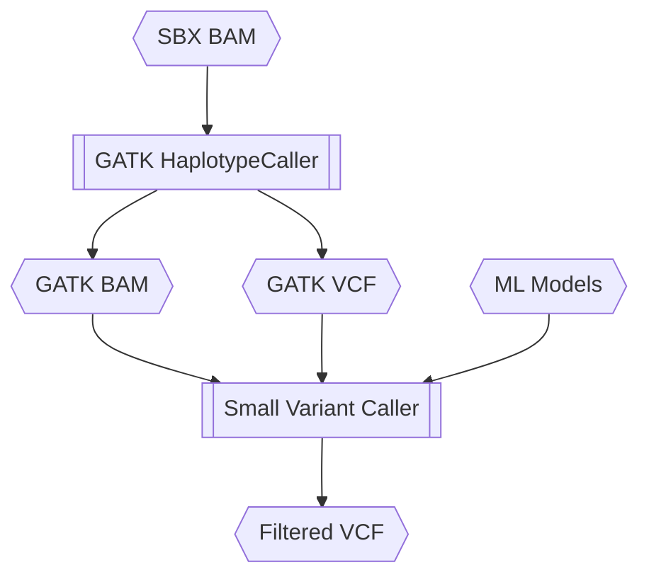
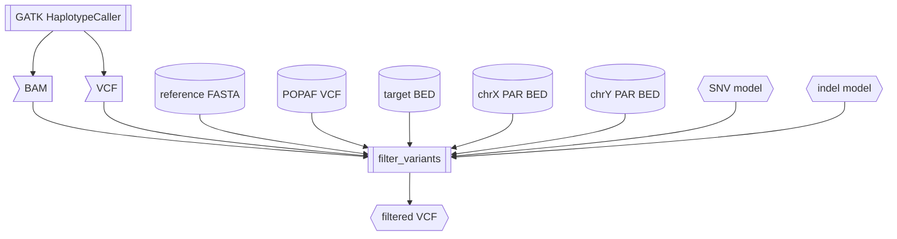
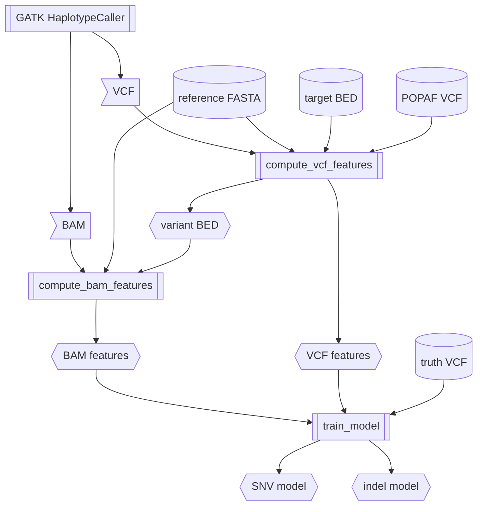

# Small Variant Caller (SVC) User Guide - 0.80.0

## Getting Started

This documentation provides guidance on how to use the Small Variant Caller (SVC) for detecting small variants with SBX-Duplex (SBX-D) data.

### Introduction

Small variants (i.e. single nucleotide variants, insertions and deletions up to 50-bp in length) constitute the majority of genomic variations. The detection of small variants has become an integral step in many bioinformatics analyses.

SVC is designed to work with [GATK](https://gatk.broadinstitute.org/hc/en-us), a widely used analysis toolkit for high-throughput sequencing data. For germline whole genome samples, GATK HaplotypeCaller is used to generate the input BAM and VCF files for SVC.

GATK on its own is not optimized to generate highly accurate variant calls directly from SBX-D data. SVC addresses this gap by using machine learning (ML) models to filter and re-genotype the candidate variant calls made by GATK, resulting in a significant improvement in variant calling accuracy compared to GATK alone for SBX-D data.

All sample types are processed with the same core idea:

1. GATK uses the alignments of SBX reads against the reference genome to produces candidate variant calls.
2. SVC uses ML models to classify and filter the candidate variant calls from GATK.

The following diagram illustrates the flow of data for processing a germline whole genome sample.



SVC has two primary operational modes: (1) Variant Filtering and (2) Model Training. The typical use case is to filter variants using the pre-trained model files. Therefore, model training is optional.

#### 1. Variant Filtering

The `filter_variants` submodule filters GATK output variants using the model(s) generated from the `train_model` submodule. Pre-trained models are provided for use with `filter_variants`, see the section [Pre-Trained Model Files](#pre-trained-model-files).

#### 2. Model Training

Three SVC submodules are involved in training machine learning model(s) for variant filtering:

- `compute_vcf_features`: Computes machine learning features from a GATK output VCF file.
- `compute_bam_features`: Computes machine learning features from a GATK output BAM file.
- `train_model`: Train machine learning model(s) using feature files generated from `compute_bam_features` and `compute_vcf_features`.

More details on each operational mode for different sample types can be found in the section [Usage](#usage).

### Recommended System Requirements

|        | Requirements                                                                                    |
|--------|-------------------------------------------------------------------------------------------------|
| CPU    | Utilization scales well up to 32 cores on a modern (4th Gen Intel Xeon or 4th Gen AMD EPYC) CPU |
| Memory | At least 32 GiB with 16 threads, memory usage scales with number of threads specified           |

***

## Usage

Variant Filtering and Model Training in SVC are designed to carry out dedicated workflows for different input sample types. Currently, SVC only supports germline whole genome samples.

### Germline Variant Calling with GATK HaplotypeCaller

GATK HaplotypeCaller output BAM and VCF are required for both variant filtering and model training of germline samples. The goal of this step is to gather candidate small variants, regardless of PASS or FAIL, for SVC to filter and re-genotype. SVC accepts BAM and VCF files from GATK v4.6 or higher.

Example command with recommended settings:

```bash
gatk HaplotypeCaller \
    -I ALIGNMENT.bam \
    -R REFERENCE.fa \
    --intervals TARGET.bed \
    -O GATK_OUTPUT.vcf.gz \
    -OVI \
    -bamout GATK_OUTPUT.bam \
    -OBI \
    -A AssemblyComplexity \
    -A TandemRepeat \
    -RF MappingQualityReadFilter \
    --activeregion-alt-multiplier 5 \
    --adaptive-pruning true \
    --enable-dynamic-read-disqualification-for-genotyping true \
    --mapping-quality-threshold-for-genotyping 1 \
    --minimum-mapping-quality 1 \
    --min-base-quality-score 6 \
    --native-pair-hmm-threads 16 \
    --smith-waterman FASTEST_AVAILABLE \
    --tmp-dir /PATH/TO/TEMP/DIRECTORY
```

Key parameters for germline variant filtering:

- `-A AssemblyComplexity` and `-A TandemRepeat` produce additional VCF annotations for machine learning features in SVC.
- `--min-base-quality-score 6` skips discordant bases in duplex consensus reads.
- `--activeregion-alt-multiplier 5` is used to increase sensitivity.

Please refer to the [user guide for GATK HaplotypeCaller](https://gatk.broadinstitute.org/hc/en-us/articles/9570334998171-HaplotypeCaller) for more details on other parameters. This process can be sped up by parallel processing of partitioned BAM files. Alternatively, use [NVIDIA Clara Parabricks haplotypecaller](https://docs.nvidia.com/clara/parabricks/latest/documentation/tooldocs/man_haplotypecaller.html), which is the GPU-accelerated counterpart of GATK HaplotypeCaller with similar command-line parameters.

### Germline Variant Filtering

The `filter_variants` submodule uses pre-trained ML models to score and re-genotype the GATK HaplotypeCaller variant calls, generating a re-genotyped output VCF file. The diagram below outlines the flow of data.



#### Example Command for Germline Variant Filtering

```bash
filter_variants \
    --bam-input GATK_OUTPUT.bam \
    --vcf-input GATK_OUTPUT.vcf.gz \
    --genome REFERENCE.fa \
    --pop-af-vcf POPAF.vcf.gz \
    --model /resources/model-germline-snv.txt.gz /resources/model-germline-indel.txt.gz \
    --workflow germline \
    --output-dir /PATH/TO/OUTPUT/DIRECTORY \
    --vcf-output FILTER_VARIANTS.vcf.gz \
    --threads 16
```

Workflows `germline` and `germline-multi-sample` can be used interchangeably for variant filtering only. See the [Pre-Trained Model Files](#pre-trained-model-files) section for more details on the pre-trained model files.

For a full breakdown of available command line options for the `filter_variants` submodule, see the section [`filter_variants` Overview & CLI Options](#filter_variants-overview-and-cli-options).

#### Input Files for Germline Variant Filtering

- GATK HaplotypeCaller output BAM and VCF files (and their indexes)
- Reference genome FASTA (and its index)
- SNV and indel model files
  - The paths in the above example are the pre-trained models for SNVs and indels, respectively.
- Population allele frequency VCF (and its index)
  - example: gnomAD population allele frequency VCF, i.e. [af-only-gnomad.hg38.vcf.gz](https://console.cloud.google.com/storage/browser/_details/gatk-best-practices/somatic-hg38/af-only-gnomad.hg38.vcf.gz;tab=live_object)

#### Output Files for Germline Variant Filtering

| Default Name      | Description                            |
|-------------------|----------------------------------------|
| output.vcf.gz     | Filtered output variant call VCF file  |
| output.vcf.gz.tbi | Filtered output variant call VCF index |

If the output VCF file exists in the output directory the file will not be overwritten. If the specified output vcf file name has a `.gz` extension, the output will be a compressed VCF file with a VCF index generated. If the `.gz` extension is not provided the output will be an uncompressed VCF file.

##### Added and modified FORMAT fields in the output VCF

The `filter_variants` output VCF contains a number of additional or modified FORMAT fields. The following table lists the fields that are added to the output as part of the germline filtering and re-genotyping process.

| Field         | Definition                                                                                                                                                                                                                                                                                                        |
|---------------|-------------------------------------------------------------------------------------------------------------------------------------------------------------------------------------------------------------------------------------------------------------------------------------------------------------------|
| ML_PROCESSED  | Indicates whether a variant was processed by `filter_variants` ML-based filtering. Assigned a value of `1` if processed, or `0` otherwise. Please note that a record may be failed due to other criteria prior to filtering with the ML model and thus may have a filter value of `FAIL` but not be ML processed. |
| DP            | The sum of REF allele support and all ALT allele support at the variant position computed based on the input BAM file.                                                                                                                                                                                            |
| GATK_DP       | The `DP` value reported by GATK HaplotypeCaller.                                                                                                                                                                                                                                                                  |
| GT            | The re-genotyped genotype (`GT`) value assigned to the record by the `filter_variants` submodule using the ML models.                                                                                                                                                                                       |
| GATK_GT       | The genotype (`GT`) assigned to the record by GATK HaplotypeCaller.                                                                                                                                                                                                                                               |
| AD            | The REF and ALT support for the variant computed from the input BAM file. Each comma-separated value is the sum of non-discordant read count and 0.5 x discordant supporting read count, rounded to the nearest integer.                                                                                                          |
| GATK_AD       | The `AD` value reported by GATK HaplotypeCaller.                                                                                                                                                                                                                                                                  |
| GATK_ALT      | The `ALT` value reported by GATK HaplotypeCaller.                                                                                                                                                                                                                                                                 |
| GNOMAD_AF     | The gnomAD allele frequency (AF) for this variant if present within the specified `--pop-af-vcf` VCF file. If the gnomAD AF is not used by the ML filtering or is missing, a value of `-1` is assigned.                                                                                                           |
| REF_AVG_MAPQ  | The average mapping quality for reads supporting the REF allele. If not used in the ML filtering process or is missing, a value of `-1` is assigned.                                                                                                                                                              |
| ALT_AVG_MAPQ  | The average mapping quality for reads supporting an ALT allele. If not used in the ML filtering process or is missing, a value of `-1` is assigned.                                                                                                                                                               |
| REF_AVG_DIST  | The average distance from the variant site to the nearest end of the read for reads supporting the REF allele. If not used in the ML filtering process or is missing, a value of `-1` is assigned.                                                                                                                |
| ALT_AVG_DIST  | The average distance from the variant site to the nearest end of the read for reads supporting an ALT allele. If not used in the ML filtering process or is missing, a value of `-1` is assigned.                                                                                                                 |
| DENSITY_100BP | The number of other variants called by GATK HaplotypeCaller found within 100bp of the variant site. If not used in the ML filtering process or is missing, a value of `-1` is assigned.                                                                                                                           |

#### Performance for Germline Variant Filtering

Observed total wall-clock runtime and peak memory usage for processing one SBX-D 30x-coverage sample with 16 threads:

| Input Data          | ML Model Training Data                  | Run Time | Peak Memory (GiB) |
|---------------------|-----------------------------------------|----------|-------------------|
| HG001 whole genome  | HG002 chr1-3 high-confidence regions    | 8m 34s   | 19.47             |
| HG001 whole genome  | HG002-7 chr1-22 high-confidence regions | 11m 52s  | 20.13             |

### Germline Model Training

Use the pre-trained models described in section [Pre-Trained Model Files](#pre-trained-model-files) for germline variant filtering. However, if you wish to train your own models (with more training samples, etc.), this section describes how to do so.

The `train_model` submodule generates two models for SNVs and Indels to perform multi-class classification to re-genotype germline variants. The following diagram outlines flow of data for one sample in model training.



#### Example Command for Germline Model Training

```bash
train_model \
    --positive-features BAM_FEATURES_FILE_LIST.txt \
    --positive-vcf-features VCF_FEATURES_FILE_LIST.txt \
    --truth-vcfs TRUTH_VCF_FILE_LIST.txt \
    --output-file SNV_MODEL.txt.gz INDEL_MODEL.txt.gz \
    --threads 16 \
    --workflow germline
```

Here, `--workflow germline` is used to indicate single-sample model training data. Replace this with `--workflow germline-multi-sample` to indicate multi-sample training data. These two workflows utilize different sets of LightGBM hyperparameters optimized for the amount of training data.

For a full breakdown of all possible command line options applicable to model training, refer to section [`train_model` Overview & CLI Options](#train_model-overview-and-cli-options).

#### Input Files for Germline Model Training

Each training sample must have the following three input files:

1. truth VCF file
    - The full path to truth VCF files for each input sample must be listed in a file passed to `--truth-vcfs`, one file per line.
2. BAM features file
   - The full paths to the BAM features file for each input sample must be listed in a file passed to `--positive-features`, one file per line.
3. VCF features file
   - The full paths to the VCF features file for each input sample must be listed in a file passed to `--positive-vcf-features`, one file per line.

The order of the samples must match across the input file lists for `--truth-vcfs`, `--positive-features`, and `--positive-vcf-features`.

The truth VCF file must correspond to the sample being sequenced. It should contain only high-confidence variant calls for the sample. The truth label for each variant is extracted from the VCF FORMAT field `GT`. For germline whole genome samples, high-confidence variant calls can be obtained from the [Genome in a Bottle (GIAB) consortium](https://jimb.stanford.edu/giab/).

The input BAM and VCF features should be computed for each training sample via the `compute_bam_features` and `compute_vcf_features` submodules prior to running `train_model`.

Example commands to compute BAM and VCF features for one training sample:

```bash
compute_vcf_features \
    --genome REFERENCE.fa \
    --vcf-input GATK_OUTPUT.vcf.gz \
    --workflow germline \
    --pop-af-vcf POPAF.vcf.gz \
    --threads 16 \
    --target-regions TARGET.bed \
    --output-file VCF_FEATURES.tsv \
    --output-bed-file VCF_REGIONS.bed

compute_bam_features \
    --genome REFERENCE \
    --bam-input GATK_OUTPUT \
    --workflow germline \
    --threads 16 \
    --target-regions VCF_REGIONS.bed \
    --output-file BAM_FEATURES.tsv
```

Here, the `--target-regions` argument specifies the target regions of interest for the sample. The `--output-bed-file` argument in `compute_vcf_features` specifies the output BED file that will be used as input to `compute_bam_features`. This reduces the number of regions that need to be processed by `compute_bam_features` and speeds up the process. See the sections [`compute_bam_features` Overview & CLI Options](#compute_bam_features-overview-and-cli-options) and [`compute_vcf_features` Overview & CLI Options](#compute_vcf_features-overview-and-cli-options) for more details.

The paths to the features TSV files must be listed in two files, one for BAM and one for VCF features. The example below illustrates how input list files for 3 training samples can be generated for multi-sample model training. Note the order of samples (e.g. `sample1`, `sample2`, `sample3`) must match in the BAM/VCF features TSV list files and the truth VCF list file.

```bash
echo /path/to/sample1/BAM_FEATURES.tsv > BAM_FEATURES_FILE_LIST.txt
echo /path/to/sample2/BAM_FEATURES.tsv >> BAM_FEATURES_FILE_LIST.txt
echo /path/to/sample3/BAM_FEATURES.tsv >> BAM_FEATURES_FILE_LIST.txt

echo /path/to/sample1/VCF_FEATURES.tsv > VCF_FEATURES_FILE_LIST.txt
echo /path/to/sample2/VCF_FEATURES.tsv >> VCF_FEATURES_FILE_LIST.txt
echo /path/to/sample3/VCF_FEATURES.tsv >> VCF_FEATURES_FILE_LIST.txt

echo /path/to/sample1/truth.vcf > TRUTH_VCF_FILE_LIST.txt
echo /path/to/sample2/truth.vcf >> TRUTH_VCF_FILE_LIST.txt
echo /path/to/sample3/truth.vcf >> TRUTH_VCF_FILE_LIST.txt
```

#### Output Files for Germline Model Training

| File Name       | Description               |
|-----------------|---------------------------|
| snv-model.txt   | SNV-specific model file   |
| indel-model.txt | indel-specific model file |

If any files exist in the output directory with the same name before `train_model` is run, they will be overwritten.

#### Tips for Germline Model Training

- Single sample model training using the argument `--workflow germline` is optimized to train models using only chromosomes 1 -3 of the sample. The remaining chromosomes of the sample can then be used to evaluate the model's performance.
- Multi-sample model training using the argument `--workflow germline-multi-sample` is optimized to train models using 6 samples. The training parameters used in this workflow were chosen to optimize training for 6 whole genome GIAB samples, with a left out sample being used to evaluate the model's performance.
- Training parameters may need to be adjusted if training using a different number of samples or number of chromosomes.

#### Performance for Germline Model Training

Observed total wall-clock runtime and peak memory usage for processing SBX-D 30x-coverage samples with 16 threads:

| Input Data                                 | Submodule            | Run Time   | Peak Memory (GiB) |
|--------------------------------------------|----------------------|------------|-------------------|
| (1) HG002, chr1-3 high-confidence regions  | compute_vcf_features | 26s        | 1.78              |
| (2) HG002, VCF output BED regions from (1) | compute_bam_features | 1m 16s     | 0.97              |
| BAM and VCF features from (1),(2)          | train_model          | 4m 01s     | 5.32              |
| (3) HG002, chr1-22 high-confidence regions | compute_vcf_features | 1m 38s     | 6.23              |
| (4) HG002, VCF output BED regions from (3) | compute_bam_features | 8m 04s     | 3.85              |
| BAM and VCF features from HG002-7          | train_model          | 1h 13m 55s | 83.50             |

***

## Overview and CLI Options

The following sections outline each SVC submodule in more detail. A breakdown of each submodule's design is provided followed by a list of CLI arguments.

### `filter_variants` Overview and CLI Options

SVC `filter_variants` processes the output BAM and VCF files from GATK to filter and re-genotype variant calls using pre-trained ML models. The exact nature of how variants are filtered depends on the specific use case being run, which are described in the next section.

#### Design Summary of `filter_variants`

- One or more coordinate-sorted and indexed GATK output BAM files are read via [htslib](https://github.com/samtools/htslib) to compute ML features.
- A coordinate-sorted, bgzip-compressed, and indexed GATK output VCF is read via [htslib](https://github.com/samtools/htslib) to compute ML features.
- BAM and VCF features are computed in the same manner as `compute_bam_features` and `compute_vcf_features`. See sections [`compute_bam_features` Overview & CLI Options](#compute_bam_features-overview-and-cli-options) and [`compute_vcf_features` Overview & CLI Options](#compute_vcf_features-overview-and-cli-options) for overview of these two submodules
- Each variant allele in the VCF record is matched against the set of computed BAM and VCF features.
- Variants without matching BAM and VCF features are designated as FAIL in the FILTER column.
- The computed features for each variant are converted into a numeric vector, which is then scored by a LightGBM model(s) generated in `train_model`. See the section [`train_model` Overview & CLI Options](#train_model-overview-and-cli-options) for overview on the `train_model` submodule. Based on the score, variants are designated as either PASS or FAIL (with one or more failure reasons possibly being assigned) in the FILTER column. If filtering germline variants their genotype may be re-assigned.
- For a faster wall-clock runtime, variant filtering can be parallelized and/or reduced to target genomic regions specified by the input BED file.
- Parallelization is implemented using [Taskflow](https://github.com/taskflow/taskflow) such that variant filtering is split into small tasks. Each task is assigned one genomic region, where only BAM and VCF records overlapping the region are processed.
- The output is a filtered and re-genotyped VCF file, which is coordinate-sorted, bgzip-compressed, and indexed.

#### `filter_variants` - Common Options and Inputs

To run germline filtering as part of `filter_variants`, the argument `--workflow germline` or `--workflow germline-multi-sample` must be included. If `filter_variants` is run in its germline filtering mode the default values in the table are automatically applied.

Required parameters are highlighted in **bold**.

| Parameter                | Description                                                                                                                                                                                                                                                                                                                                                                                                             | Value(s)                                                                                                                            |
|--------------------------|-------------------------------------------------------------------------------------------------------------------------------------------------------------------------------------------------------------------------------------------------------------------------------------------------------------------------------------------------------------------------------------------------------------------------|-------------------------------------------------------------------------------------------------------------------------------------|
| **--vcf-input**          | Path to an input VCF file (`*.vcf.gz`) produced by GATK HaplotypeCaller. VCF file must be coordinate-sorted, bgzip-compressed, and indexed.                                                                                                                                                                                                                                                                             | Path to a sorted and indexed VCF file                                                                                               |
| **--bam-input**          | Path(s) to one or more input BAM files produced by GATK HaplotypeCaller. BAM files must be coordinate-sorted and indexed. If multiple BAM files are provided all input BAM files must be from the same sample. Any duplicate alignments contained between BAM files are only counted once. BAM files must contain sequence and quality strings for each alignment.                                                      | Path(s) to sorted and indexed BAM files                                                                                             |
| **--genome**             | Path to a reference genome (indexed) FASTA file. Reference must match the reference used by GATK HaplotypeCaller.                                                                                                                                                                                                                                                                                                       | Path to an existing FASTA file (may be gzipped)                                                                                     |
| **--workflow**           | The specific internal filtering workflow to run. If running germline analysis then either `germline` or `germline-multi-sample` should be passed. Passing this argument will tell `filter_variants` to run germline filtering and re-genotyping.                                                                                                                                                                        | One of {`germline`, `germline-multi-sample`}                                                                                        |
| **--pop-af-vcf**         | Path to a gnomAD population allele frequency VCF (i.e. [af-only-gnomad.hg38.vcf.gz](https://console.cloud.google.com/storage/browser/_details/gatk-best-practices/somatic-hg38/af-only-gnomad.hg38.vcf.gz;tab=live_object)). VCF file must contain *AF* INFO tags with allele frequency values for variants. Allele frequencies are used by the ML models to filter variants. Required if running the germline workflow. | Path to an existing VCF file                                                                                                        |
| --model                  | Path(s) to LightGBM model files. Two model files (separated by space) must be provided: one for SNVs and the other for indels containing the words "snv" and "indel" in the file names, respectively. File order does not matter. File may be optionally gzip/zstd-compressed with extension `.gz` or `.zst`.                                                                                                           | Paths to two existing LightGBM model files [default: `/resources/model-germline-snv.txt.gz /resources/model-germline-indel.txt.gz`] |
| --config                 | Path to a configuration JSON file. Use `--workflow` to specify the workflow in the config to be executed. A file containing the default configurations for each supported workflow is provided. See section [Custom Configurations](#custom-configurations) for more details.                                                                                                                                           | Path to an existing JSON file                                                                                                       |
| --output-dir             | Path to the output directory.                                                                                                                                                                                                                                                                                                                                                                                           | Path to a directory [default: `.` (the current working directory)]                                                                  |
| --vcf-output             | VCF output location, relative to output directory.                                                                                                                                                                                                                                                                                                                                                                      | File name ending in `.vcf` or `.vcf.gz` [default: `output.vcf.gz`]                                                                  |
| --target-regions         | Path to a TAB delimited BED file of target regions. When passed only variants within the BED region(s) specified within the file are filtered. Any variants outside the region(s) are still included in the output but automatically have their FILTER status set to FAIL.                                                                                                                                              | Path to an existing BED file                                                                                                        |
| --interest-regions       | Path to a BED file of regions of interest. When run with the pre-trained models, you can safely ignore the warning message `VCF feature 'at_interest' is specified, but there are no Interest regions!` because the pre-trained models were not trained with any "interest" regions.                                                                                                                                    | Path to an existing BED file                                                                                                        |
| --threads                | Number of threads to use (0=available hardware threads).                                                                                                                                                                                                                                                                                                                                                                | Integer >= 0  [default: `1`]                                                                                                        |
| --decode-yc              | Decode duplex consensus reads into their constituent reads before feature extraction. Needs `--duplex`. The input BAM file(s) must contain `YC` tags.                                                                                                                                                                                                                                                                   | [default: `false`]                                                                                                                  |
| --no-decode-yc           | Do not decode duplex consensus reads. Turns off `--decode-yc`.                                                                                                                                                                                                                                                                                                                                                          |                                                                                                                                     |
| --min-base-type          | Minimum base type in duplex reads for variant support. Needs: `--decode-yc`                                                                                                                                                                                                                                                                                                                                             | One of {`discordant`, `simplex`, `concordant`} [default: `simplex`]                                                                 |
| --min-mapq               | Minimum mapping quality. Adjusting this parameter may alter the BAM support for variant calls. Any read alignments that support the variant but have a mapping quality less than the minimum specified will be ignored and not counted as a variant supporting alignment.                                                                                                                                               | Integer [0, 255] inclusive [default: `1`]                                                                                           |
| --min-bq                 | Minimum base quality. Adjusting this parameter may alter the BAM support for variant calls. Any read alignments that support the variant but have a base quality less than the minimum specified will be ignored and not counted as a variant supporting alignment.                                                                                                                                                     | Integer [0, 93] inclusive [default: `6`]                                                                                            |
| --min-dist               | Minimum distance of variant from fragment end. If the variant is found to be less than this number of bases from the end of a read's alignment, the alignment will not be counted as a variant supporting alignment.                                                                                                                                                                                                    | Integer >= 0  [default: `2`]                                                                                                        |
| --min-family-size        | Minimum cluster size. This value should be set to 2 if using Roche SBX-D sequencing data.                                                                                                                                                                                                                                                                                                                               | Integer >= 0 [default: `2`]                                                                                                          |
| --filter-homopolymer     | Skip variants adjacent to homopolymer that spans beyond a read's 3' end.                                                                                                                                                                                                                                                                                                                                                | [default: `true`]                                                                                                                   |
| --no-filter-homopolymer  | Do not filter variants adjacent to homopolymers. Turns off `--filter-homopolymer`.                                                                                                                                                                                                                                                                                                                                      |                                                                                                                                     |
| --min-homopolymer-length | Minimum length of homopolymer in reference. Only has an effect when `--filter-homopolymer` is true. The `--min-homopolymer-length` value is used as a threshold to determine whether or not a stretch of identical bases in a read is considered a homopolymer. Only runs of identical bases greater or equal to the value of this parameter are considered homopolymers.                                               | Integer > 0 [default: `4`]                                                                                                          |
| --duplex                 | The input BAM contains SBX-D sequencing data. This flag is required for any analysis using Roche SBX-D sequencing data.                                                                                                                                                                                                                                                                                                 | [default: `true`]                                                                                                                   |
| --no-duplex              | The input BAM does not contain SBX-D sequencing data. Turns off `--duplex`.                                                                                                                                                                                                                                                                                                                                             |                                                                                                                                     |
| --normalize              | Normalize read depth features. Use this flag only when input models were trained with this flag in `train_model`.                                                                                                                                                                                                                                                                                                       | [default: `true`]                                                                                                                   |
| --no-normalize           | Do not normalize read depth features. Turns off `--normalize`.                                                                                                                                                                                                                                                                                                                                                          |                                                                                                                                     |
| --sd-chr-name            | Name of an autosomal chromosome in reference genome to use for sex determination.                                                                                                                                                                                                                                                                                                                                       | [default: `chr1`]                                                                                                                   |
| --par-bed-x              | Path to chromosome X pseudoautosomal region BED file (i.e. [GRCh38_chrX_PAR.bed](https://ftp-trace.ncbi.nlm.nih.gov/ReferenceSamples/giab/release/genome-stratifications/v3.5/GRCh38@all/XY/GRCh38_chrX_PAR.bed.gz)). Only required for filtering chr X variants; not required for filtering autosomal variants.                                                                                                        | Path to an existing BED file                                                                                                        |
| --par-bed-y              | Path to chromosome Y pseudoautosomal region BED file (i.e. [GRCh38_chrY_PAR.bed](https://ftp-trace.ncbi.nlm.nih.gov/ReferenceSamples/giab/release/genome-stratifications/v3.5/GRCh38@all/XY/GRCh38_chrY_PAR.bed.gz)). Only required for filtering chr Y variants; not required for filtering autosomal variants.                                                                                                        | Path to an existing BED file                                                                                                        |
| --skip-variants-vcf      | VCF file containing variants not counted by `--max-variants-per-read` and `--max-variants-per-read-normalized`.                                                                                                                                                                                                                                                                                                         | Path to an existing VCF file                                                                                                        |

***

### `train_model` Overview and CLI Options

The `train_model` submodule allows for the training of LightGBM models for variant filtering and re-genotyping. SVC uses decision-tree-based ML models trained using LightGBM. The exact specifics of how the models are trained and run are based on the use case and number of samples used to train the model.

The models used in the variant filtering process rely on features computed from the input BAM and VCF for the sample being filtered. The `train_model` submodule takes as input files that list file paths to TSVs that contain pre-computed BAM and VCF features from the sample(s) that will be used for training the model(s). Depending on the use case, multiple samples may be needed. In addition to the features files the `train_model` submodule requires a list of VCF truth files that contain true variant calls for the sample(s) that can be used to train the model. The following sections breakdown model training for each of the supported use cases.

#### Design Summary of `train_model`

- ML models are trained on BAM and VCF features using [LightGBM](https://github.com/microsoft/LightGBM).
- The BAM and VCF features for each variant are converted into a numeric vector.
- Numeric vectors for all variants are appended together into a single vector, which is the input for training a LightGBM model.
- Each variant in the training data is assigned a classification label based on its genotype (or lack thereof) in the truth VCF.
- The outputs are one or more LightGBM model file(s).

#### `train_model` - Common Options and Inputs

Required parameters are highlighted in **bold**.

| Parameter                    | Description                                                                                                                                                                                                                                                                                                                                                                                                                                                                   | Value(s)                                     |
|------------------------------|-------------------------------------------------------------------------------------------------------------------------------------------------------------------------------------------------------------------------------------------------------------------------------------------------------------------------------------------------------------------------------------------------------------------------------------------------------------------------------|----------------------------------------------|
| **--workflow**               | Apply settings for the designated workflow. If this option is used without `--config`, then workflow-specific default values are automatically set for various options. Note the `germline` and `germline-multi-sample` share the same feature sets but differ in their training parameter configurations.                                                                                                                                                                    | One of {`germline`, `germline-multi-sample`} |
| **--positive-features**      | Path to a text file that lists BAM features file path(s), one path per line. Each file in this list is generated from a single sample using the `compute_bam_features` submodule. If the sample's alignments are split into multiple BAM files, a single features file must be computed for the sample by passing all BAM files to `compute_bam_features`. The number and order of the features files must match those passed to `--positive-vcf-features` and `--truth-vcfs`. | Path to an existing text file                |
| **--positive-vcf-features**  | Path to a text file that lists VCF features file path(s), one path per line. Each file in this list is generated from a single sample using the `compute_vcf_features` submodule. The number and order of the features files must match those passed to `--positive-features` and `--truth-vcfs`.                                                                                                                                                                             | Path to an existing text file                |
| **--truth-vcfs**             | Path to a text file that lists truth VCF file path(s), one path per line. For the `germline` and `germline-multi-sample` workflows, each variant record in the VCF file must have a `GT` genotype tag. The number and order of the VCF files must match those passed to `--positive-vcf-features` and `--positive-features`.                                                                                                                                                  | Path to an existing text file                |
| --output-file                | Paths to output models. Two output files are required, one for SNVs and the other for indels, containing the words "snv" and "indel" in the file names, respectively. A file name with extension `.gz` or `.zst` turns on gzip/zstd compression.                                                                                                                                                                                                                           |                                              |
| --config                     | Path to a configuration JSON file. Use `--workflow` to specify the workflow in the config to be executed. A file containing the default configurations for each supported workflows is provided. See section [Custom Configurations](#custom-configurations) for more details.                                                                                                                                                                                                | Path to an existing JSON file                |
| --normalize                  | Normalize read depth features. `filter_variants` must also use `--normalize` for models trained with this flag.                                                                                                                                                                                                                                                                                                                                                               | [default: `true`]                            |
| --no-normalize               | Do not normalize read depth features. Turns off `--normalize`.                                                                                                                                                                                                                                                                                                                                                                                                                |                                              |
| --train-snv-iterations       | The maximum number of training iterations for the germline SNV model before stopping.                                                                                                                                                                                                                                                                                                                                                                                         | Integer > 0 [default: `1000`]                |
| --train-indel-iterations     | The maximum number of training iterations for the germline indel model before stopping.                                                                                                                                                                                                                                                                                                                                                                                       | Integer > 0 [default: `8000`]                |
| --write-training-data-tsv    | Write model training data to a TSV file. This file is useful for debugging purposes.                                                                                                                                                                                                                                                                                                                                                                                          | [default: `false`]                           |
| --no-write-training-data-tsv | Do not write model training data to a TSV file. Turns off `--write-training-data-tsv`.                                                                                                                                                                                                                                                                                                                                                                                        |                                              |

***

### `compute_bam_features` Overview and CLI Options

Regardless of the use case, the `train_model` submodule requires ML features to be computed from GATK BAM and VCF. `compute_bam_features` is a submodule within SVC designed specifically to compute features from BAM files from a single sample and generate an output TSV file. Each line in the output TSV file contains the list of relevant ML features extracted from the BAM for a single candidate variant for model training.

#### Design Summary of `compute_bam_features`

- One or more coordinate-sorted and indexed BAM files is read via [htslib](https://github.com/samtools/htslib) to compute ML features.
- At each alignment position, ML features are computed for both reference allele and alternate allele(s).
- Reference allele features are computed from alignment sequence matches.
- Alternate allele features are computed from mismatches, insertions, and deletions.
- Many ML features, such as the mean base quality (`baseq_mean`) of variants, can be computed.
- For a list of available BAM features, refer to the section [Model Feature Definition](#model-feature-definition)
- For a faster wall-clock runtime, feature computation can be parallelized and/or reduced to target genomic regions specified by the input BED file.
- Parallelization is implemented using [Taskflow](https://github.com/taskflow/taskflow) such that feature computation is split into small tasks. Each task is assigned one genomic region, where only BAM records overlapping the region are processed.
- The output is a tabular text file, where the rows are variants and the columns are computed features.

#### `compute_bam_features` - Common Options and Inputs

Required parameters are highlighted in **bold**.

| Parameter                          | Description                                                                                                                                                                                                                                                                                                                                                               | Value(s)                                                            |
|------------------------------------|---------------------------------------------------------------------------------------------------------------------------------------------------------------------------------------------------------------------------------------------------------------------------------------------------------------------------------------------------------------------------|---------------------------------------------------------------------|
| **--bam-input**                    | Path(s) to one or more input BAM files produced by GATK HaplotypeCaller. BAM files must be coordinate-sorted and indexed. If multiple BAM files are provided all input BAM files must be from the same sample. Any duplicate alignments contained between BAM files are only counted once. BAM files must contain sequence and quality strings for each alignment.        | Path(s) to sorted and indexed BAM files                             |
| **--genome**                       | Path to a reference genome (indexed) FASTA file. Reference must match the reference used by GATK HaplotypeCaller.                                                                                                                                                                                                                                                         | Path to an existing FASTA file (may be gzipped)                     |
| **--workflow**                     | Applies settings for the designated workflow. If this option is used without `--config`, then workflow-specific default values are automatically set for various options.                                                                                                                                                                                                 | One of {`germline`, `germline-multi-sample`}                        |
| --config                           | Path to a configuration JSON file. Use `--workflow` to specify the workflow in the config to be executed. A file containing the default configurations for the supported workflows is provided. See section [Custom Configurations](#custom-configurations) for more details.                                                                                             | Path to an existing JSON file                                       |
| --output-file                      | Path to the output features TSV file.                                                                                                                                                                                                                                                                                                                                                 | [default: `bam_features.txt`]                                       |
| --target-regions                   | Path to a BED file of target regions.                                                                                                                                                                                                                                                                                                                                     | Path to an existing BED file                                        |
| --threads                          | Number of threads used (0=available hardware threads).                                                                                                                                                                                                                                                                                                                    | Integer >= 0 [default: `1`]                                         |
| --duplex                           | The input BAM contains SBX-D sequencing data. This flag is required for any analysis using Roche SBX-D sequencing data.                                                                                                                                                                                                                                                   | [default: `true`]                                                   |
| --no-duplex                        | The input BAM does not contain SBX-D sequencing data. Turns off `--duplex`.                                                                                                                                                                                                                                                                                               |                                                                     |
| --decode-yc                        | Decode duplex consensus reads into their constituent reads before feature extraction. Needs `--duplex`. The input BAM file(s) must contain `YC` tags.                                                                                                                                                                                                                     | [default: `false`]                                                  |
| --no-decode-yc                     | Do not decode duplex consensus reads. Turns off `--decode-yc`.                                                                                                                                                                                                                                                                                                            |                                                                     |
| --min-base-type                    | Minimum base type in duplex reads for variant support. Needs `--decode-yc`.                                                                                                                                                                                                                                                                                                | One of {`discordant`, `simplex`, `concordant`} [default: `simplex`] |
| --warn-as-error                    | Treat warn messages as errors.                                                                                                                                                                                                                                                                                                                                             | [default: `false`]                                                  |
| --min-mapq                         | Minimum mapping quality. Adjusting this parameter may alter the BAM support for variant calls. Any read alignments that support the variant but have a mapping quality less than the minimum specified will be ignored and not counted as a variant supporting alignment.                                                                                                 | Integer [0, 255] inclusive [default: `1`]                           |
| --min-bq                           | Minimum base quality. Adjusting this parameter may alter the BAM support for variant calls. Any read alignments that support the variant but have a base quality less than the minimum specified will be ignored and not counted as a variant supporting alignment.                                                                                                       | Integer [0, 93] inclusive [default: `6`]                            |
| --min-dist                         | Minimum distance of variant from fragment end. If the variant is found to be less than this number of bases from the end of a read's alignment, the alignment will not be counted as a variant supporting alignment.                                                                                                                                                      | Integer >= 0 [default: `0`]                                         |
| --min-family-size                  | Minimum cluster size. If `--duplex` is true this value is set automatically to 2.                                                                                                                                                                                                                                                                                         | Integer >= 0 [default: `0`]                                          |
| --max-variants-per-read            | Maximum number of variants allowed per read. By default, this is set to 0, meaning there is no set maximum. If the value is set to a number greater than 0, read alignments that contain more than the value number of variants are skipped.                                                                                                                              | Integer >= 0 [default: `0`]                                         |
| --max-variants-per-read-normalized | Maximum number of variants allowed per read, normalized by alignment length (i.e. match, mismatch, and insertion only). By default, this is set to 0, meaning there is no set maximum. If the value is set to a number greater than 0, read alignments that contain more than the value number of variants normalized to the alignment length are skipped.                | Float [0.0, 1.0] inclusive [default: `0`]                           |
| --skip-variants-vcf                | VCF file containing variants not counted by `--max-variants-per-read` and `--max-variants-per-read-normalized`.                                                                                                                                                                                                                                                           | Path to an existing VCF file                                                                     |
| --filter-homopolymer               | Skip variants adjacent to homopolymer that spans beyond a read's 3' end.                                                                                                                                                                                                                                                                                                  | [default: `false`]                                                  |
| --no-filter-homopolymer            | Do not filter variants adjacent to homopolymers. Turns off `--filter-homopolymer`.                                                                                                                                                                                                                                                                                        |                                                                     |
| --min-homopolymer-length           | Minimum length of homopolymer in reference. Only has an effect when `--filter-homopolymer` is true. The `--min-homopolymer-length` value is used as a threshold to determine whether or not a stretch of identical bases in a read is considered a homopolymer. Only runs of identical bases greater or equal to the value of this parameter are considered homopolymers. | Integer > 0 [default: `4`]                                          |

***

### `compute_vcf_features` Overview and CLI Options

Regardless of the use case, the `train_model` submodule requires ML features to be computed from GATK BAM and VCF. `compute_vcf_features` is a submodule within SVC designed specifically to compute features from a VCF file from a single sample and generate an output TSV file. Each line in the output TSV file contains the list of relevant ML features extracted from the VCF for a single candidate variant for model training.

#### Design Summary of `compute_vcf_features`

- A coordinate-sorted, bgzip-compressed, and indexed VCF is read via [htslib](https://github.com/samtools/htslib) to compute ML features.
- For each VCF record, ML features are computed for both reference allele and alternate allele(s).
- Many ML features, such as the allele depth (`alt_ad`) of variants, can be computed.
- For a list of available VCF features, refer to section [Model Feature Definition](#model-feature-definition).
- For a faster wall-clock runtime, feature computation can be parallelized and/or reduced to target genomic regions specified by the input BED file.
- Parallelization is implemented using [Taskflow](https://github.com/taskflow/taskflow) such that feature computation is split into small tasks. Each task is assigned one genomic region, where only VCF records overlapping the region are processed.
- The output is a tabular text file, where the rows are variants and the columns are computed features.

#### `compute_vcf_features` - Common Options and Inputs

Required parameters are highlighted in **bold**.

| Parameter           | Description                                                                                                                                                                                                                                                               | Value(s)                                        |
|---------------------|---------------------------------------------------------------------------------------------------------------------------------------------------------------------------------------------------------------------------------------------------------------------------|-------------------------------------------------|
| **--vcf-input**     | Path to an input VCF file (`*.vcf.gz`) produced by GATK HaplotypeCaller. VCF file must be coordinate-sorted, bgzip-compressed, and indexed.                                                                                                                               | Path to an existing VCF file                    |
| **--genome**        | Path to a reference genome (indexed) FASTA file. Reference must match the reference used by GATK HaplotypeCaller.                                                                                                                                                         | Path to an existing FASTA file (may be gzipped) |
| **--workflow**      | Apply settings for the designated workflow. If this option is used without `--config`, then workflow-specific default values are automatically set for various options.                                                                                                   | One of {`germline`, `germline-multi-sample`     |
| --config            | Path to a configuration JSON file. Use `--workflow` to specify the workflow in the config to be executed. A file containing the default configurations for supported workflows is provided. See section [Custom Configurations](#custom-configurations) for more details. | Path to an existing JSON file                   |
| --output-file       | Path to the output features TSV file.                                                                                                                                                                                                                                     | [default: `vcf_features.txt`]                   |
| --target-regions    | Path to a BED file of target regions.                                                                                                                                                                                                                                     | Path to an existing BED file                    |
| --interest-regions  | Path to a BED file of regions of interest.                                                                                                                                                                                                                                | Path to an existing BED file                    |
| --threads           | Number of threads used (0=available hardware threads).                                                                                                                                                                                                                    | Integer >= 0  [default: `1`]                    |
| --output-bed        | Path to an output BED file for extracted features.                                                                                                                                                                                                                          | Path to a BED file                              |
| --left-pad          | Left-padding to variant start position for output BED file.                                                                                                                                                                                                                | Integer >= 0 [default: `0`]                     |
| --right-pad         | Right-padding to variant end position for output BED file.                                                                                                                                                                                                                 | Integer >= 0 [default: `0`]                     |
| --collapse-distance | Distance to collapse nearby variants after padding is applied for output BED file.                                                                                                                                                   CLI Op                                | Integer >= 0  [default: `0`]                    |
| --warn-as-error     | Treat warn messages as errors.                                                                                                                                                                                                                                             | [default: `false`]                              |

***

### `vcf_to_bed` Overview and CLI Options

In addition to variant filtering and model training, SVC has an additional submodule `vcf_to_bed` that creates a BED file based on variant positions in a VCF file. This submodule acts as a utility tool that can be used to speed up BAM feature computation for model training.

#### `vcf_to_bed` - Common Options and Inputs

Required parameters are highlighted in **bold**.

| Parameter           | Description                                                                        | Value(s)                     |
|---------------------|------------------------------------------------------------------------------------|------------------------------|
| **--vcf-input**     | Path to input VCF file.                                                            | Path to an existing VCF file |
| --output-file       | Output BED file name.                                                              | [default: `vcf-regions.bed`] |
| --left-pad          | Left-padding to variant start position for output BED file.                        | Integer >= 0 [default: `0`]  |
| --right-pad         | Right-padding to variant start position for output BED file.                       | Integer >= 0 [default: `0`]  |
| --collapse-distance | Distance to collapse nearby variants after padding is applied for output BED file. | Integer >= 0  [default: `0`] |
| --target-regions    | Path to a BED file of target regions.                                              | Path to an existing BED file |
| --threads           | Number of threads used (0=available hardware threads).                             | Integer >= 0 [default: `1`]  |

***

## Troubleshooting

| Issue                       | Description and Mitigation                                                                                                                                                                                                                                                                                                                                                                                                                                                                                                                                                                         |
|-----------------------------|----------------------------------------------------------------------------------------------------------------------------------------------------------------------------------------------------------------------------------------------------------------------------------------------------------------------------------------------------------------------------------------------------------------------------------------------------------------------------------------------------------------------------------------------------------------------------------------------------|
| Parameter Precedence        | When the `--workflow` option is used a number of parameters have their default values adjusted to match the specified workflow. Explicitly setting a different value on the command line for the given parameter will take precedence over the adjusted default value and will be the one used by the submodule. This also applies when a config file is passed using the `--config` option. In this case, workflow-specific defaults are set based on those provided in the JSON config file, however any values passed directly through the command line will overwrite those in the config file. |
| Help Message default values | The help message shown for each submodule on the command line may not list default values for each parameter as their values differ by use case. Please refer to this document and the relevant table for the use case you are running for a clear breakdown of use-case specific command line option defaults                                                                                                                                                                                                                                                                                     |
| Inclusive Parameter Values  | Unless otherwise specified, all threshold cutoffs and minimum values used for variant filtering and feature computation are inclusive. For example a minimum base quality of 6 implies that a base with quality 6 will be included but one with quality 5 will be excluded.                                                                                                                                                                                                                                                                                                                         |

***

## Appendix

### Concepts and Terminology

The following table defines frequently used acronyms and terms within this document.

| Term              | Definition                                                                                                                                                                                                                                                                                                                                    |
|-------------------|-----------------------------------------------------------------------------------------------------------------------------------------------------------------------------------------------------------------------------------------------------------------------------------------------------------------------------------------------|
| SNV               | **S**ingle **N**ucleotide **V**ariant. A single base mismatch against the reference genome at a given chromosomal position.                                                                                                                                                                                                                   |
| Indel             | **In**sertion or **Del**etion. An insertion of one or more nucleotides into the reference genome at a given chromosomal position. A deletion of one or more nucleotides from the reference genome at a given chromosomal position.                                                                                                            |
| Germline Variants | Variants that are present in an individual's genome relative to a reference genome that were inherited from the individual's parents. As the human genome is diploid, having two copies of each autosomal chromosome, germline variants at a given reference position occur either on one chromosomal copy or both.                           |
| BAM               | **B**inary **A**lignment **M**ap. The BAM format is a compressed binary representation of the SAM (Sequence Alignment Map) format used for storing nucleotide sequence alignments to a reference genome. A BAM file sorted by reference genome positions can be indexed to allow random access to alignments at target reference position(s). |
| VCF               | **V**ariant **C**all **F**ormat. The VCF format is a text-based file format used for storing information about genetic variants such as SNVs and indels relative to a reference genome. VCF files can be compressed and indexed to allow for random access based on a given reference position.                                               |
| Genotype          | A classification given to germline variants to denote whether the variant is present in only one of the two chromosomes of the sample's genome (heterozygous) or both of the chromosomes (homozygous), or not present at all.                                                                                                                 |
| ML                | Machine learning                                                                                                                                                                                                                                                                                                                              |
| Model file        | A [LightGBM](https://lightgbm.readthedocs.io/en/latest/index.html) ML model file. SVC utilizes the LightGBM framework to train gradient boosting decision tree ML models for filtering and re-genotyping variants.                                                                                                                            |

### Custom Configurations

All SVC submodules except for `vcf_to_bed` can accept a configuration JSON file as input. The configuration file contains the workflow-specific predefined settings for:

- command line arguments
- model training parameters
- model feature lists

A description for each key in the configuration JSON file is provided below. Keys that correspond to command line arguments can be overridden by passing the argument directly on the command line.

The default configuration file is located in the `profiles_config.json` within the `resources` directory of the Docker image. This file can be used as a template for creating custom configuration files, which must be passed to the `--config` argument of the submodule.

#### Configuration JSON Keys

Keys for CLI parameters:

| Key                           | Parameter                                     | filter_variants | train_model | compute_bam_features | compute_vcf_features |
|-------------------------------|-----------------------------------------------|-----------------|-------------|----------------------|----------------------|
| workflow                      | --workflow                                    | Y               | Y           | Y                    | Y                    |
| min_mapq                      | --min-mapq                                    | Y               | N           | Y                    | N                    |
| min_bq                        | --min-bq                                      | Y               | N           | Y                    | N                    |
| min_allowed_distance_from_end | --min-dist                                    | Y               | N           | Y                    | N                    |
| min_family_size               | --min-family-size                             | Y               | N           | Y                    | N                    |
| filter_homopolymer            | --filter-homopolymer, --no-filter-homopolymer | Y               | N           | Y                    | N                    |
| min_homopolymer_length        | --min-homopolymer-length                      | Y               | N           | Y                    | N                    |
| duplex                        | --duplex, --no-duplex                         | Y               | N           | Y                    | N                    |
| decode_yc                     | --decode-yc, --no-decode-yc                   | Y               | N           | Y                    | N                    |
| iterations                    | --train-iterations                            | N               | Y           | N                    | N                    |
| snv_iterations                | --train-snv-iterations                        | N               | Y           | N                    | N                    |
| indel_iterations              | --train-indel-iterations                      | N               | Y           | N                    | N                    |
| normalize_features            | --normalize, --no-normalize                   | N               | Y           | N                    | N                    |

Keys for non-CLI parameters:

- primarily used in model training and feature extraction

| Key                     | Description                                   |
|-------------------------|-----------------------------------------------|
| n_classes               | Number of model classes                       |
| feature_names           | BAM feature names                             |
| vcf_feature_names       | VCF feature names                             |
| snv_scoring_names       | SNV model scoring feature names               |
| snv_categorical_names   | SNV model categorical feature names           |
| indel_scoring_names     | Indel model scoring feature names             |
| indel_categorical_names | Indel model categorical feature names         |
| use_vcf_features        | Whether to use VCF features in model training |
| snv_model_file          | SNV model file name                           |
| indel_model_file        | Indel model file name                         |
| model_lgbm_params       | LightGBM parameters for model training        |
| snv_model_lgbm_params   | LightGBM parameters for SNV model training    |
| indel_model_lgbm_params | LightGBM parameters for Indel model training  |
| scoring_names           | Scoring feature names                         |
| categorical_names       | Categorical feature names                     |

### Pre-trained Model Files

Pre-trained model files for the `filter_variants` submodule are provided. In our Docker image, these models are available in the `/resources` folder.

| Filename                                     | Workflow | Training Data                  | Training Coverage | Chemistry | Sequencing Date |
|----------------------------------------------|----------|--------------------------------|-------------------|-----------|-----------------|
| model-germline-sbxd-snv.txt.gz               | germline | HG002 chr1-3 HC (1 sample)     | 30x dedup         | SBX-D     | August 2025     |
| model-germline-sbxd-indel.txt.gz             | germline | HG002 chr1-3 HC (1 sample)     | 30x dedup         | SBX-D     | August 2025     |
| model-germline-sbxd-multisample-snv.txt.gz   | germline | HG002-7 chr1-22 HC (6 samples) | 30x dedup         | SBX-D     | August 2025     |
| model-germline-sbxd-multisample-indel.txt.gz | germline | HG002-7 chr1-22 HC (6 samples) | 30x dedup         | SBX-D     | August 2025     |

- "HC" refers to the high-confidence regions provided by the [Genome in a Bottle (GIAB) consortium](https://jimb.stanford.edu/giab/).
- "dedup" refers to the deduplicated coverage of the training data.
- Both single-sample and multi-sample pre-trained models can be used with the `germline` workflow in `filter_variants`.
- Multi-sample pre-trained models have better F1 scores compared to single-sample pre-trained models, but they require more RAM.

### Model Feature Definition

#### Variant ID Features

Features for identifying variants; used by both BAM and VCF features.

| Name          | Description                                                                                                                                                     |
|:--------------|:----------------------------------------------------------------------------------------------------------------------------------------------------------------|
| chrom         | Chromosome name                                                                                                                                                 |
| pos           | 1-based start position of variant in the chromosome                                                                                                             |
| ref           | Reference (REF) allele                                                                                                                                          |
| alt           | Alternate (ALT) allele                                                                                                                                          |
| alt_len       | Length of ALT-allele minus length of REF-allele                                                                                                                 |
| subtype_index | Substitution type index; `1: A>C`, `2: A>G`, `3: A>T`, `4: C>A`, `5: C>G`, `6: C>T`, `7: G>A`, `8: G>C`, `9: G>T`, `10: indel`, `11: T>A`, `12: T>C`, `13: T>G` |
| variant_type  | `0`:snv, `1`:deletion, `2`:insertion, `3`:unknown                                                                                                               |

#### BAM Features

Features for both ALT- and REF-alleles extracted from alignment records in BAM files.

NOTE:

- "lowbq" features (with `_lowbq` suffix) are designated for reads with non-ACGT characters or low base quality in the homopolymer base(s) at or nearby the variant's start position.
- "nonhp" features (with `ref_nonhp_` prefix) are designated for reads supporting the REF-allele, where the sequence from the REF-allele's start position to the alignment end position is not a homopolymer.

| Name                      | Description                                                                                                                                        |
|:--------------------------|:---------------------------------------------------------------------------------------------------------------------------------------------------|
| baseq_af                  | Allele frequency based on base quality for the ALT-allele                                                                                          |
| baseq_min                 | Minimum base quality in read base(s) supporting the ALT-allele                                                                                     |
| baseq_max                 | Maximum base quality in read base(s) supporting the ALT-allele                                                                                     |
| baseq_sum                 | Sum of base quality in read base(s) supporting the ALT-allele                                                                                      |
| baseq_mean                | Mean base quality in read base(s) supporting the ALT-allele                                                                                        |
| baseq_lt20_count          | Number of reads supporting ALT-allele with base quality less than 20                                                                               |
| baseq_lt20_ratio          | Proportion of reads supporting ALT-allele with base quality less than 20                                                                           |
| context                   | Two characters representing the base before and after the variant's start position                                                                 |
| context_index             | `context` represented as an integer                                                                                                                |
| distance_min              | Minimum distance from the variant's start position to the nearest alignment end                                                                    |
| distance_max              | Maximum distance from the variant's start position to the nearest alignment end                                                                    |
| distance_sum              | Sum of distances from the variant's start position to the nearest alignment end                                                                    |
| distance_sum_lowbq        | Sum of distances from the variant's start position to the nearest alignment end in "lowbq" reads only                                              |
| distance_mean             | Mean distance from the variant's start position to the nearest alignment end                                                                       |
| distance_mean_lowbq       | Mean distance from the variant's start position to the nearest alignment end in "lowbq" reads only                                                 |
| duplex                    | Number of duplex reads supporting the ALT-allele                                                                                                   |
| duplex_lowbq              | Number of duplex reads supporting the ALT-allele in "lowbq" reads only                                                                             |
| duplex_af                 | Allele frequency based on duplex reads supporting the ALT-allele                                                                                   |
| duplex_dp                 | Depth of duplex reads supporting the ALT-allele                                                                                                    |
| familysize_sum            | Sum of family size of reads supporting the ALT-allele                                                                                              |
| familysize_mean           | Mean family size of reads supporting the ALT-allele                                                                                                |
| familysize_lt3_count      | Number of reads supporting ALT-allele with family size less than 3                                                                                 |
| familysize_lt5_count      | Number of reads supporting ALT-allele with family size less than 5                                                                                 |
| familysize_lt3_ratio      | Proportion of reads supporting ALT-allele with family size less than 3                                                                             |
| familysize_lt5_ratio      | Proportion of reads supporting ALT-allele with family size less than 5                                                                             |
| mapq_af                   | Allele frequency based on mapping quality                                                                                                          |
| mapq_min                  | Minimum mapping quality in read base(s) supporting the ALT-allele                                                                                  |
| mapq_max                  | Maximum mapping quality in read base(s) supporting the ALT-allele                                                                                  |
| mapq_sum                  | Sum of mapping quality in read base(s) supporting the ALT-allele                                                                                   |
| mapq_sum_lowbq            | Sum of mapping quality in read base(s) supporting the ALT-allele in "lowbq" reads only                                                             |
| mapq_mean                 | Mean mapping quality in read base(s) supporting the ALT-allele                                                                                     |
| mapq_mean_lowbq           | Mean mapping quality in read base(s) supporting the ALT-allele in "lowbq" reads only                                                               |
| mapq_lt60_count           | Number of reads supporting ALT-allele with mapping quality less than 60                                                                            |
| mapq_lt40_count           | Number of reads supporting ALT-allele with mapping quality less than 40                                                                            |
| mapq_lt30_count           | Number of reads supporting ALT-allele with mapping quality less than 30                                                                            |
| mapq_lt20_count           | Number of reads supporting ALT-allele with mapping quality less than 20                                                                            |
| mapq_lt60_ratio           | Proportion of reads supporting ALT-allele with mapping quality less than 60                                                                        |
| mapq_lt40_ratio           | Proportion of reads supporting ALT-allele with mapping quality less than 40                                                                        |
| mapq_lt30_ratio           | Proportion of reads supporting ALT-allele with mapping quality less than 30                                                                        |
| mapq_lt20_ratio           | Proportion of reads supporting ALT-allele with mapping quality less than 20                                                                        |
| minusonly                 | Number of reads supporting the ALT-allele on the minus strand                                                                                      |
| nonduplex                 | Number of non-duplex reads supporting the ALT-allele                                                                                               |
| normal_support            | Number of reads supporting the ALT-allele in normal sample only                                                                                    |
| normal_mapq_mean          | Mean mapping quality of reads supporting the ALT-allele in normal sample only                                                                      |
| normal_baseq_mean         | Mean base quality of reads supporting the ALT-allele in normal sample only                                                                         |
| normal_distance_mean      | Mean distance from the variant's start position to the nearest alignment end of reads supporting the ALT-allele in normal sample only              |
| normal_ref_support        | Number of reads supporting the REF-allele in normal sample only                                                                                    |
| plusonly                  | Number of reads supporting the ALT-allele on the plus strand                                                                                       |
| ref_baseq_af              | Allele frequency based on base quality for the REF-allele                                                                                          |
| ref_baseq_sum             | Sum of base quality in read base(s) supporting the REF-allele                                                                                      |
| ref_baseq_mean            | Mean base quality in read base(s) supporting the REF-allele                                                                                        |
| ref_baseq_lt20_count      | Number of reads supporting REF-allele with base quality less than 20                                                                               |
| ref_baseq_lt20_ratio      | Proportion of reads supporting REF-allele with base quality less than 20                                                                           |
| ref_distance_min          | Minimum distance from the variant's start position to the nearest alignment end of reads supporting the REF-allele                                 |
| ref_distance_max          | Maximum distance from the variant's start position to the nearest alignment end of reads supporting the REF-allele                                 |
| ref_distance_sum          | Sum of distances from the variant's start position to the nearest alignment end of reads supporting the REF-allele                                 |
| ref_distance_sum_lowbq    | Sum of distances from the variant's start position to the nearest alignment end of reads supporting the REF-allele in "lowbq" reads only           |
| ref_distance_mean         | Mean distance from the variant's start position to the nearest alignment end of reads supporting the REF-allele                                    |
| ref_distance_mean_lowbq   | Mean distance from the variant's start position to the nearest alignment end of reads supporting the REF-allele in "lowbq" reads only              |
| ref_duplex_lowbq          | Number of duplex reads supporting the REF-allele in "lowbq" reads only                                                                             |
| ref_duplex_af             | Allele frequency based on duplex reads supporting the REF-allele                                                                                   |
| ref_familysize_sum        | Sum of family size of reads supporting the REF-allele                                                                                              |
| ref_familysize_mean       | Mean family size of reads supporting the REF-allele                                                                                                |
| ref_familysize_lt3_count  | Number of reads supporting REF-allele with family size less than 3                                                                                 |
| ref_familysize_lt5_count  | Number of reads supporting REF-allele with family size less than 5                                                                                 |
| ref_familysize_lt3_ratio  | Proportion of reads supporting REF-allele with family size less than 3                                                                             |
| ref_familysize_lt5_ratio  | Proportion of reads supporting REF-allele with family size less than 5                                                                             |
| ref_mapq_min              | Minimum mapping quality in read base(s) supporting the REF-allele                                                                                  |
| ref_mapq_max              | Maximum mapping quality in read base(s) supporting the REF-allele                                                                                  |
| ref_mapq_sum              | Sum of mapping quality in read base(s) supporting the REF-allele                                                                                   |
| ref_mapq_sum_lowbq        | Sum of mapping quality in read base(s) supporting the REF-allele in "lowbq" reads only                                                             |
| ref_mapq_mean             | Mean mapping quality in read base(s) supporting the REF-allele                                                                                     |
| ref_mapq_mean_lowbq       | Mean mapping quality in read base(s) supporting the REF-allele in "lowbq" reads only                                                               |
| ref_mapq_af               | Allele frequency based on mapping quality for the REF-allele                                                                                       |
| ref_mapq_lt60_count       | Number of reads supporting REF-allele with mapping quality less than 60                                                                            |
| ref_mapq_lt40_count       | Number of reads supporting REF-allele with mapping quality less than 40                                                                            |
| ref_mapq_lt30_count       | Number of reads supporting REF-allele with mapping quality less than 30                                                                            |
| ref_mapq_lt20_count       | Number of reads supporting REF-allele with mapping quality less than 20                                                                            |
| ref_mapq_lt60_ratio       | Proportion of reads supporting REF-allele with mapping quality less than 60                                                                        |
| ref_mapq_lt40_ratio       | Proportion of reads supporting REF-allele with mapping quality less than 40                                                                        |
| ref_mapq_lt30_ratio       | Proportion of reads supporting REF-allele with mapping quality less than 30                                                                        |
| ref_mapq_lt20_ratio       | Proportion of reads supporting REF-allele with mapping quality less than 20                                                                        |
| ref_nonhp_baseq_min       | Minimum base quality in read base(s) supporting the REF-allele in "nonhp" reads only                                                               |
| ref_nonhp_baseq_max       | Maximum base quality in read base(s) supporting the REF-allele in "nonhp" reads only                                                               |
| ref_nonhp_baseq_sum       | Sum of base quality in read base(s) supporting the REF-allele in "nonhp" reads only                                                                |
| ref_nonhp_baseq_mean      | Mean base quality in read base(s) supporting the REF-allele in "nonhp" reads only                                                                  |
| ref_nonhp_mapq_min        | Minimum mapping quality in read base(s) supporting the REF-allele in "nonhp" reads only                                                            |
| ref_nonhp_mapq_max        | Maximum mapping quality in read base(s) supporting the REF-allele in "nonhp" reads only                                                            |
| ref_nonhp_mapq_sum        | Sum of mapping quality in read base(s) supporting the REF-allele in "nonhp" reads only                                                             |
| ref_nonhp_mapq_mean       | Mean mapping quality in read base(s) supporting the REF-allele in "nonhp" reads only                                                               |
| ref_nonhp_mapq_lt60_count | Number of reads supporting REF-allele with mapping quality less than 60 in "nonhp" reads only                                                      |
| ref_nonhp_mapq_lt40_count | Number of reads supporting REF-allele with mapping quality less than 40 in "nonhp" reads only                                                      |
| ref_nonhp_mapq_lt30_count | Number of reads supporting REF-allele with mapping quality less than 30 in "nonhp" reads only                                                      |
| ref_nonhp_mapq_lt20_count | Number of reads supporting REF-allele with mapping quality less than 20 in "nonhp" reads only                                                      |
| ref_nonhp_mapq_lt60_ratio | Proportion of reads supporting REF-allele with mapping quality less than 60 in "nonhp" reads only                                                  |
| ref_nonhp_mapq_lt40_ratio | Proportion of reads supporting REF-allele with mapping quality less than 40 in "nonhp" reads only                                                  |
| ref_nonhp_mapq_lt30_ratio | Proportion of reads supporting REF-allele with mapping quality less than 30 in "nonhp" reads only                                                  |
| ref_nonhp_mapq_lt20_ratio | Proportion of reads supporting REF-allele with mapping quality less than 20 in "nonhp" reads only                                                  |
| ref_nonhp_support         | Number of reads supporting the REF-allele in "nonhp" reads only                                                                                    |
| ref_nonhp_weighted_depth  | Weighted depth of reads supporting the REF-allele in "nonhp" reads only; sum of ((`baseq` / 138) \* (`mapq` / 60)) in all "nonhp" reads            |
| ref_support               | Number of reads supporting the REF-allele                                                                                                          |
| ref_weighted_depth        | Weighted depth of reads supporting the REF-allele; sum of ((`baseq` / 138) * (`mapq` / 60)) in all reads supporting the REF-allele                 |
| strandbias                | Strand bias; `f` \* (1 - `f`) where `f` = (`duplex` \* 0.5 + `plusonly`) / (`duplex` + `plusonly` + `minusonly`)                                   |
| support                   | Number of reads supporting the ALT-allele                                                                                                          |
| support_reverse           | Number of reads supporting the ALT-allele on the reverse strand                                                                                    |
| alignmentbias             | Alignment bias; 0.25 - `f` \* (1 - `f`), where `f` is the percentage of reads aligned to the reverse strand of the reference genome                |
| weighted_depth            | Weighted depth of reads supporting the ALT-allele; sum of ((`baseq` / 138) \* (`mapq` / 60)) in all reads supporting the ALT-allele                |
| weightedscore             | Weighed score of duplex and non-duplex counts                                                                                                      |
| adt                       | Absolute value of (`duplex` - `ref_nonhp_support`) / (`duplex` + `ref_nonhp_support`);                                                             |
| adtl                      | Log 10 of (`duplex` + `ref_nonhp_support`) \* `adt`                                                                                                |
| num_alt                   | Number of ALT-alleles at the corresponding REF-allele's start position                                                                             |
| indel_af                  | `duplex` / (`duplex` + `ref_nonhp_support`)                                                                                                        |

#### VCF Features

Features for both ALT- and REF-allleles extracted from VCF file, reference genome, and other associated resources (e.g. population allele frequencies).

NOTE:

- Features for short tandem repeats (i.e. `homopolymer`, `direpeat`, `trirepeat`, `quadrepeat`) are computed using the VCF fields `RU` and `RPA`. If `RU` and `RPA` are not available, then the features are computed manually using reference sequence 100 bp after the variant position.

| Name              | Source                         | Description                                                                                                                                         |
|:------------------|:-------------------------------|:----------------------------------------------------------------------------------------------------------------------------------------------------|
| pre_2bp_context   | reference                      | 2-bp context before the variant's start position                                                                                                    |
| post_2bp_context  | reference                      | 2-bp context after the variant's start position                                                                                                     |
| post_30bp_context | reference                      | 30-bp context after the variant's start position                                                                                                    |
| uniq_3mers        | reference                      | Number of unique 3-mers in `post_30bp_context`                                                                                                      |
| uniq_4mers        | reference                      | Number of unique 4-mers in `post_30bp_context`                                                                                                      |
| uniq_5mers        | reference                      | Number of unique 5-mers in `post_30bp_context`                                                                                                      |
| uniq_6mers        | reference                      | Number of unique 6-mers in `post_30bp_context`                                                                                                      |
| homopolymer       | reference or fields `RU`,`RPA` | Homopolymer length after the variant's start position                                                                                               |
| direpeat          | reference or fields `RU`,`RPA` | Occurrence of 2-mer repeat after the variant's start position                                                                                       |
| trirepeat         | reference or fields `RU`,`RPA` | Occurrence of 3-mer repeat after the variant's start position                                                                                       |
| quadrepeat        | reference or fields `RU`,`RPA` | Occurrence of 4-mer repeat after the variant's start position                                                                                       |
| variant_density   |                                | Number of variants within a 201-bp window (100 bp up/downstream) at the variant site                                                                |
| ref_ad            | field `AD`                     | Number of reads supporting the REF-allele in the VCF file. This is the sum of both non-discordant and discordant supporting reads.                  |
| alt_ad            | field `AD`                     | Number of reads supporting the ALT-allele in the VCF file. This is the sum of both non-discordant and discordant supporting reads.                  |
| alt_ad2           | field `AD`                     | Number of reads supporting the other ALT-allele in the VCF file. This is the sum of both non-discordant and discordant supporting reads.            |
| ref_ad_af         | fields `AD`,`DP`               | Allele frequency based on number of reads supporting the REF-allele in the VCF file; `ref_ad` / `normal_dp`                                         |
| alt_ad_af         | fields `AD`,`DP`               | Allele frequency based on number of reads supporting the ALT-allele in the VCF file; `alt_ad` / `normal_dp`                                         |
| alt_ad2_af        | fields `AD`,`DP`               | Allele frequency based on number of reads supporting the other ALT-allele in the VCF file; `alt_ad2` / `normal_dp`                                  |
| normal_dp         | field `DP`                     | Depth of reads in normal sample only                                                                                                                |
| popaf             | `--pop-af-vcf` VCF file        | Population allele frequency for the ALT-allele                                                                                                      |
| genotype          | field `GT`                     | Genotype of the variant                                                                                                                             |
| vcf_variant_qual  | `QUAL` column                  | Variant quality                                                                                                                                     |
| vcf_variant_gq    | field `GQ`                     | Variant genotype quality                                                                                                                            |
| hapcomp           | field `HAPCOMP`                | Edit distances of each ALT-allele's most common supporting haplotype from closest germline haplotype, excluding differences at the site in question |
| hapdom            | field `HAPDOM`                 | For each ALT-allele, fraction of read support that best fits the most-supported haplotype containing the allele                                     |
| ru                | field `RU`                     | Tandem repeat unit (bases)                                                                                                                          |
| rpa_ref           | field `RPA`                    | Number of times tandem repeat unit is repeated for the REF-allele                                                                                   |
| rpa_alt           | field `RPA`                    | Number of times tandem repeat unit is repeated for the ALT-allele                                                                                   |
| str               | field `STR`                    | Variant is a short tandem repeat; `0`:False, `1`:True                                                                                               |
| at_interest       | `--interest-regions` BED file  | Variant is in an interest region; `0`:False, `1`:True                                                                                               |
