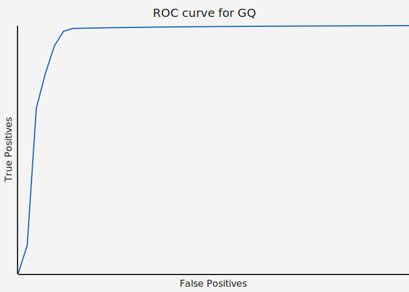
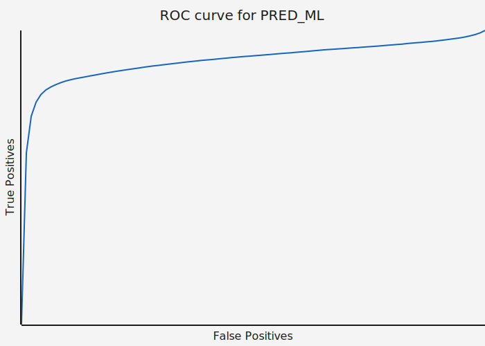

# Small Variant Caller

## Getting started

### Introduction

Small variants (i.e. single nucleotide variants, insertions and deletions up to 50-bp in length) constitute the majority of genomic variations. The detection of small variants has become an integral step in many bioinformatics analyses.

Small Variant Caller (SVC) analyzes SBX-Duplex (SBX-D) sequencing data in three main processes:

1. **Variant calling**: Call candidate variants based on alignments of SBX reads against the reference genome.
2. **Variant filtering**: Filter/re-genotype candidate variants using machine learning (ML) models.
3. **Model training**: Train machine learning models for variant filtering.

Typical use case involves variant calling followed by variant filtering. Model training is only necessary for generating custom machine learning models for variant filtering.



#### 1. Variant calling

SVC is designed to work with variant calls from [GATK](https://gatk.broadinstitute.org/hc/en-us) (version 4.6 or above), a widely used analysis toolkit for high-throughput sequencing data. Depending on the use case, either GATK HaplotypeCaller or Mutect2 is used to generate the candidate variants BAM and VCF files for variant filtering in SVC.

#### 2. Variant filtering

Since GATK HaplotypeCaller/Mutect2 is not designed and optimized to generate highly accurate variant calls directly from SBX-D data, SVC utilizes machine learning models to filter and re-genotype the candidate variant calls made by GATK HaplotypeCaller/Mutect2, resulting in a substantial improvement in variant call F1 scores for SBX-D data.

The `filter_variants` submodule in SVC filters GATK output variants using the model(s) generated from the `train_model` submodule. Pre-trained models are provided for use with `filter_variants`, see the section [Pre-trained model files](#pre-trained-model-files).

#### 3. Model training

Three SVC submodules are involved in training machine learning model(s) for variant filtering:

- `compute_vcf_features`: Compute machine learning features from a GATK output VCF file.
- `compute_bam_features`: Compute machine learning features from a GATK output BAM file.
- `train_model`: Train machine learning model(s) using feature files generated from `compute_bam_features` and `compute_vcf_features`.

More details on each operational mode for different sample types can be found in the section [Usage](#usage).

### Recommended system requirements

|        | Requirements                                                                                    |
|--------|-------------------------------------------------------------------------------------------------|
| CPU    | Utilization scales well up to 32 cores on a modern (4th Gen Intel Xeon or 4th Gen AMD EPYC) CPU |
| Memory | At least 32 GiB with 16 threads, memory usage scales with number of threads specified           |

***

## Usage

Variant filtering and model training in SVC are designed to carry out dedicated use cases for different input sample types. Each use case is implemented as a dedicated sub-command. The following sub-commands are available:

| Sub-Command             | Description                                                                                                                                   |
|-------------------------|-----------------------------------------------------------------------------------------------------------------------------------------------|
| `germline`              | Germline whole genome sample analysis. Intended for single-sample model training and variant filtering with pre-trained single-sample models. |
| `germline-multi-sample` | Germline whole genome sample analysis. Intended for multi-sample model training and variant filtering with pre-trained multi-sample models.   |
| `tumor-normal-wgs`      | Paired tumor-normal whole genome sample analysis                                                                                              |
| `tumor-only-te`         | Tumor only target enrichment sample analysis                                                                                                  |

### Germline whole genome





### Germline variant calling

GATK HaplotypeCaller output BAM and VCF are required for both variant filtering and model training of germline samples. The goal of this step is to gather candidate small variants, regardless of PASS or FAIL, for SVC to filter and re-genotype.

Example command with recommended settings:

```bash
gatk HaplotypeCaller \
    -I ALIGNMENT.bam \
    -R REFERENCE.fa \
    --intervals TARGET.bed \
    -O GATK_OUTPUT.vcf.gz \
    -OVI \
    -bamout GATK_OUTPUT.bam \
    -OBI \
    -A AssemblyComplexity \
    -A TandemRepeat \
    -RF MappingQualityReadFilter \
    --activeregion-alt-multiplier 5 \
    --adaptive-pruning true \
    --enable-dynamic-read-disqualification-for-genotyping true \
    --mapping-quality-threshold-for-genotyping 1 \
    --minimum-mapping-quality 1 \
    --min-base-quality-score 6 \
    --native-pair-hmm-threads 4 \
    --smith-waterman FASTEST_AVAILABLE \
    --max-mnp-distance=0 \
    --tmp-dir /PATH/TO/TEMP/DIRECTORY
```

Key parameters for germline variant filtering:

- `-A AssemblyComplexity` and `-A TandemRepeat` produce additional VCF annotations for machine learning features in SVC.
- `--min-base-quality-score 6` skips discordant bases in duplex consensus reads.
- `--activeregion-alt-multiplier 5` is used to increase sensitivity.
- `--max-mnp-distance=0` splits MNVs into SNVs. This is required to properly filter and re-genotype SNVs.

Please refer to the [user guide for GATK HaplotypeCaller](https://gatk.broadinstitute.org/hc/en-us/articles/9570334998171-HaplotypeCaller) for more details on other parameters. This process can be sped up by parallel processing of partitioned BAM files. Alternatively, use [NVIDIA Clara Parabricks haplotypecaller](https://docs.nvidia.com/clara/parabricks/latest/documentation/tooldocs/man_haplotypecaller.html), which is the GPU-accelerated counterpart of GATK HaplotypeCaller with similar command-line parameters.





### Germline variant filtering

The `filter_variants` submodule uses pre-trained ML models to score and re-genotype the GATK HaplotypeCaller variant calls, generating a re-genotyped output VCF file. The diagram below outlines the flow of data.



#### Example commands for germline variant filtering

```bash
filter_variants germline \
    --bam-input GATK_OUTPUT.bam \
    --vcf-input GATK_OUTPUT.vcf.gz \
    --genome REFERENCE.fa \
    --snv-model /resources/model-germline-snv.txt.gz \
    --indel-model /resources/model-germline-indel.txt.gz \
    --pop-af-vcf POPAF.vcf.gz \
    --output-dir /PATH/TO/OUTPUT/DIRECTORY \
    --vcf-output FILTER_VARIANTS.vcf.gz \
    --threads 16
```

See the [Pre-trained model files](#pre-trained-model-files) section for more details on the pre-trained model files. For a full breakdown of available command line options for the `filter_variants` submodule, see the section [`filter_variants` overview and CLI options](#filter_variants-overview-and-cli-options).

#### Input files for germline variant filtering

- GATK HaplotypeCaller output BAM and VCF files (and their indexes)
- Reference genome FASTA (and its index)
- SNV and indel model files
  - The paths in the above example are the pre-trained models for single sample trained SNVs and indels, respectively.
- Population allele frequency VCF (and its index)
  - example: gnomAD population allele frequency VCF, i.e. [af-only-gnomad.hg38.vcf.gz](https://console.cloud.google.com/storage/browser/_details/gatk-best-practices/somatic-hg38/af-only-gnomad.hg38.vcf.gz;tab=live_object)
  - Required when using the pre-trained germline models, otherwise the prediction accuracy will be affected.
  - Not required if input custom models were trained without the `popaf` scoring feature.
  - Training models with the `popaf` feature is recommended to improve model accuracy (by ~0.01% in F1 score).

#### Output files for germline variant filtering

| Default Name      | Description                            |
|-------------------|----------------------------------------|
| output.vcf.gz     | Filtered output variant call VCF file  |
| output.vcf.gz.tbi | Filtered output variant call VCF index |

The output VCF file must not already exist in the output directory, otherwise an error will be encountered. If the specified output file name has a `.gz` extension, the output will be a BGZF-compressed VCF file with its tabix index. If the `.gz` extension is not provided, the output VCF file will not be compressed.

##### Added and modified fields in the output VCF for germline variant filtering

The `filter_variants` output VCF contains a number of additional or modified fields as part of the germline filtering and re-genotyping process. Please also see the section for [Understanding PRED_ML, GQ, and QUAL in the output VCF](#understanding-pred_ml-gq-and-qual-in-the-output-vcf) for more details on how to interpret the values of these fields.

| Field         | Type   | Definition                                                                                                                                                                                                                                                                                                        |
|---------------|--------|-------------------------------------------------------------------------------------------------------------------------------------------------------------------------------------------------------------------------------------------------------------------------------------------------------------------|
| QUAL          | QUAL   | Variant quality score. The value ranges from 0 to 255. It is calculated as `-10 * log10(1 - P(variant))`, where `P(variant)` is the sum of the prediction probabilities of all non-reference genotypes.                                                                                                           |
| ML_PROCESSED  | FORMAT | Indicates whether a variant was processed by `filter_variants` ML-based filtering. Assigned a value of `1` if processed, or `0` otherwise. Please note that a record may be failed due to other criteria prior to filtering with the ML model and thus may have a filter value of `FAIL` but not be ML processed. |
| PRED_ML       | FORMAT | Prediction probability score for the predicted genotype. The value ranges from 0 to 1.                                                                                                                                                                                                                            |
| GQ            | FORMAT | Genotype quality. The value ranges from 0 to 255. It is calculated as `-10 * log10(1 - P(genotype))`, where `P(genotype)` is the prediction probability score for the variant genotype. `GQ` is essentially the Phred score for the value of `PRED_ML`.                                                           |
| DP            | FORMAT | The sum of REF allele support and all ALT allele support at the variant position computed based on the input BAM file.                                                                                                                                                                                            |
| GATK_DP       | FORMAT | The `DP` value reported by GATK HaplotypeCaller.                                                                                                                                                                                                                                                                  |
| GT            | FORMAT | The re-genotyped genotype (`GT`) value assigned to the record by the `filter_variants` submodule using the ML models.                                                                                                                                                                                             |
| GATK_GT       | FORMAT | The genotype (`GT`) assigned to the record by GATK HaplotypeCaller.                                                                                                                                                                                                                                               |
| AD            | FORMAT | The REF and ALT support for the variant computed from the input BAM file. Each comma-separated value is the sum of non-discordant read count and 0.5 x discordant supporting read count, rounded to the nearest integer.                                                                                          |
| GATK_AD       | FORMAT | The `AD` value reported by GATK HaplotypeCaller.                                                                                                                                                                                                                                                                  |
| GATK_ALT      | FORMAT | The `ALT` value reported by GATK HaplotypeCaller.                                                                                                                                                                                                                                                                 |
| GNOMAD_AF     | FORMAT | The gnomAD allele frequency (AF) for this variant if present within the specified `--pop-af-vcf` VCF file. If the gnomAD AF is not used by the ML filtering or is missing, a value of `-1` is assigned.                                                                                                           |
| REF_AVG_MAPQ  | FORMAT | The average mapping quality for reads supporting the REF allele. If not used in the ML filtering process or is missing, a value of `-1` is assigned.                                                                                                                                                              |
| ALT_AVG_MAPQ  | FORMAT | The average mapping quality for reads supporting an ALT allele. If not used in the ML filtering process or is missing, a value of `-1` is assigned.                                                                                                                                                               |
| REF_AVG_DIST  | FORMAT | The average distance from the variant site to the nearest end of the read for reads supporting the REF allele. If not used in the ML filtering process or is missing, a value of `-1` is assigned.                                                                                                                |
| ALT_AVG_DIST  | FORMAT | The average distance from the variant site to the nearest end of the read for reads supporting an ALT allele. If not used in the ML filtering process or is missing, a value of `-1` is assigned.                                                                                                                 |
| DENSITY_100BP | FORMAT | The number of other variants called by GATK HaplotypeCaller found within 100bp of the variant site. If not used in the ML filtering process or is missing, a value of `-1` is assigned.                                                                                                                           |

#### Performance for germline variant filtering

Observed total wall-clock runtime and peak memory usage for processing one SBX-D 30x-coverage sample with 16 threads:

| Input Data          | ML Model Training Data                  | Run Time | Peak Memory (GiB) |
|---------------------|-----------------------------------------|----------|-------------------|
| HG001 whole genome  | HG002 chr1-3 high-confidence regions    | 8m 34s   | 19.47             |





### Germline model training

Use the pre-trained models described in section [Pre-trained model files](#pre-trained-model-files) for germline variant filtering. However, if you wish to train your own models (with more training samples, etc.), this section describes how to do so.

The `train_model` submodule generates two models for SNVs and indels to perform multi-class classification to re-genotype germline variants. The following diagram outlines flow of data for one sample in model training.



#### Example commands for germline model training

```bash
train_model germline \
    --positive-bam-features BAM_FEATURES_FILE_LIST.txt \
    --positive-vcf-features VCF_FEATURES_FILE_LIST.txt \
    --truth-vcfs TRUTH_VCF_FILE_LIST.txt \
    --snv-output-file SNV_MODEL.txt.gz\
    --indel-output-file INDEL_MODEL.txt.gz \
    --threads 16
```

For a full breakdown of all possible command line options applicable to model training, refer to section [`train_model` Overview & CLI Options](#train_model-overview-and-cli-options).

#### Input files for germline model training

Each training sample must have the following three input files:

1. Truth VCF file
    - The full path to the truth VCF file for the input sample must be listed in a file passed to `--truth-vcfs`.
2. BAM features file
    - The full path to the BAM features file for the input sample must be listed in a file passed to `--positive-bam-features`.
3. VCF features file
    - The full path to the VCF features file for the input sample must be listed in a file passed to `--positive-vcf-features`.

The truth VCF file must correspond to the sample being sequenced. It should contain only high-confidence variant calls for the sample. The truth label for each variant is extracted from the VCF FORMAT field `GT`. For germline whole genome samples, high-confidence variant calls can be obtained from the [Genome in a Bottle (GIAB) consortium](https://jimb.stanford.edu/giab/).

The input BAM and VCF features should be computed for the training sample via the `compute_bam_features` and `compute_vcf_features` submodules prior to running `train_model`.

Example commands to compute BAM and VCF features for one training sample:

```bash
compute_vcf_features germline \
    --genome REFERENCE.fa \
    --vcf-input GATK_OUTPUT.vcf.gz \
    --pop-af-vcf POPAF.vcf.gz \
    --threads 16 \
    --target-regions TARGET.bed \
    --output-file VCF_FEATURES.tsv \
    --output-bed VCF_REGIONS.bed

compute_bam_features germline \
    --genome REFERENCE \
    --bam-input GATK_OUTPUT \
    --threads 16 \
    --target-regions VCF_REGIONS.bed \
    --output-file BAM_FEATURES.tsv
```

Here, the `--target-regions` argument specifies the target regions of interest for the sample. The `--output-bed` argument in `compute_vcf_features` specifies the output BED file that will be used as input to `compute_bam_features`. This reduces the number of regions that need to be processed by `compute_bam_features` and speeds up the process. See the sections [`compute_bam_features` Overview & CLI Options](#compute_bam_features-overview-and-cli-options) and [`compute_vcf_features` Overview & CLI Options](#compute_vcf_features-overview-and-cli-options) for more details.

The paths to the features TSV files must be listed in two files, one for BAM and one for VCF features. The example below illustrates how input list files for a training sample can be generated for single-sample germline model training.

```bash
echo /path/to/sample1/BAM_FEATURES.tsv > BAM_FEATURES_FILE_LIST.txt

echo /path/to/sample1/VCF_FEATURES.tsv > VCF_FEATURES_FILE_LIST.txt

echo /path/to/sample1/truth.vcf > TRUTH_VCF_FILE_LIST.txt

```

#### Output files for germline model training

| Default Name       | Description      |
|--------------------|------------------|
| snv-model.txt.gz   | SNV model file   |
| indel-model.txt.gz | indel model file |

The output model files must not already exist in the output directory, otherwise an error will be encountered. If the specified output file name has a `.gz` extension, the output will be a gzip-compressed file. If the `.gz` extension is not provided, the output file will not be compressed.

#### Tips for germline model training

- Single sample model training using the sub-command `germline` is optimized to train models using only chromosomes 1 -3 of the sample. The remaining chromosomes of the sample can then be used to evaluate the model's performance.
- Training parameters may need to be adjusted if training using a different number of samples or number of chromosomes. If a model needs to be trained using multiple samples use the sub-command `germline-multi-sample`. See the tab for this sub-command for a full breakdown of how train a model with multiple samples.

#### Performance for germline model training

Observed total wall-clock runtime and peak memory usage for processing SBX-D 30x-coverage samples with 16 threads:

| Input Data                                 | Submodule            | Run Time   | Peak Memory (GiB) |
|--------------------------------------------|----------------------|------------|-------------------|
| (1) HG002, chr1-3 high-confidence regions  | compute_vcf_features | 26s        | 1.78              |
| (2) HG002, VCF output BED regions from (1) | compute_bam_features | 1m 16s     | 0.97              |
| BAM and VCF features from (1),(2)          | train_model          | 4m 01s     | 5.32              |





### Germline whole genome with multi-sample models





### Germline variant calling for use with multi-sample models

GATK HaplotypeCaller output BAM and VCF are required for both variant filtering and model training of germline samples. The goal of this step is to gather candidate small variants, regardless of PASS or FAIL, for SVC to filter and re-genotype.

Example command with recommended settings:

```bash
gatk HaplotypeCaller \
    -I ALIGNMENT.bam \
    -R REFERENCE.fa \
    --intervals TARGET.bed \
    -O GATK_OUTPUT.vcf.gz \
    -OVI \
    -bamout GATK_OUTPUT.bam \
    -OBI \
    -A AssemblyComplexity \
    -A TandemRepeat \
    -RF MappingQualityReadFilter \
    --activeregion-alt-multiplier 5 \
    --adaptive-pruning true \
    --enable-dynamic-read-disqualification-for-genotyping true \
    --mapping-quality-threshold-for-genotyping 1 \
    --minimum-mapping-quality 1 \
    --min-base-quality-score 6 \
    --native-pair-hmm-threads 16 \
    --smith-waterman FASTEST_AVAILABLE \
    --max-mnp-distance=0 \
    --tmp-dir /PATH/TO/TEMP/DIRECTORY
```

Key parameters for germline variant filtering:

- `-A AssemblyComplexity` and `-A TandemRepeat` produce additional VCF annotations for machine learning features in SVC.
- `--min-base-quality-score 6` skips discordant bases in duplex consensus reads.
- `--activeregion-alt-multiplier 5` is used to increase sensitivity.
- `--max-mnp-distance=0` splits MNVs into SNVs. This is required to properly filter and re-genotype SNVs.

Please refer to the [user guide for GATK HaplotypeCaller](https://gatk.broadinstitute.org/hc/en-us/articles/9570334998171-HaplotypeCaller) for more details on other parameters. This process can be sped up by parallel processing of partitioned BAM files. Alternatively, use [NVIDIA Clara Parabricks haplotypecaller](https://docs.nvidia.com/clara/parabricks/latest/documentation/tooldocs/man_haplotypecaller.html), which is the GPU-accelerated counterpart of GATK HaplotypeCaller with similar command-line parameters.





### Germline variant filtering with multi-sample models

The `filter_variants` submodule can use ML models pre-trained with multiple samples to score and re-genotype the GATK HaplotypeCaller variant calls, generating a re-genotyped output VCF file. The diagram below outlines the flow of data.



#### Example command for germline variant filtering with multi-sample models

If using pre-trained multi-sample models the `germline-multi-sample` sub-command should be used.

```bash
filter_variants germline-multi-sample \
    --bam-input GATK_OUTPUT.bam \
    --vcf-input GATK_OUTPUT.vcf.gz \
    --genome REFERENCE.fa \
    --snv-model /resources/model-germline-sbxd-multisample-snv.txt.gz \
    --indel-model /resources/model-germline-sbxd-multisample-indel.txt.gz \
    --pop-af-vcf POPAF.vcf.gz \
    --output-dir /PATH/TO/OUTPUT/DIRECTORY \
    --vcf-output FILTER_VARIANTS.vcf.gz \
    --threads 16
```

See the [Pre-Trained Model Files](#pre-trained-model-files) section for more details on the pre-trained model files. For a full breakdown of available command line options for the `filter_variants` submodule, see the section [`filter_variants` Overview & CLI Options](#filter_variants-overview-and-cli-options).

#### Input files for germline variant filtering with multi-sample models

- GATK HaplotypeCaller output BAM and VCF files (and their indexes)
- Reference genome FASTA (and its index)
- SNV and indel model files
  - The paths in the above example are the pre-trained multi-sample models for SNVs and indels, respectively.
- Population allele frequency VCF (and its index)
  - example: gnomAD population allele frequency VCF, i.e. [af-only-gnomad.hg38.vcf.gz](https://console.cloud.google.com/storage/browser/_details/gatk-best-practices/somatic-hg38/af-only-gnomad.hg38.vcf.gz;tab=live_object)
  - Required when using the pre-trained germline models, otherwise the prediction accuracy will be affected.
  - Not required if input custom models were trained without the `popaf` scoring feature.
  - Training models with the `popaf` feature is recommended to improve model accuracy (by ~0.01% in F1 score).

#### Output files for germline variant filtering with multi-sample models

| Default Name      | Description                            |
|-------------------|----------------------------------------|
| output.vcf.gz     | Filtered output variant call VCF file  |
| output.vcf.gz.tbi | Filtered output variant call VCF index |

The output VCF file must not already exist in the output directory, otherwise an error will be encountered. If the specified output file name has a `.gz` extension, the output will be a BGZF-compressed VCF file with its tabix index. If the `.gz` extension is not provided, the output VCF file will not be compressed.

##### Added and modified fields in the output VCF for germline variant filtering with multi-sample models

The `filter_variants` output VCF contains a number of additional or modified fields as part of the germline filtering and re-genotyping process. Please also see the section for [Understanding PRED_ML, GQ, and QUAL in the output VCF](#understanding-pred_ml-gq-and-qual-in-the-output-vcf) for more details on how to interpret the values of these fields.

| Field         | Type   | Definition                                                                                                                                                                                                                                                                                                        |
|---------------|--------|-------------------------------------------------------------------------------------------------------------------------------------------------------------------------------------------------------------------------------------------------------------------------------------------------------------------|
| QUAL          | QUAL   | Variant quality score. The value ranges from 0 to 255. It is calculated as `-10 * log10(1 - P(variant))`, where `P(variant)` is the sum of the prediction probabilities of all non-reference genotypes.                                                                                                           |
| ML_PROCESSED  | FORMAT | Indicates whether a variant was processed by `filter_variants` ML-based filtering. Assigned a value of `1` if processed, or `0` otherwise. Please note that a record may be failed due to other criteria prior to filtering with the ML model and thus may have a filter value of `FAIL` but not be ML processed. |
| PRED_ML       | FORMAT | Prediction probability score for the predicted genotype. The value ranges from 0 to 1.                                                                                                                                                                                                                            |
| GQ            | FORMAT | Genotype quality. The value ranges from 0 to 255. It is calculated as `-10 * log10(1 - P(genotype))`, where `P(genotype)` is the prediction probability score for the variant genotype. `GQ` is essentially the Phred score for the value of `PRED_ML`.                                                           |
| DP            | FORMAT | The sum of REF allele support and all ALT allele support at the variant position computed based on the input BAM file.                                                                                                                                                                                            |
| GATK_DP       | FORMAT | The `DP` value reported by GATK HaplotypeCaller.                                                                                                                                                                                                                                                                  |
| GT            | FORMAT | The re-genotyped genotype (`GT`) value assigned to the record by the `filter_variants` submodule using the ML models.                                                                                                                                                                                             |
| GATK_GT       | FORMAT | The genotype (`GT`) assigned to the record by GATK HaplotypeCaller.                                                                                                                                                                                                                                               |
| AD            | FORMAT | The REF and ALT support for the variant computed from the input BAM file. Each comma-separated value is the sum of non-discordant read count and 0.5 x discordant supporting read count, rounded to the nearest integer.                                                                                          |
| GATK_AD       | FORMAT | The `AD` value reported by GATK HaplotypeCaller.                                                                                                                                                                                                                                                                  |
| GATK_ALT      | FORMAT | The `ALT` value reported by GATK HaplotypeCaller.                                                                                                                                                                                                                                                                 |
| GNOMAD_AF     | FORMAT | The gnomAD allele frequency (AF) for this variant if present within the specified `--pop-af-vcf` VCF file. If the gnomAD AF is not used by the ML filtering or is missing, a value of `-1` is assigned.                                                                                                           |
| REF_AVG_MAPQ  | FORMAT | The average mapping quality for reads supporting the REF allele. If not used in the ML filtering process or is missing, a value of `-1` is assigned.                                                                                                                                                              |
| ALT_AVG_MAPQ  | FORMAT | The average mapping quality for reads supporting an ALT allele. If not used in the ML filtering process or is missing, a value of `-1` is assigned.                                                                                                                                                               |
| REF_AVG_DIST  | FORMAT | The average distance from the variant site to the nearest end of the read for reads supporting the REF allele. If not used in the ML filtering process or is missing, a value of `-1` is assigned.                                                                                                                |
| ALT_AVG_DIST  | FORMAT | The average distance from the variant site to the nearest end of the read for reads supporting an ALT allele. If not used in the ML filtering process or is missing, a value of `-1` is assigned.                                                                                                                 |
| DENSITY_100BP | FORMAT | The number of other variants called by GATK HaplotypeCaller found within 100bp of the variant site. If not used in the ML filtering process or is missing, a value of `-1` is assigned.                                                                                                                           |

#### Performance for germline variant filtering with multi-sample models

Observed total wall-clock runtime and peak memory usage for processing one SBX-D 30x-coverage sample with 16 threads:

| Input Data          | ML Model Training Data                  | Run Time | Peak Memory (GiB) |
|---------------------|-----------------------------------------|----------|-------------------|
| HG001 whole genome  | HG002-7 chr1-22 high-confidence regions | 11m 52s  | 20.13             |





### Germline multi-sample model training

Use the pre-trained models described in section [Pre-trained model files](#pre-trained-model-files) for germline variant filtering. However, if you wish to train your own models (with more training samples, etc.), this section describes how to do so.

The `train_model` submodule generates two models for SNVs and indels to perform multi-class classification to re-genotype germline variants. The following diagram outlines flow of data for two samples in model training.



#### Example commands for germline multi-sample model training

If training with multiple samples use the `germline-multi-sample` sub-command to indicate multi-sample training data. This sub-command utilizes a different set of LightGBM hyperparameters optimized for the amount of training data compared to single sample model training. The command below provides an example of multi-sample model training.

```bash
train_model germline-multi-sample \
    --positive-bam-features BAM_FEATURES_FILE_LIST.txt \
    --positive-vcf-features VCF_FEATURES_FILE_LIST.txt \
    --truth-vcfs TRUTH_VCF_FILE_LIST.txt \
    --snv-output-file SNV_MODEL.txt.gz\
    --indel-output-file INDEL_MODEL.txt.gz \
    --threads 16
```

For a full breakdown of all possible command line options applicable to model training, refer to section [`train_model` Overview & CLI Options](#train_model-overview-and-cli-options).

#### Input files for germline multi-sample model training

Each training sample must have the following three input files:

1. Truth VCF file
    - The full paths to the truth VCF file for each input sample must be listed in a file passed to `--truth-vcfs`, one file per line.
2. BAM features file
    - The full paths to the BAM features file for each input sample must be listed in a file passed to `--positive-bam-features`, one file per line.
3. VCF features file
    - The full paths to the VCF features file for each input sample must be listed in a file passed to `--positive-vcf-features`, one file per line.

The order of the samples must match across the input file lists for `--truth-vcfs`, `--positive-bam-features`, and `--positive-vcf-features`.

The truth VCF file must correspond to the sample being sequenced. It should contain only high-confidence variant calls for the sample. The truth label for each variant is extracted from the VCF FORMAT field `GT`. For germline whole genome samples, high-confidence variant calls can be obtained from the [Genome in a Bottle (GIAB) consortium](https://jimb.stanford.edu/giab/).

The input BAM and VCF features should be computed for each training sample via the `compute_bam_features` and `compute_vcf_features` submodules prior to running `train_model`.

Example commands to compute BAM and VCF features for one training sample:

```bash
compute_vcf_features germline \
    --genome REFERENCE.fa \
    --vcf-input GATK_OUTPUT.vcf.gz \
    --pop-af-vcf POPAF.vcf.gz \
    --threads 16 \
    --target-regions TARGET.bed \
    --output-file VCF_FEATURES.tsv \
    --output-bed VCF_REGIONS.bed

compute_bam_features germline \
    --genome REFERENCE \
    --bam-input GATK_OUTPUT \
    --threads 16 \
    --target-regions VCF_REGIONS.bed \
    --output-file BAM_FEATURES.tsv
```

Here, the `--target-regions` argument specifies the target regions of interest for the sample. The `--output-bed` argument in `compute_vcf_features` specifies the output BED file that will be used as input to `compute_bam_features`. This reduces the number of regions that need to be processed by `compute_bam_features` and speeds up the process. See the sections [`compute_bam_features` Overview & CLI Options](#compute_bam_features-overview-and-cli-options) and [`compute_vcf_features` Overview & CLI Options](#compute_vcf_features-overview-and-cli-options) for more details.

The paths to the features TSV files must be listed in two files, one for BAM and one for VCF features. The example below illustrates how input list files for 3 training samples can be generated for multi-sample model training. Note the order of samples (e.g. `sample1`, `sample2`, `sample3`) must match in the BAM/VCF features TSV list files and the truth VCF list file.

```bash
echo /path/to/sample1/BAM_FEATURES.tsv > BAM_FEATURES_FILE_LIST.txt
echo /path/to/sample2/BAM_FEATURES.tsv >> BAM_FEATURES_FILE_LIST.txt
echo /path/to/sample3/BAM_FEATURES.tsv >> BAM_FEATURES_FILE_LIST.txt

echo /path/to/sample1/VCF_FEATURES.tsv > VCF_FEATURES_FILE_LIST.txt
echo /path/to/sample2/VCF_FEATURES.tsv >> VCF_FEATURES_FILE_LIST.txt
echo /path/to/sample3/VCF_FEATURES.tsv >> VCF_FEATURES_FILE_LIST.txt

echo /path/to/sample1/truth.vcf > TRUTH_VCF_FILE_LIST.txt
echo /path/to/sample2/truth.vcf >> TRUTH_VCF_FILE_LIST.txt
echo /path/to/sample3/truth.vcf >> TRUTH_VCF_FILE_LIST.txt
```

#### Output files for germline multi-sample model training

| Default Name       | Description      |
|--------------------|------------------|
| snv-model.txt.gz   | SNV model file   |
| indel-model.txt.gz | indel model file |

The output model files must not already exist in the output directory, otherwise an error will be encountered. If the specified output file name has a `.gz` extension, the output will be a gzip-compressed file. If the `.gz` extension is not provided, the output file will not be compressed.

#### Tips for germline multi-sample model training

- Multi-sample model training using the sub-command `germline-multi-sample` is optimized to train models using 6 samples. The training parameters used in this use case were chosen to optimize training for 6 whole genome GIAB samples, with a left out sample being used to evaluate the model's performance.
- Training parameters may need to be adjusted if training using a different number of samples or number of chromosomes.

#### Performance for germline multi-sample model training

Observed total wall-clock runtime and peak memory usage for processing SBX-D 30x-coverage samples with 16 threads:

| Input Data                                 | Submodule            | Run Time   | Peak Memory (GiB) |
|--------------------------------------------|----------------------|------------|-------------------|
| (1) HG002, chr1-22 high-confidence regions | compute_vcf_features | 1m 38s     | 6.23              |
| (2) HG002, VCF output BED regions from (1) | compute_bam_features | 8m 04s     | 3.85              |
| BAM and VCF features from HG002-7          | train_model          | 1h 13m 55s | 83.50             |





### Tumor-normal whole genome





### Tumor-normal WGS variant calling

GATK Mutect2 output BAM and VCF files are required for both variant filtering and model training with paired tumor-normal samples. The goal of this step is to gather candidate small variants, regardless of PASS or FAIL, from both the tumor and normal samples for SVC to filter and identify possible somatic variation.

Example command with recommended settings:

```bash
gatk Mutect2 \
    -R REFERENCE.fa \
    --native-pair-hmm-threads 16 \
    --minimum-mapping-quality 1 \
    --min-base-quality-score 6 \
    --f1r2-median-mq 1 \
    --base-quality-score-threshold 19 \
    --initial-tumor-lod -5 \
    --tumor-lod-to-emit -5 \
    --pruning-lod-threshold -9 \
    --max-reads-per-alignment-start 0 \
    --active-probability-threshold 0.00005 \
    --smith-waterman FASTEST_AVAILABLE \
    -A AssemblyComplexity
    -A TandemRepeat \
    --normal-lod 2.2 \
    --min-pruning 2 \
    --max-mnp-distance 0 \
    --min-dangling-branch-length 0 \
    --allow-non-unique-kmers-in-ref true \
    --enable-dynamic-read-disqualification-for-genotyping true \
    --recover-all-dangling-branches true \
    --pileup-detection true \
    --genotype-germline-sites true \
    --create-output-bam-index true \
    --create-output-bam-md5 false \
    --create-output-variant-index true \
    --create-output-variant-md5 false \
    -I TUMOR_ALIGNMENT.bam \
    -I NORMAL_ALIGNMENT.bam \
    --normal normal_read_group_id \
    --output GATK_OUTPUT.vcf.gz \
    --bam-output GATK_OUTPUT.bam
```

Key parameters for somatic variant detection:

- `-A AssemblyComplexity` and `-A TandemRepeat` produce additional VCF annotations for machine learning features in SVC.
- `--min-base-quality-score 6` skips discordant bases in duplex consensus reads.
- `--max-mnp-distance=0` splits MNVs into SNVs. This is required to properly filter and re-genotype SNVs.

Please refer to the [user guide for GATK Mutect2](https://gatk.broadinstitute.org/hc/en-us/articles/360037593851-Mutect2) for more details on other parameters. This process can be sped up by parallel processing of partitioned BAM files. Alternatively, use [NVIDIA Clara Parabricks mutectcaller](https://docs.nvidia.com/clara/parabricks/latest/documentation/tooldocs/man_mutectcaller.html), which is the GPU-accelerated counterpart of GATK Mutect2 with similar command-line parameters.





### Tumor-normal WGS variant filtering

The `filter_variants` submodule uses pre-trained ML models to score the GATK Mutect2 variant calls, generating a filtered output VCF file with passing somatic variants. The diagram below outlines the flow of data.



#### Example command for tumor-normal variant filtering

```bash
filter_variants tumor-normal-wgs \
    --bam-input GATK_OUTPUT.bam \
    --vcf-input GATK_OUTPUT.vcf.gz \
    --genome REFERENCE.fa \
    --model /resources/model-somatic-tumor-normal.txt.gz \
    --pop-af-vcf POPAF.vcf.gz \
    --output-dir /PATH/TO/OUTPUT/DIRECTORY \
    --vcf-output FILTER_VARIANTS.vcf.gz \
    --threads 16
```

See the [Pre-Trained Model Files](#pre-trained-model-files) section for more details on the pre-trained model files. For a full breakdown of available command line options for the `filter_variants` submodule, see the section [`filter_variants` Overview & CLI Options](#filter_variants-overview-and-cli-options).

#### Input files for tumor-normal variant filtering

- GATK Mutect2 output BAM and VCF files (and their indexes)
- Reference genome FASTA (and its index)
- Tumor-Normal model file
  - The path in the above example is the pre-trained tumor-normal model file.
- Population allele frequency VCF (and its index)
  - example: gnomAD population allele frequency VCF, i.e. [af-only-gnomad.hg38.vcf.gz](https://console.cloud.google.com/storage/browser/_details/gatk-best-practices/somatic-hg38/af-only-gnomad.hg38.vcf.gz;tab=live_object)
  - Required when using the pre-trained tumor-normal model, otherwise the prediction accuracy will be affected.
  - Not required if input custom models were trained without the `popaf` scoring feature.
  - Training models with the `popaf` feature is recommended to improve model accuracy.

#### Output files for tumor-normal variant filtering

| Default Name      | Description                            |
|-------------------|----------------------------------------|
| output.vcf.gz     | Filtered output variant call VCF file  |
| output.vcf.gz.tbi | Filtered output variant call VCF index |

The output VCF file must not already exist in the output directory, otherwise an error will be encountered. If the specified output file name has a `.gz` extension, the output will be a BGZF-compressed VCF file with its tabix index. If the `.gz` extension is not provided, the output VCF file will not be compressed.

##### Added and modified fields in the output VCF for tumor-normal variant filtering

The `filter_variants` output VCF contains a number of additional or modified fields as part of the tumor-normal filtering process. Please also see the section for [Understanding PRED_ML, GQ, and QUAL in the output VCF](#understanding-pred_ml-gq-and-qual-in-the-output-vcf) for more details on how to interpret the values of these fields.

| Field   | Type   | Definition                                                                                                                                                  |
|---------|--------|-------------------------------------------------------------------------------------------------------------------------------------------------------------|
| QUAL    | QUAL   | Variant quality score. The value ranges from 0 to 255. It is calculated as `-10 * log10(1 - PRED_ML)`, where `PRED_ML` is the prediction probability score. |
| PRED_ML | FORMAT | Prediction probability score for the variant. The value ranges from 0 to 1.                                                                                 |
| REFBQ   | INFO   | Mean base quality of the reference allele.                                                                                                                  |
| REFMQ   | INFO   | Mean mapping quality of the reference allele.                                                                                                               |
| ALTBQ   | INFO   | Mean base quality of the alt allele.                                                                                                                        |
| ALTMQ   | INFO   | Mean mapping quality of the alt allele.                                                                                                                     |
| SUBTYPE | INFO   | Numeric value representing the type of subsitution or if variant is an indel                                                                                |
| CONTEXT | INFO   | Base context around the variant, one upstream and one downstream base.                                                                                      |
| POPAF   | INFO   | The population allele frequency for this variant, 0 if variant not found in provided pop-af-vcf or no pop-af-vcf file provided.                             |
| BQ      | FORMAT | The mean base quality of the alt allele.                                                                                                                    |
| MQ      | FORMAT | The mean mapping quality of the alt allele.                                                                                                                 |
| DT      | FORMAT | The mean distance from the end of the alignment of the alt allele.                                                                                          |

#### Performance for tumor-normal variant filtering

Observed total wall-clock runtime and peak memory usage for processing one SBX-D 100x-Tumor + 40x Normal sample with 16 threads:

| Input Data                                   | ML Model Training Data                                                 | Run Time | Peak Memory (GiB) |
|----------------------------------------------|------------------------------------------------------------------------|----------|-------------------|
| 100x Tumor + 40x Normal HCC1395 whole genome | 6 100x Tumor Samples at varying tumor purity + 2 40x normal replicates | 64m 26s  | 49.14             |





### Tumor-normal WGS model training

Use the pre-trained model described in section [Pre-trained model files](#pre-trained-model-files) for tumor-normal variant filtering. However, if you wish to train your own models (with more training samples, etc.), this section describes how to do so.

The `train_model` submodule generates a model that can be used to filter SNVs and indels in a paired tumor-normal context. The following diagram outlines flow of data for one sample in model training.



#### Example command for tumor-normal model training

```bash
train_model tumor-normal-wgs \
    --positive-bam-features POSITIVE_BAM_FEATURES_FILE_LIST.txt \
    --positive-vcf-features POSITIVE_VCF_FEATURES_FILE_LIST.txt \
    --negative-bam-features NEGATIVE_BAM_FEATURES_FILE_LIST.txt \
    --negative-vcf-features NEGATIVE_VCF_FEATURES_FILE_LIST.txt \
    --truth-vcfs TRUTH_VCF_FILE_LIST.txt \
    --output-file MODEL.txt.gz \
    --threads 16
```

Here the `tumor-normal-wgs` sub-command is used to train a LightGBM model from one or more samples. Samples can be replicates with different tumor purity.

For a full breakdown of all possible command line options applicable to model training, refer to section [`train_model` Overview & CLI Options](#train_model-overview-and-cli-options).

#### Input files for tumor-normal model training

Each training sample must have the following five input files:

1. Truth VCF file
    - The full path to truth VCF files for each input sample must be listed in a file passed to `--truth-vcfs`, one file per line.
2. Positive BAM features file
    - The full paths to the Positive BAM features file for each input sample must be listed in a file passed to `--positive-bam-features`, one file per line.
3. Negative BAM features file
   - The full paths to the Negative/Healthy BAM features file for each input sample must be listed in a file passed to `--negative-bam-features`, one file per line.
4. Positive VCF features file
    - The full paths to the Positive VCF features file for each input sample must be listed in a file passed to `--positive-vcf-features`, one file per line.
5. Negative VCF features file
    - The full paths to the Negative/Healthy VCF features file for each input sample must be listed in a file passed to `--negative-vcf-features`, one file per line.

The order of the samples must match across the input file lists for `--truth-vcfs`, `--positive-bam-features`, and `--positive-vcf-features`. Additionally, the order must also match between `--negative-bam-features`, `--negative-vcf-features`.

The truth VCF file must correspond to the positive sample used. It should contain only high-confidence variant calls for the sample. Any entries in the truth VCF are considered to be true positive somatic variants and only these variants are assigned a label of `1`. Only data points from the positive feature set corresponding to a truth variant with a label of `1` are used as positives in model training. All variants in the negative/healthy samples are given a label of `0`. NOTE: This process results in an uneven distribution of training examples with many more negative data points compared to positives used for model training.

All input BAM and VCF feature files should be computed for each training sample via the `compute_bam_features` and `compute_vcf_features` submodules prior to running `train_model`.

Example commands to compute BAM and VCF features for one training sample:

```bash
compute_vcf_features tumor-normal-wgs \
    --genome REFERENCE.fa \
    --vcf-input GATK_OUTPUT.vcf.gz \
    --pop-af-vcf POPAF.vcf.gz \
    --threads 16 \
    --output-file VCF_FEATURES.tsv

compute_bam_features tumor-normal-wgs \
    --genome REFERENCE \
    --bam-input GATK_OUTPUT \
    --threads 16 \
    --tumor-sample-name TUMOR_SAMPLE_NAME \
    --output-file BAM_FEATURES.tsv
```

See the sections [`compute_bam_features` Overview & CLI Options](#compute_bam_features-overview-and-cli-options) and [`compute_vcf_features` Overview & CLI Options](#compute_vcf_features-overview-and-cli-options) for more details.

The paths to the features TSV files must be listed in two files for positive and negative samples, one for BAM and one for VCF features. The example below illustrates how input list files for 3 positive and 3 negative training samples can be generated for model training. Note the order of samples (e.g. `sample1`, `sample2`, `sample3`) must match in the BAM/VCF features TSV list files and the truth VCF list file.

```bash
echo /path/to/sample1/BAM_FEATURES.tsv > POSITIVE_BAM_FEATURES_FILE_LIST.txt
echo /path/to/sample2/BAM_FEATURES.tsv >> POSITIVE_BAM_FEATURES_FILE_LIST.txt
echo /path/to/sample3/BAM_FEATURES.tsv >> POSITIVE_BAM_FEATURES_FILE_LIST.txt

echo /path/to/sample1/VCF_FEATURES.tsv > POSITIVE_VCF_FEATURES_FILE_LIST.txt
echo /path/to/sample2/VCF_FEATURES.tsv >> POSITIVE_VCF_FEATURES_FILE_LIST.txt
echo /path/to/sample3/VCF_FEATURES.tsv >> POSITIVE_VCF_FEATURES_FILE_LIST.txt

echo /path/to/sample1/truth.vcf > TRUTH_VCF_FILE_LIST.txt
echo /path/to/sample2/truth.vcf >> TRUTH_VCF_FILE_LIST.txt
echo /path/to/sample3/truth.vcf >> TRUTH_VCF_FILE_LIST.txt

echo /path/to/negative_sample1/NEGATIVE_BAM_FEATURES.tsv > NEGATIVE_BAM_FEATURES_FILE_LIST.txt
echo /path/to/negative_sample2/NEGATIVE_BAM_FEATURES.tsv >> NEGATIVE_BAM_FEATURES_FILE_LIST.txt
echo /path/to/negative_sample3/NEGATIVE_BAM_FEATURES.tsv >> NEGATIVE_BAM_FEATURES_FILE_LIST.txt

echo /path/to/negative_sample1/NEGATIVE_VCF_FEATURES.tsv > NEGATIVE_VCF_FEATURES_FILE_LIST.txt
echo /path/to/negative_sample2/NEGATIVE_VCF_FEATURES.tsv >> NEGATIVE_VCF_FEATURES_FILE_LIST.txt
echo /path/to/negative_sample3/NEGATIVE_VCF_FEATURES.tsv >> NEGATIVE_VCF_FEATURES_FILE_LIST.txt
```

#### Output files for tumor-normal model training

| Default Name | Description |
|--------------|-------------|
| model.txt.gz | model file  |

The output model file must not already exist in the output directory, otherwise an error will be encountered. If the specified output file name has a `.gz` extension, the output will be a gzip-compressed file. If the `.gz` extension is not provided, the output file will not be compressed.

#### Tips for tumor-normal model training

- Current training parameters are arbitrarily selected and have not been optimized.
- Training parameters may need to be adjusted if training using a different number of samples or number of chromosomes.

#### Performance for tumor-normal model training

Observed total wall-clock runtime and peak memory usage for processing 6 SBX-D 100x-Tumor + 2 40x-Normal samples with 20 threads:

| Input Data                                                         | Submodule            | Run Time | Peak Memory (GiB) |
|--------------------------------------------------------------------|----------------------|----------|-------------------|
| Precomputed BAM and VCF features from 6 tumor and 2 normal samples | train_model          | 46m 35s  | 104.86            |





### Tumor-only target enrichment





### Tumor-only TE variant calling

GATK Mutect2 output BAM and VCF files are required for both variant filtering and model training for somatic tumor-only samples with target enrichment. The goal of this step is to gather candidate small variants, regardless of PASS or FAIL, from sample, regardless of location and coverage for SVC to filter and identify possible somatic variation.

Example command with recommended settings:

```bash
gatk Mutect2 \
  --input INPUT.bam \
  --reference REFERENCE \
  --output GATK_OUTPUT.vcf.gz \
  --bamout GATK_OUTPUT.bam \
  --initial-tumor-lod -5 \
  --tumor-lod-to-emit -5 \
  --pruning-lod-threshold -8 \
  --linked-de-bruijn-graph false \
  --recover-all-dangling-branches true \
  --min-pruning 0 \
  --max-reads-per-alignment-start 0 \
  --enable-dynamic-read-disqualification-for-genotyping true \
  --active-probability-threshold 0.0001 \
  --native-pair-hmm-threads 16 \
  --tmp-dir tmp
```

Please refer to the [user guide for GATK Mutect2](https://gatk.broadinstitute.org/hc/en-us/articles/360037593851-Mutect2) for more details on other parameters. This process can be sped up by parallel processing of partitioned BAM files. Alternatively, use [NVIDIA Clara Parabricks mutectcaller](https://docs.nvidia.com/clara/parabricks/latest/documentation/tooldocs/man_mutectcaller.html), which is the GPU-accelerated counterpart of GATK Mutect2 with similar command-line parameters.





### Tumor-only TE variant filtering

The `filter_variants` submodule uses pre-trained ML models to score the GATK Mutect2 variant calls, generating a filtered output VCF file with passing somatic variants. The diagram below outlines the flow of data.



#### Example command for tumor-only TE variant filtering

```bash
filter_variants tumor-only-te \
    --bam-input GATK_OUTPUT.bam \
    --vcf-input GATK_OUTPUT.vcf.gz \
    --genome REFERENCE.fa \
    --model /resources/model.txt.gz \
    --output-dir /PATH/TO/OUTPUT/DIRECTORY \
    --vcf-output FILTER_VARIANTS.vcf.gz \
    --threads 16
```

See the [Pre-Trained Model Files](#pre-trained-model-files) section for more details on the pre-trained model files. For a full breakdown of available command line options for the `filter_variants` submodule, see the section [`filter_variants` Overview & CLI Options](#filter_variants-overview-and-cli-options).

#### Input files for tumor-only TE variant filtering

- GATK Mutect2 output BAM and VCF files (and their indexes)
- Reference genome FASTA (and its index)
- Tumor-Only-TE model file
  - The path in the above example is the pre-trained tumor-only TE model file.

#### Output files for tumor-only TE variant filtering

| Default Name      | Description                            |
|-------------------|----------------------------------------|
| output.vcf.gz     | Filtered output variant call VCF file  |
| output.vcf.gz.tbi | Filtered output variant call VCF index |

The output VCF file must not already exist in the output directory, otherwise an error will be encountered. If the specified output file name has a `.gz` extension, the output will be a BGZF-compressed VCF file with its tabix index. If the `.gz` extension is not provided, the output VCF file will not be compressed.

##### Added and modified fields in the output VCF for tumor-only TE variant filtering

The `filter_variants` output VCF contains a number of additional or modified FORMAT fields. The following table lists the fields that are added to the output as part of the tumor-normal filtering process.

| Field   | Type   | Definition                                                                                                                                                  |
|---------|--------|-------------------------------------------------------------------------------------------------------------------------------------------------------------|
| QUAL    | QUAL   | Variant quality score. The value ranges from 0 to 255. It is calculated as `-10 * log10(1 - PRED_ML)`, where `PRED_ML` is the prediction probability score. |
| PRED_ML | FORMAT | Prediction probability score for the variant. The value ranges from 0 to 1.                                                                                 |
| WC      | FORMAT | Weighted Counts of molecules supporting the Alt allele.                                                                                                     |
| ND      | FORMAT | Counts of non duplex molecules supporting the Alt allele.                                                                                                   |
| DC      | FORMAT | Counts of duplex molecules supporting the Alt allele.                                                                                                       |
| SBM     | FORMAT | Strand Bias Metric.                                                                                                                                         |
| PO      | FORMAT | Counts of Alt allele with only support from + strand.                                                                                                       |
| MO      | FORMAT | Counts of Alt allele with only support from - strand.                                                                                                       |
| SC      | FORMAT | Two base pair sequence context.                                                                                                                             |
| PID     | FORMAT | Physical Phasing ID, from GATK.                                                                                                                             |
| MS      | FORMAT | Hotspot Variant Identifier.                                                                                                                                 |





### Tumor-only TE model training

Use the pre-trained model described in section [Pre-trained model files](#pre-trained-model-files) for tumor-only te variant filtering. However, if you wish to train your own models (with more training samples, etc.), this section describes how to do so.

The `train_model` submodule generates a model that can be used to filter SNVs and indels to identify somatic variation. The following diagram outlines flow of data for one sample in model training.

#### Example command for tumor-only TE model training

```bash
train_model tumor-only-te \
    --positive-bam-features POSITIVE_BAM_FEATURES_FILE_LIST.txt \
    --positive-vcf-features POSITIVE_VCF_FEATURES_FILE_LIST.txt \
    --negative-bam-features NEGATIVE_BAM_FEATURES_FILE_LIST.txt \
    --negative-vcf-features NEGATIVE_VCF_FEATURES_FILE_LIST.txt \
    --truth-vcfs TRUTH_VCF_FILE_LIST.txt \
    --output-file MODEL.txt.gz \
    --threads 16
```

Here the `tumor-only-te` sub-command is used to train a LightGBM model from one or more samples. Each positive sample should have a matching truth VCF that contains expected true positive calls. For a full breakdown of all possible command line options applicable to model training, refer to section [`train_model` Overview & CLI Options](#train_model-overview-and-cli-options).

#### Input files for tumor-only TE model training

Each training sample must have the following five input files:

1. Truth VCF file
    - The full path to truth VCF files for each input sample must be listed in a file passed to `--truth-vcfs`, one file per line.
2. Positive BAM features file
    - The full paths to the Positive BAM features file for each input sample must be listed in a file passed to `--positive-bam-features`, one file per line.
3. Negative BAM features file
    - The full paths to the Negative/Healthy BAM features file for each input sample must be listed in a file passed to `--negative-bam-features`, one file per line.
4. Positive VCF features file
    - The full paths to the Positive VCF features file for each input sample must be listed in a file passed to `--positive-vcf-features`, one file per line.
5. Negative VCF features file
    - The full paths to the Negative/Healthy VCF features file for each input sample must be listed in a file passed to `--negative-vcf-features`, one file per line.

The order of the samples must match across the input file lists for `--truth-vcfs`, `--positive-bam-features`, and `--positive-vcf-features`. Additionally, the order must also match between `--negative-bam-features`, `--negative-vcf-features`.

Each truth VCF file must correspond to the respective positive sample. It should contain only high-confidence variant calls for the sample. Any entries in the truth VCF are considered to be true positive somatic variants and only these variants are assigned a label of `1`. Only data points from the positive feature set corresponding to a truth variant with a label of `1` are used as positives in model training. All variants in the negative/healthy samples are given a label of `0`. NOTE: This process results in an uneven distribution of training examples with many more negative data points compared to positives used for model training.

All input BAM and VCF feature files should be computed for each training sample via the `compute_bam_features` and `compute_vcf_features` submodules prior to running `train_model`.

Example commands to compute BAM and VCF features for one training sample:

```bash
compute_vcf_features tumor-only-te \
    --genome REFERENCE.fa \
    --vcf-input GATK_OUTPUT.vcf.gz \
    --threads 16 \
    --output-file VCF_FEATURES.tsv

compute_bam_features tumor-only-te \
    --genome REFERENCE \
    --bam-input GATK_OUTPUT \
    --threads 16 \
    --tumor-sample-name TUMOR_SAMPLE_NAME \
    --output-file BAM_FEATURES.tsv
```

See the sections [`compute_bam_features` Overview & CLI Options](#compute_bam_features-overview-and-cli-options) and [`compute_vcf_features` Overview & CLI Options](#compute_vcf_features-overview-and-cli-options) for more details.

The paths to the features TSV files must be listed in two files for positive and negative samples, one for BAM and one for VCF features. The example below illustrates how input list files for 3 positive and 3 negative training samples can be generated for model training. Note the order of samples (e.g. `sample1`, `sample2`, `sample3`) must match in the BAM/VCF features TSV list files and the truth VCF list file.

```bash
echo /path/to/sample1/BAM_FEATURES.tsv > POSITIVE_BAM_FEATURES_FILE_LIST.txt
echo /path/to/sample2/BAM_FEATURES.tsv >> POSITIVE_BAM_FEATURES_FILE_LIST.txt
echo /path/to/sample3/BAM_FEATURES.tsv >> POSITIVE_BAM_FEATURES_FILE_LIST.txt

echo /path/to/sample1/VCF_FEATURES.tsv > POSITIVE_VCF_FEATURES_FILE_LIST.txt
echo /path/to/sample2/VCF_FEATURES.tsv >> POSITIVE_VCF_FEATURES_FILE_LIST.txt
echo /path/to/sample3/VCF_FEATURES.tsv >> POSITIVE_VCF_FEATURES_FILE_LIST.txt

echo /path/to/sample1/truth.vcf > TRUTH_VCF_FILE_LIST.txt
echo /path/to/sample2/truth.vcf >> TRUTH_VCF_FILE_LIST.txt
echo /path/to/sample3/truth.vcf >> TRUTH_VCF_FILE_LIST.txt

echo /path/to/negative_sample1/NEGATIVE_BAM_FEATURES.tsv > NEGATIVE_BAM_FEATURES_FILE_LIST.txt
echo /path/to/negative_sample2/NEGATIVE_BAM_FEATURES.tsv >> NEGATIVE_BAM_FEATURES_FILE_LIST.txt
echo /path/to/negative_sample3/NEGATIVE_BAM_FEATURES.tsv >> NEGATIVE_BAM_FEATURES_FILE_LIST.txt

echo /path/to/negative_sample1/NEGATIVE_VCF_FEATURES.tsv > NEGATIVE_VCF_FEATURES_FILE_LIST.txt
echo /path/to/negative_sample2/NEGATIVE_VCF_FEATURES.tsv >> NEGATIVE_VCF_FEATURES_FILE_LIST.txt
echo /path/to/negative_sample3/NEGATIVE_VCF_FEATURES.tsv >> NEGATIVE_VCF_FEATURES_FILE_LIST.txt
```

#### Output files for tumor-only TE model training

| Default Name | Description |
|--------------|-------------|
| model.txt.gz | model file  |

The output model file must not already exist in the output directory, otherwise an error will be encountered. If the specified output file name has a `.gz` extension, the output will be a gzip-compressed file. If the `.gz` extension is not provided, the output file will not be compressed.

#### Tips for tumor-only TE model training

- Current training parameters are arbitrarily selected and have not been optimized.
- Training parameters may need to be adjusted if training using a different number of samples or number of chromosomes.





***

#### Understanding PRED_ML, GQ, and QUAL in the output VCF





Germline variant filtering utilizes multi-class machine learning models that produce prediction probabilities for four genotype classes:

- `./.`: homozygous reference genotype
- `0/1`: heterozygous reference-variant genotype
- `1/1`: homozygous variant genotype
- `1/2`: heterozygous genotype with two different variant alleles

A variant with the `./.` genotype classification lacks sufficient evidence to support the variant call. The other three classes are non-reference (i.e. variant) genotypes. A variant's genotype classification is chosen using the highest prediction probability score.

In haploid regions, the genotypes are reduced to only two classes:

- `.`: reference genotype
- `1`: variant genotype

The following fields in the output VCF are derived from the prediction probabilities of the ML model:

- `PRED_ML` is the prediction probability score ranging between 0 and 1 for the predicted genotype, which is the direct output of the ML model.

- `GQ` is the genotype quality score calculated from `PRED_ML` of the predicted genotype. It is calculated as `-10 * log10(1 - PRED_ML))`, which is the Phred-scaled confidence score for the predicted genotype. A higher `GQ` score indicates a higher confidence in the predicted genotype.

- `QUAL` is the variant quality score calculated from `PRED_ML` of all variant genotypes. It is calculated as `-10 * log10(1 - P(variant)))`, where `P(variant)` is the sum of the prediction probabilities of all variant genotypes. Therefore, `QUAL` is essentially the Phred-scaled confidence score for the variant being a true variant regardless of the specific genotype.

The original values for `GQ` and `QUAL` reported by GATK HaplotypeCaller are replaced to reflect the ML-based filtering and re-genotyping performed by `filter_variants`.

### Creating an ROC curve for `germline` or `germline-multi-sample`

Since `QUAL` does not discriminate between heterozygous and homozygous genotype errors, it is recommended to plot ROC curves based on either `PRED_ML` or `GQ` instead of `QUAL` for a more accurate evaluation of the model's performance.

To create an ROC curve for `GQ`, first generate the data to plot using RTG vcfeval:

```bash
rtg vcfeval \
    -b TRUTH.vcf.gz \
    -c SVC_FILTER_VARIANTS_OUTPUT.vcf.gz \
    -t REFERENCE.sdf \
    --evaluation-regions REGIONS.bed \
    --decompose \
    --ref-overlap \
    --o OUTPUT_DIR \
    -f GQ
```

The above command will generate the ROC data for SNVs and indels separately:

- `snp_roc.tsv.gz` - ROC data for SNVs
- `non_snp_roc.tsv.gz` - ROC data for indels

Then, the ROC curve can be plotted using columns `false_positives` and `true_positives_call` for the X and Y axes, respectively. For illustration purpose, here is an example ROC curve plotted for `GQ` in indels.







`tumor-normal-wgs` variant filtering utilizes a binary-classification machine learning model that produces the prediction probability for a variant.

The following fields in the output VCF are derived from the prediction probabilities of the ML model:

- `PRED_ML` is the prediction probability score ranging between 0 and 1 for the variant, which is the direct output of the ML model.

- `QUAL` is the variant quality score calculated from `PRED_ML` of the predicted genotype. It is calculated as `-10 * log10(1 - PRED_ML))`, which is the Phred-scaled confidence score for the predicted genotype. A higher `QUAL` score indicates a higher confidence in the variant.

- `GQ` is the genotype quality score. It is identical to `QUAL` for `tumor-normal-wgs` variant filtering because the model is not designed to predict specific genotypes.

The original values for `GQ` and `QUAL` reported by GATK Mutect2 are replaced to reflect the ML-based filtering performed by `filter_variants`.

### Creating an ROC curve for `tumor-normal-wgs`

To create an ROC curve for `PRED_ML`, first generate the data to plot using RTG vcfeval:

```bash
rtg vcfeval \
    -b TRUTH.vcf.gz \
    -c SVC_FILTER_VARIANTS_OUTPUT.vcf.gz \
    -t REFERENCE.sdf \
    --evaluation-regions REGIONS.bed \
    --decompose \
    --ref-overlap \
    --o OUTPUT_DIR \
    -f PRED_ML
```

The above command will generate the ROC data for SNVs and indels separately:

- `snp_roc.tsv.gz` - ROC data for SNVs
- `non_snp_roc.tsv.gz` - ROC data for indels

Then, the ROC curve can be plotted using columns `false_positives` and `true_positives_call` for the X and Y axes, respectively. For illustration purpose, here is an example ROC curve plotted for `PRED_ML` in SNVs.







***

## Overview and CLI options

The following sections outline each SVC submodule in more detail. A breakdown of each submodule's design is provided followed by a list of CLI arguments.

### `filter_variants` overview and CLI options

SVC `filter_variants` processes the output BAM and VCF files from GATK to filter and re-genotype variant calls using pre-trained ML models. The exact nature of how variants are filtered depends on the specific use case being run, which are described in the next section.

#### Design summary of `filter_variants`

- One or more coordinate-sorted and indexed GATK output BAM files are read via [htslib](https://github.com/samtools/htslib) to compute ML features.
- A coordinate-sorted, bgzip-compressed, and indexed GATK output VCF is read via [htslib](https://github.com/samtools/htslib) to compute ML features.
- BAM and VCF features are computed in the same manner as `compute_bam_features` and `compute_vcf_features`. See sections [`compute_bam_features` overview & CLI options](#compute_bam_features-overview-and-cli-options) and [`compute_vcf_features` overview & CLI options](#compute_vcf_features-overview-and-cli-options) for overview of these two submodules
- Each variant allele in the VCF record is matched against the set of computed BAM and VCF features.
- Variants without matching BAM and VCF features are designated as FAIL in the FILTER column.
- The computed features for each variant are converted into a numeric vector, which is then scored by a LightGBM model(s) generated in `train_model`. See the section [`train_model` overview & CLI options](#train_model-overview-and-cli-options) for overview on the `train_model` submodule. Based on the score, variants are designated as either PASS or FAIL (with one or more failure reasons possibly being assigned) in the FILTER column. If filtering germline variants their genotype may be re-assigned.
- For a faster wall-clock runtime, variant filtering can be parallelized and/or reduced to target genomic regions specified by the input BED file.
- Parallelization is implemented using [Taskflow](https://github.com/taskflow/taskflow) such that variant filtering is split into small tasks. Each task is assigned one genomic region, where only BAM and VCF records overlapping the region are processed.
- The output is a filtered and re-genotyped VCF file, which is coordinate-sorted, bgzip-compressed, and indexed.

#### `filter_variants` common CLI options

The following table lists the relevant parameters that are shared across all sub-commands. Required parameters are highlighted in **bold**.

| Parameter                        | Description                                                                                                                                                                                                                                                                                                      | Value(s)                                                           |
|----------------------------------|------------------------------------------------------------------------------------------------------------------------------------------------------------------------------------------------------------------------------------------------------------------------------------------------------------------|--------------------------------------------------------------------|
| **--genome**                     | Path to a reference genome (indexed) FASTA file. Reference must match the reference used by GATK HaplotypeCaller/Mutect2.                                                                                                                                                                                        | Path to an existing FASTA file (may be gzipped)                    |
| --config                         | Path to a configuration JSON file. The use case selected is based on the sub-command used. A file containing the default configurations for each supported use case is provided. See section [Custom configurations](#custom-configurations) for more details.                                                   | Path to an existing JSON file                                      |
| --output-dir                     | Path to the output directory.                                                                                                                                                                                                                                                                                    | Path to a directory [default: `.` (the current working directory)] |
| --vcf-output                     | VCF output location, relative to output directory.                                                                                                                                                                                                                                                               | File name ending in `.vcf` or `.vcf.gz` [default: `output.vcf.gz`] |
| --target-regions                 | Path to a TAB delimited BED file of target regions. When passed only variants within the BED region(s) specified within the file are filtered. Any variants outside the region(s) are still included in the output but automatically have their FILTER status set to FAIL.                                       | Path to an existing BED file                                       |
| --interest-regions               | Path to a BED file of regions of interest. When run with the pre-trained models, you can safely ignore the warning message `VCF feature 'at_interest' is specified, but there are no Interest regions!` because the pre-trained models were not trained with any "interest" regions.                             | Path to an existing BED file                                       |
| --threads                        | Number of threads to use (0=available hardware threads).                                                                                                                                                                                                                                                         | Integer >= 0  [default: `1`]                                       |
| --max-bam-region-size-per-thread | Maximum BAM region size per thread during feature extraction (inclusive)                                                                                                                                                                                                                                         | Integer > 0 [default: `16384`]                                     |
| --max-vcf-region-size-per-thread | Maximum VCF region size per thread during feature extraction (inclusive)                                                                                                                                                                                                                                         | Integer > 0 [default: `64000`]                                     |
| --sd-chr-name                    | Name of an autosomal chromosome in reference genome to use for sex determination.                                                                                                                                                                                                                                | [default: `chr1`]                                                  |
| --par-bed-x                      | Path to chromosome X pseudoautosomal region BED file (i.e. [GRCh38_chrX_PAR.bed](https://ftp-trace.ncbi.nlm.nih.gov/ReferenceSamples/giab/release/genome-stratifications/v3.5/GRCh38@all/XY/GRCh38_chrX_PAR.bed.gz)). Only required for filtering chr X variants; not required for filtering autosomal variants. | Path to an existing BED file                                       |
| --par-bed-y                      | Path to chromosome Y pseudoautosomal region BED file (i.e. [GRCh38_chrY_PAR.bed](https://ftp-trace.ncbi.nlm.nih.gov/ReferenceSamples/giab/release/genome-stratifications/v3.5/GRCh38@all/XY/GRCh38_chrY_PAR.bed.gz)). Only required for filtering chr Y variants; not required for filtering autosomal variants. | Path to an existing BED file                                       |
| --skip-variants-vcf              | VCF file containing variants not counted by `--max-variants-per-read` and `--max-variants-per-read-normalized`.                                                                                                                                                                                                  | Path to an existing VCF file                                       |
| --output-vcf-buffer-size         | Output buffer size for writing output VCF file                                                                                                                                                                                                                                                                   | Integer > 0 [default: `8 * number of threads (--threads)`]         |

#### `filter_variants` subcommand CLI options

Each sub-command has its own tab below, with the relevant parameters and their default values specified. Required parameters are highlighted in **bold**.





To run germline filtering using single sample trained models with `filter_variants`, the sub-command `germline` must be used. If `filter_variants` is run in its germline filtering mode the default values in the table are automatically applied.

| Parameter                          | Description                                                                                                                                                                                                                                                                                                                                                                                                                                     | Value(s)                                                                            |
|------------------------------------|-------------------------------------------------------------------------------------------------------------------------------------------------------------------------------------------------------------------------------------------------------------------------------------------------------------------------------------------------------------------------------------------------------------------------------------------------|-------------------------------------------------------------------------------------|
| **--vcf-input**                    | Path to an input VCF file (`*.vcf.gz`) produced by GATK HaplotypeCaller. VCF file must be coordinate-sorted, bgzip-compressed, and indexed.                                                                                                                                                                                                                                                                                                     | Path to a sorted and indexed VCF file                                               |
| **--bam-input**                    | Path(s) to one or more input BAM files produced by GATK HaplotypeCaller. BAM files must be coordinate-sorted and indexed. If multiple BAM files are provided all input BAM files must be from the same sample. Any duplicate alignments contained between BAM files are only counted once. BAM files must contain sequence and quality strings for each alignment.                                                                              | Path(s) to sorted and indexed BAM files                                             |
| **--pop-af-vcf**                   | Path to a VCF containing population allele frequency (i.e. [af-only-gnomad.hg38.vcf.gz](https://console.cloud.google.com/storage/browser/_details/gatk-best-practices/somatic-hg38/af-only-gnomad.hg38.vcf.gz;tab=live_object)) in the *AF* INFO field. These values are used by the ML models to filter variants. Required when using pre-trained germline models. Optional if custom models were trained without the `popaf` scoring feature. | Path to an existing VCF file                                                        |
| --snv-model                        | Path to input SNV model file. Support gzip/zstd-compressed file with extension `.gz` or `.zst`.                                                                                                                                                                                                                                                                                                                                                 | Paths to an existing model file [default: `/resources/model-germline-snv.txt.gz`]   |
| --indel-model                      | Path to input indel model file. Support gzip/zstd-compressed file with extension `.gz` or `.zst`.                                                                                                                                                                                                                                                                                                                                               | Paths to an existing model file [default: `/resources/model-germline-indel.txt.gz`] |
| --decode-yc                        | Decode base types for duplex consensus reads using `YC` tags. Option `none`: do not find and decode YC tags; base types are inferred from base quality. Option `consensus`: decode YC tags to infer base types for consensus reads. Option `split`: decode YC tags to split each consensus read into two constituent reads (R1, R2) before feature extraction.                                                                                  | One of {`none`, `consensus`, `split`} [default: `consensus`]                        |
| --min-base-type                    | Minimum base type in duplex reads for variant support.                                                                                                                                                                                                                                                                                                                                                                                          | One of {`discordant`, `simplex`, `concordant`} [default: `simplex`]                 |
| --min-mapq                         | Minimum mapping quality. Adjusting this parameter may alter the BAM support for variant calls. Any read alignments that support the variant but have a mapping quality less than the minimum specified will be ignored and not counted as a variant supporting alignment.                                                                                                                                                                       | Integer [0, 255] inclusive [default: `1`]                                           |
| --min-bq                           | Minimum base quality. Adjusting this parameter may alter the BAM support for variant calls. Any read alignments that support the variant but have a base quality less than the minimum specified will be ignored and not counted as a variant supporting alignment.                                                                                                                                                                             | Integer [0, 93] inclusive [default: `6`]                                            |
| --min-dist                         | Minimum distance of variant from fragment end. If the variant is found to be less than this number of bases from the end of a read's alignment, the alignment will not be counted as a variant supporting alignment.                                                                                                                                                                                                                            | Integer >= 0  [default: `2`]                                                        |
| --min-family-size                  | Minimum cluster size. This value should be set to 2 if using Roche SBX-D sequencing data.                                                                                                                                                                                                                                                                                                                                                       | Integer >= 0 [default: `2`]                                                         |
| --filter-homopolymer               | skip variant adjacent to homopolymer that spans beyond the alignment's end position.                                                                                                                                                                                                                                                                                                                                                            | One of {`none`, `alignment-end`} [default: `alignment-end`]                         |
| --min-homopolymer-length           | Minimum length of homopolymer in reference. Only has an effect when `--filter-homopolymer alignment-end` is set. The `--min-homopolymer-length` value is used as a threshold to determine whether or not a stretch of identical bases in a read is considered a homopolymer. Only runs of identical bases greater or equal to the value of this parameter are considered homopolymers.                                                          | Integer > 0 [default: `4`]                                                          |
| --sequencing-protocol              | The sequencing protocol used to generate the input data. Option `duplex`: duplex sequencing data, e.g. SBX-D. Option `duplex-simplex`: a hybrid of duplex and simplex sequencing data, e.g. SBX-D & SBX-S. Option `umi`: UMI consensus sequencing data.                                                                                                                                                                                         | One of {`duplex`, `duplex-simplex`, `umi`} [default: `duplex`]                      |
| --normalize-features               | Normalize feature values. Use this parameter only when input models were trained with this parameter in `train_model`. Option `none`: Do not normalize feature values. Option `median-dp`: Normalize read-depth related feature values by the chromosome's median DP value.                                                                                                                                                                     | One of {`none`, `median-dp`} [default: `median-dp`]                                 |
| --max-variants-per-read            | Maximum number of variants allowed per read. By default, this is set to 0, meaning there is no set maximum. If the value is set to a number greater than 0, read alignments that contain more than the value number of variants are skipped.                                                                                                                                                                                                    | Integer >= 0 [default: `0`]                                                         |
| --max-variants-per-read-normalized | Maximum number of variants allowed per read, normalized by alignment length (i.e. match, mismatch, and insertion only). By default, this is set to 0, meaning there is no set maximum. If the value is set to a number greater than 0, read alignments that contain more than the value number of variants normalized to the alignment length are skipped.                                                                                      | Float [0.0, 1.0] inclusive [default: `0`]                                           |





To run germline filtering using multi-sample trained models with `filter_variants`, the sub-command `germline-multi-sample` must be used. If `filter_variants` is run in its germline filtering mode with multi-sample models the default values in the table are automatically applied.

| Parameter                          | Description                                                                                                                                                                                                                                                                                                                                                                                                                                     | Value(s)                                                                                             |
|------------------------------------|-------------------------------------------------------------------------------------------------------------------------------------------------------------------------------------------------------------------------------------------------------------------------------------------------------------------------------------------------------------------------------------------------------------------------------------------------|------------------------------------------------------------------------------------------------------|
| **--vcf-input**                    | Path to an input VCF file (`*.vcf.gz`) produced by GATK HaplotypeCaller. VCF file must be coordinate-sorted, bgzip-compressed, and indexed.                                                                                                                                                                                                                                                                                                     | Path to a sorted and indexed VCF file                                                                |
| **--bam-input**                    | Path(s) to one or more input BAM files produced by GATK HaplotypeCaller. BAM files must be coordinate-sorted and indexed. If multiple BAM files are provided all input BAM files must be from the same sample. Any duplicate alignments contained between BAM files are only counted once. BAM files must contain sequence and quality strings for each alignment.                                                                              | Path(s) to sorted and indexed BAM files                                                              |
| **--pop-af-vcf**                   | Path to a VCF containing population allele frequency (i.e. [af-only-gnomad.hg38.vcf.gz](https://console.cloud.google.com/storage/browser/_details/gatk-best-practices/somatic-hg38/af-only-gnomad.hg38.vcf.gz;tab=live_object)) in the *AF* INFO field. These values are used by the ML models to filter variants. Required when using pre-trained germline models. Optional if custom models were trained without the `popaf` scoring feature. | Path to an existing VCF file                                                                         |
| --snv-model                        | Path to input SNV model file. Support gzip/zstd-compressed file with extension `.gz` or `.zst`.                                                                                                                                                                                                                                                                                                                                                 | Paths to an existing model file [default: `/resources/model-germline-sbxd-multisample-snv.txt.gz`]   |
| --indel-model                      | Path to input indel model file. Support gzip/zstd-compressed file with extension `.gz` or `.zst`.                                                                                                                                                                                                                                                                                                                                               | Paths to an existing model file [default: `/resources/model-germline-sbxd-multisample-indel.txt.gz`] |
| --decode-yc                        | Decode base types for duplex consensus reads using `YC` tags. Option `none`: do not find and decode YC tags; base types are inferred from base quality. Option `consensus`: decode YC tags to infer base types for consensus reads. Option `split`: decode YC tags to split each consensus read into two constituent reads (R1, R2) before feature extraction.                                                                                  | One of {`none`, `consensus`, `split`} [default: `consensus`]                                         |
| --min-base-type                    | Minimum base type in duplex reads for variant support.                                                                                                                                                                                                                                                                                                                                                                                          | One of {`discordant`, `simplex`, `concordant`} [default: `simplex`]                                  |
| --min-mapq                         | Minimum mapping quality. Adjusting this parameter may alter the BAM support for variant calls. Any read alignments that support the variant but have a mapping quality less than the minimum specified will be ignored and not counted as a variant supporting alignment.                                                                                                                                                                       | Integer [0, 255] inclusive [default: `1`]                                                            |
| --min-bq                           | Minimum base quality. Adjusting this parameter may alter the BAM support for variant calls. Any read alignments that support the variant but have a base quality less than the minimum specified will be ignored and not counted as a variant supporting alignment.                                                                                                                                                                             | Integer [0, 93] inclusive [default: `6`]                                                             |
| --min-dist                         | Minimum distance of variant from fragment end. If the variant is found to be less than this number of bases from the end of a read's alignment, the alignment will not be counted as a variant supporting alignment.                                                                                                                                                                                                                            | Integer >= 0  [default: `2`]                                                                         |
| --min-family-size                  | Minimum cluster size. This value should be set to 2 if using Roche SBX-D sequencing data.                                                                                                                                                                                                                                                                                                                                                       | Integer >= 0 [default: `2`]                                                                          |
| --filter-homopolymer               | skip variant adjacent to homopolymer that spans beyond the alignment's end position.                                                                                                                                                                                                                                                                                                                                                            | One of {`none`, `alignment-end`} [default: `alignment-end`]                                          |
| --min-homopolymer-length           | Minimum length of homopolymer in reference. Only has an effect when `--filter-homopolymer alignment-end` is set. The `--min-homopolymer-length` value is used as a threshold to determine whether or not a stretch of identical bases in a read is considered a homopolymer. Only runs of identical bases greater or equal to the value of this parameter are considered homopolymers.                                                          | Integer > 0 [default: `4`]                                                                           |
| --sequencing-protocol              | The sequencing protocol used to generate the input data. Option `duplex`: duplex sequencing data, e.g. SBX-D. Option `duplex-simplex`: a hybrid of duplex and simplex sequencing data, e.g. SBX-D & SBX-S. Option `umi`: UMI consensus sequencing data.                                                                                                                                                                                         | One of {`duplex`, `duplex-simplex`, `umi`} [default: `duplex`]                                       |
| --normalize-features               | Normalize feature values. Use this parameter only when input models were trained with this parameter in `train_model`. Option `none`: Do not normalize feature values. Option `median-dp`: Normalize read-depth related feature values by the chromosome's median DP value.                                                                                                                                                                     | One of {`none`, `median-dp`} [default: `median-dp`]                                                  |
| --max-variants-per-read            | Maximum number of variants allowed per read. By default, this is set to 0, meaning there is no set maximum. If the value is set to a number greater than 0, read alignments that contain more than the value number of variants are skipped.                                                                                                                                                                                                    | Integer >= 0 [default: `0`]                                                                          |
| --max-variants-per-read-normalized | Maximum number of variants allowed per read, normalized by alignment length (i.e. match, mismatch, and insertion only). By default, this is set to 0, meaning there is no set maximum. If the value is set to a number greater than 0, read alignments that contain more than the value number of variants normalized to the alignment length are skipped.                                                                                      | Float [0.0, 1.0] inclusive [default: `0`]                                                            |





To run tumor-normal filtering as part of `filter_variants`, the sub-command `tumor-normal-wgs` must be included. If `filter_variants` is run in is tumor-normal-wgs filtering mode the default values in the table are automatically applied.

| Parameter                          | Description                                                                                                                                                                                                                                                                                                                                                                                                                                           | Value(s)                                                                                     |
|------------------------------------|-------------------------------------------------------------------------------------------------------------------------------------------------------------------------------------------------------------------------------------------------------------------------------------------------------------------------------------------------------------------------------------------------------------------------------------------------------|----------------------------------------------------------------------------------------------|
| **--vcf-input**                    | Path to an input VCF file (`*.vcf.gz`) produced by GATK Mutect2 containing calls from both the tumor and normal samples. VCF file must be coordinate-sorted, bgzip-compressed, and indexed.                                                                                                                                                                                                                                                           | Path to a sorted and indexed VCF file                                                        |
| **--bam-input**                    | Path(s) to one or more input BAM files produced by GATK Mutect2 containing alignments from both the tumor and normal samples. BAM files must be coordinate-sorted and indexed. If multiple BAM files are provided all input BAM files must be from the same sample. Any duplicate alignments contained between BAM files are only counted once. BAM files must contain sequence and quality strings for each alignment as well as the read group tag. | Path(s) to sorted and indexed BAM files                                                      |
| **--pop-af-vcf**                   | Path to a VCF containing population allele frequency (i.e. [af-only-gnomad.hg38.vcf.gz](https://console.cloud.google.com/storage/browser/_details/gatk-best-practices/somatic-hg38/af-only-gnomad.hg38.vcf.gz;tab=live_object)) in the *AF* INFO field. These values are used by the ML model to filter variants. Required when using pre-trained tumor-normal model. Optional if custom models were trained without the `popaf` scoring feature.     | Path to an existing VCF file                                                                 |
| **--tumor-sample-name**            | Name of the tumor sample's read group. Used to identify which alignments come from the tumor sample.                                                                                                                                                                                                                                                                                                                                                  | Sample name as a String                                                                      |
| --model                            | Path to input model file. Support gzip/zstd-compressed file with extension `.gz` or `.zst`.                                                                                                                                                                                                                                                                                                                                                           | Path to an existing model file [default: `/resources/model-somatic-tumor-normal.txt.gz`] |
| --decode-yc                        | Decode base types for duplex consensus reads using `YC` tags. Option `none`: do not find and decode YC tags; base types are inferred from base quality. Option `consensus`: decode YC tags to infer base types for consensus reads. Option `split`: decode YC tags to split each consensus read into two constituent reads (R1, R2) before feature extraction.                                                                                        | One of {`none`, `consensus`, `split`} [default: `none`]                                      |
| --min-base-type                    | Minimum base type in duplex reads for variant support.                                                                                                                                                                                                                                                                                                                                                                                                | One of {`discordant`, `simplex`, `concordant`} [default: `concordant`]                       |
| --min-mapq                         | Minimum mapping quality. Adjusting this parameter may alter the BAM support for variant calls. Any read alignments that support the variant but have a mapping quality less than the minimum specified will be ignored and not counted as a variant supporting alignment.                                                                                                                                                                             | Integer [0, 255] inclusive [default: `1`]                                                    |
| --min-bq                           | Minimum base quality. Adjusting this parameter may alter the BAM support for variant calls. Any read alignments that support the variant but have a base quality less than the minimum specified will be ignored and not counted as a variant supporting alignment.                                                                                                                                                                                   | Integer [0, 93] inclusive [default: `23`]                                                    |
| --min-dist                         | Minimum distance of variant from fragment end. If the variant is found to be less than this number of bases from the end of a read's alignment, the alignment will not be counted as a variant supporting alignment.                                                                                                                                                                                                                                  | Integer >= 0  [default: `2`]                                                                 |
| --min-family-size                  | Minimum cluster size. This value should be set to 2 if using Roche SBX-D sequencing data.                                                                                                                                                                                                                                                                                                                                                             | Integer >= 0 [default: `2`]                                                                  |
| --filter-homopolymer               | skip variant adjacent to homopolymer that spans beyond the alignment's end position.                                                                                                                                                                                                                                                                                                                                                                  | One of {`none`, `alignment-end`} [default: `none`]                                           |
| --min-homopolymer-length           | Minimum length of homopolymer in reference. Only has an effect when `--filter-homopolymer alignment-end` is set. The `--min-homopolymer-length` value is used as a threshold to determine whether or not a stretch of identical bases in a read is considered a homopolymer. Only runs of identical bases greater or equal to the value of this parameter are considered homopolymers.                                                                | Integer > 0 [default: `7`]                                                                   |
| --sequencing-protocol              | The sequencing protocol used to generate the input data. Option `duplex`: duplex sequencing data, e.g. SBX-D. Option `duplex-simplex`: a hybrid of duplex and simplex sequencing data, e.g. SBX-D & SBX-S. Option `umi`: UMI consensus sequencing data.                                                                                                                                                                                               | One of {`duplex`, `duplex-simplex`, `umi`} [default: `duplex`]                               |
| --normalize-features               | Normalize feature values. Use this parameter only when input models were trained with this parameter in `train_model`. Option `none`: Do not normalize feature values. Option `median-dp`: Normalize read-depth related feature values by the chromosome's median DP value.                                                                                                                                                                           | One of {`none`, `median-dp`} [default: `none`]                                               |
| --max-variants-per-read            | Maximum number of variants allowed per read. By default, this is set to 0, meaning there is no set maximum. If the value is set to a number greater than 0, read alignments that contain more than the value number of variants are skipped.                                                                                                                                                                                                          | Integer >= 0 [default: `0`]                                                                  |
| --max-variants-per-read-normalized | Maximum number of variants allowed per read, normalized by alignment length (i.e. match, mismatch, and insertion only). By default, this is set to 0, meaning there is no set maximum. If the value is set to a number greater than 0, read alignments that contain more than the value number of variants normalized to the alignment length are skipped.                                                                                            | Float [0.0, 1.0] inclusive [default: `0`]                                                    |
| --snv-min-ml-score                 | ML score threshold for SNVs. Variants must score at least this much to be included.                                                                                                                                                                                                                                                                                                                                                                   | Float [0,1] [default: `0.037`]                                                               |
| --indel-min-ml-score               | ML score threshold for indels. Variants must score at least this much to be included.                                                                                                                                                                                                                                                                                                                                                                 | Float [0,1] [default: `0.02`]                                                                |
| --min-tumor-support                | Tumor support threshold. Variants must have at least this many supporting reads to be included.                                                                                                                                                                                                                                                                                                                                                       | Integer >= 0 [default: `1`]                                                                  |





To run tumor-only TE filtering with `filter_variants`, the sub-command `tumor-only-te` must be used. If `filter_variants` is run in its tumor-only TE filtering mode the default values in the table are automatically applied.

| Parameter                          | Description                                                                                                                                                                                                                                                                                                                                                                                       | Value(s)                                                               |
|------------------------------------|---------------------------------------------------------------------------------------------------------------------------------------------------------------------------------------------------------------------------------------------------------------------------------------------------------------------------------------------------------------------------------------------------|------------------------------------------------------------------------|
| **--vcf-input**                    | Path to an input VCF file (`*.vcf.gz`) produced by GATK Mutect2. VCF file must be coordinate-sorted, bgzip-compressed, and indexed.                                                                                                                                                                                                                                                               | Path to a sorted and indexed VCF file                                  |
| **--bam-input**                    | Path(s) to one or more input BAM files produced by GATK Mutect2. BAM files must be coordinate-sorted and indexed. If multiple BAM files are provided all input BAM files must be from the same sample. Any duplicate alignments contained between BAM files are only counted once. BAM files must contain sequence and quality strings for each alignment.                                        | Path(s) to sorted and indexed BAM files                                |
| --pop-af-vcf                       | Path to a VCF containing population allele frequency (i.e. [af-only-gnomad.hg38.vcf.gz](https://console.cloud.google.com/storage/browser/_details/gatk-best-practices/somatic-hg38/af-only-gnomad.hg38.vcf.gz;tab=live_object)) in the *AF* INFO field. These values are used by the ML models to filter variants. Only required if custom models were trained using the `popaf` scoring feature. | Path to an existing VCF file                                           |
| --model                            | Path to an input model file. Support gzip/zstd-compressed file with extension `.gz` or `.zst`.                                                                                                                                                                                                                                                                                                    | Paths to an existing model file [default: `/resources/model.txt.gz`]   |
| --decode-yc                        | Decode base types for duplex consensus reads using `YC` tags. Option `none`: do not find and decode YC tags; base types are inferred from base quality. Option `consensus`: decode YC tags to infer base types for consensus reads. Option `split`: decode YC tags to split each consensus read into two constituent reads (R1, R2) before feature extraction.                                    | One of {`none`, `consensus`, `split`} [default: `none`]                |
| --min-base-type                    | Minimum base type in duplex reads for variant support.                                                                                                                                                                                                                                                                                                                                            | One of {`discordant`, `simplex`, `concordant`} [default: `discordant`] |
| --min-mapq                         | Minimum mapping quality. Adjusting this parameter may alter the BAM support for variant calls. Any read alignments that support the variant but have a mapping quality less than the minimum specified will be ignored and not counted as a variant supporting alignment.                                                                                                                         | Integer [0, 255] inclusive [default: `9`]                              |
| --min-bq                           | Minimum base quality. Adjusting this parameter may alter the BAM support for variant calls. Any read alignments that support the variant but have a base quality less than the minimum specified will be ignored and not counted as a variant supporting alignment.                                                                                                                               | Integer [0, 93] inclusive [default: `6`]                               |
| --min-dist                         | Minimum distance of variant from fragment end. If the variant is found to be less than this number of bases from the end of a read's alignment, the alignment will not be counted as a variant supporting alignment.                                                                                                                                                                              | Integer >= 0  [default: `0`]                                           |
| --min-family-size                  | Minimum cluster size. This value should be set to 2 if using Roche SBX-D sequencing data.                                                                                                                                                                                                                                                                                                         | Integer >= 0 [default: `3`]                                            |
| --filter-homopolymer               | skip variant adjacent to homopolymer that spans beyond the alignment's end position.                                                                                                                                                                                                                                                                                                              | One of {`none`, `alignment-end`} [default: `none`]                     |
| --min-homopolymer-length           | Minimum length of homopolymer in reference. Only has an effect when `--filter-homopolymer alignment-end` is set. The `--min-homopolymer-length` value is used as a threshold to determine whether or not a stretch of identical bases in a read is considered a homopolymer. Only runs of identical bases greater or equal to the value of this parameter are considered homopolymers.            | Integer > 0 [default: `7`]                                             |
| --sequencing-protocol              | The sequencing protocol used to generate the input data. Option `duplex`: duplex sequencing data, e.g. SBX-D. Option `duplex-simplex`: a hybrid of duplex and simplex sequencing data, e.g. SBX-D & SBX-S. Option `umi`: UMI consensus sequencing data.                                                                                                                                           | One of {`duplex`, `duplex-simplex`, `umi`} [default: `umi`]            |
| --normalize-features               | Normalize feature values. Use this parameter only when input models were trained with this parameter in `train_model`. Option `none`: Do not normalize feature values. Option `median-dp`: Normalize read-depth related feature values by the chromosome's median DP value.                                                                                                                       | One of {`none`, `median-dp`} [default: `none`]                         |
| --max-variants-per-read            | Maximum number of variants allowed per read. By default, this is set to 0, meaning there is no set maximum. If the value is set to a number greater than 0, read alignments that contain more than the value number of variants are skipped.                                                                                                                                                      | Integer >= 0 [default: `10`]                                           |
| --max-variants-per-read-normalized | Maximum number of variants allowed per read, normalized by alignment length (i.e. match, mismatch, and insertion only). By default, this is set to 0, meaning there is no set maximum. If the value is set to a number greater than 0, read alignments that contain more than the value number of variants normalized to the alignment length are skipped.                                        | Float [0.0, 1.0] inclusive [default: `0.0`]                            |
| --blocklist                        | Text file listing variants to skip. Variants are represented as `chr_pos_ref_alt`, one per line. Variant position is 1-based.                                                                                                                                                                                                                                                                     | Path to a non-empty text file                                          |
| --hotspot-vcf                      | VCF file containing a list of hotspot variants.                                                                                                                                                                                                                                                                                                                                                   | Path to an existing VCF file                                           |
| --forcecall-bed                    | BED file with forced call positions to be included in the output.                                                                                                                                                                                                                                                                                                                                 | Path to an existing BED file                                           |
| --min-alt-counts                   | Minimum number of alt counts for retaining a variant (inclusive).                                                                                                                                                                                                                                                                                                                                 | Integer >= 0 [default: `3`]                                            |
| --min-af                           | Minimum allowed variant allele frequency (inclusive).                                                                                                                                                                                                                                                                                                                                             | Float [0,1] [default: `0.01`]                                          |
| --min-phased-af                    | Minimum allowed phased allele frequency for a variant (inclusive).                                                                                                                                                                                                                                                                                                                                | Float [0,1] [default: `0.001`]                                         |
| --max-phased-af                    | Maximum allowed phased allele frequency for a variant (inclusive).                                                                                                                                                                                                                                                                                                                                | Float [0,1] [default: `0.5`]                                           |
| --min-weighted-counts              | Threshold for weighted counts (inclusive). Variants must score at least this much to be included.                                                                                                                                                                                                                                                                                                 | Integer >= 0 [default: `4`]                                            |
| --hotspot-min-weighted-counts      | Threshold for hotspot weighted counts (inclusive). Variants must score at least this much to be included.                                                                                                                                                                                                                                                                                         | Integer >= 0 [default: `2`]                                            |
| --min-ml-score                     | Threshold for ML score (inclusive). Variants must score at least this much to be included.                                                                                                                                                                                                                                                                                                        | Float [0,1] [default: `0.3`]                                           |
| --hotspot-min-ml-score             | Threshold for ML score in hotspots (inclusive). Variants must score at least this much to be included.                                                                                                                                                                                                                                                                                            | Float [0,1] [default: `0.01`]                                          |
| --phased                           | Call phased variants in VCF.                                                                                                                                                                                                                                                                                                                                                                      | One of {`true`, `false`} [default: `false`]                            |





***

### `train_model` overview and CLI options

The `train_model` submodule allows for the training of LightGBM models for variant filtering and re-genotyping. SVC uses decision-tree-based ML models trained using LightGBM. The exact specifics of how the models are trained and run are based on the use case and number of samples used to train the model.

The models used in the variant filtering process rely on features computed from the input BAM and VCF for the sample being filtered. The `train_model` submodule takes as input files that list file paths to TSVs that contain pre-computed BAM and VCF features from the sample(s) that will be used for training the model(s). Depending on the use case, multiple samples may be needed. In addition to the features files the `train_model` submodule requires a list of VCF truth files that contain true variant calls for the sample(s) that can be used to train the model. The following sections breakdown model training for each of the supported use cases.

#### Design summary of `train_model`

- ML models are trained on BAM and VCF features using [LightGBM](https://github.com/microsoft/LightGBM).
- The BAM and VCF features for each variant are converted into a numeric vector.
- Numeric vectors for all variants are appended together into a single vector, which is the input for training a LightGBM model.
- Each variant in the training data is assigned a classification label based either based on its genotype (or lack thereof) in the truth VCF if training germline models, or if the variant occurs in a positive or negative sample if somatic.
- The outputs are one or more LightGBM model file(s).

#### `train_model` common CLI options

The following table lists the relevant parameters that are shared across all sub-commands. Required parameters are highlighted in **bold**.

| Parameter | Description                                                                                                                                                                                                                                                    | Value(s)                      |
|-----------|----------------------------------------------------------------------------------------------------------------------------------------------------------------------------------------------------------------------------------------------------------------|-------------------------------|
| --config  | Path to a configuration JSON file. The use case selected is based on the sub-command used. A file containing the default configurations for each supported use case is provided. See section [Custom configurations](#custom-configurations) for more details. | Path to an existing JSON file |
| --threads | Number of threads to use (0=available hardware threads).                                                                                                                                                                                                       | Integer >= 0  [default: `1`]  |

#### `train_model` subcommand CLI options

Each sub-command has its own tab below, with the relevant parameters and their default values specified.





| Parameter                        | Description                                                                                                                                                                                                                                                                                                                                                                                                                                                                    | Value(s)                                            |
|----------------------------------|--------------------------------------------------------------------------------------------------------------------------------------------------------------------------------------------------------------------------------------------------------------------------------------------------------------------------------------------------------------------------------------------------------------------------------------------------------------------------------|-----------------------------------------------------|
| **--positive-bam-features**      | Path to a text file that lists BAM features file path(s), one path per line. Each file in this list is generated from a single sample using the `compute_bam_features` submodule. If the sample's alignments are split into multiple BAM files, a single features file must be computed for the sample by passing all BAM files to `compute_bam_features`. The number and order of the features files must match those passed to `--positive-vcf-features` and `--truth-vcfs`. | Path to an existing text file                       |
| **--positive-vcf-features**      | Path to a text file that lists VCF features file path(s), one path per line. Each file in this list is generated from a single sample using the `compute_vcf_features` submodule. The number and order of the features files must match those passed to `--positive-bam-features` and `--truth-vcfs`.                                                                                                                                                                          | Path to an existing text file                       |
| **--truth-vcfs**                 | Path to a text file that lists truth VCF file path(s), one path per line. For the `germline` and `germline-multi-sample` sub-commands, each variant record in the VCF file must have a `GT` genotype tag. The number and order of the VCF files must match those passed to `--positive-vcf-features` and `--positive-bam-features`.                                                                                                                                            | Path to an existing text file                       |
| --snv-output-file                | Output path for SNV model. File extension `.gz` or `.zst` turns on gzip/zstd compression.                                                                                                                                                                                                                                                                                                                                                                                      | Non-existent file [default: `snv_model.txt.gz`]     |
| --indel-output-file              | Output path for indel model. File extension `.gz` or `.zst` turns on gzip/zstd compression.                                                                                                                                                                                                                                                                                                                                                                                    | Non-existent file [default: `indel_model.txt.gz`]   |
| --normalize-features             | Normalize features values based on VCF feature `normal_dp`. `filter_variants` must also use `--normalize` for models trained with this parameter. Option `none`: Do not normalize feature values. Option `median-dp`: Normalize read-depth related features values by the chromosome's median DP value.                                                                                                                                                                        | One of {`none`, `median-dp`} [default: `median-dp`] |
| --snv-iterations                 | The maximum number of training iterations for the germline SNV model before stopping.                                                                                                                                                                                                                                                                                                                                                                                          | Integer > 0 [default: `1500`]                       |
| --indel-iterations               | The maximum number of training iterations for the germline indel model before stopping.                                                                                                                                                                                                                                                                                                                                                                                        | Integer > 0 [default: `1500`]                       |
| --snv-output-training-data-tsv   | Output path for SNV model training data TSV. This file is useful for debugging purposes.                                                                                                                                                                                                                                                                                                                                                                                       |                                                     |
| --indel-output-training-data-tsv | Output path for indel model training data TSV. This file is useful for debugging purposes.                                                                                                                                                                                                                                                                                                                                                                                     |                                                     |





| Parameter                        | Description                                                                                                                                                                                                                                                                                                                                                                                                                                                                    | Value(s)                                            |
|----------------------------------|--------------------------------------------------------------------------------------------------------------------------------------------------------------------------------------------------------------------------------------------------------------------------------------------------------------------------------------------------------------------------------------------------------------------------------------------------------------------------------|-----------------------------------------------------|
| **--positive-bam-features**      | Path to a text file that lists BAM features file path(s), one path per line. Each file in this list is generated from a single sample using the `compute_bam_features` submodule. If the sample's alignments are split into multiple BAM files, a single features file must be computed for the sample by passing all BAM files to `compute_bam_features`. The number and order of the features files must match those passed to `--positive-vcf-features` and `--truth-vcfs`. | Path to an existing text file                       |
| **--positive-vcf-features**      | Path to a text file that lists VCF features file path(s), one path per line. Each file in this list is generated from a single sample using the `compute_vcf_features` submodule. The number and order of the features files must match those passed to `--positive-bam-features` and `--truth-vcfs`.                                                                                                                                                                          | Path to an existing text file                       |
| **--truth-vcfs**                 | Path to a text file that lists truth VCF file path(s), one path per line. For the `germline` and `germline-multi-sample` sub-commands, each variant record in the VCF file must have a `GT` genotype tag. The number and order of the VCF files must match those passed to `--positive-vcf-features` and `--positive-bam-features`.                                                                                                                                            | Path to an existing text file                       |
| --snv-output-file                | Output path for SNV model. File extension `.gz` or `.zst` turns on gzip/zstd compression.                                                                                                                                                                                                                                                                                                                                                                                      | Non-existent file [default: `snv_model.txt.gz`]     |
| --indel-output-file              | Output path for indel model. File extension `.gz` or `.zst` turns on gzip/zstd compression.                                                                                                                                                                                                                                                                                                                                                                                    | Non-existent file [default: `indel_model.txt.gz`]   |
| --normalize-features             | Normalize features values based on VCF feature `normal_dp`. `filter_variants` must also use `--normalize` for models trained with this parameter. Option `none`: Do not normalize feature values. Option `median-dp`: Normalize read-depth related features values by the chromosome's median DP value.                                                                                                                                                                        | One of {`none`, `median-dp`} [default: `median-dp`] |
| --snv-iterations                 | The maximum number of training iterations for the germline SNV model before stopping.                                                                                                                                                                                                                                                                                                                                                                                          | Integer > 0 [default: `1000`]                       |
| --indel-iterations               | The maximum number of training iterations for the germline indel model before stopping.                                                                                                                                                                                                                                                                                                                                                                                        | Integer > 0 [default: `8000`]                       |
| --snv-output-training-data-tsv   | Output path for SNV model training data TSV. This file is useful for debugging purposes.                                                                                                                                                                                                                                                                                                                                                                                       |                                                     |
| --indel-output-training-data-tsv | Output path for indel model training data TSV. This file is useful for debugging purposes.                                                                                                                                                                                                                                                                                                                                                                                     |                                                     |





| Parameter                   | Description                                                                                                                                                                                                                                                                                                                                                                                                                                                                            | Value(s)                                       |
|-----------------------------|----------------------------------------------------------------------------------------------------------------------------------------------------------------------------------------------------------------------------------------------------------------------------------------------------------------------------------------------------------------------------------------------------------------------------------------------------------------------------------------|------------------------------------------------|
| **--positive-bam-features** | Path to a text file that lists BAM features file path(s), one path per line. Each file in this list is generated from a single somatic sample using the `compute_bam_features` submodule. If the sample's alignments are split into multiple BAM files, a single features file must be computed for the sample by passing all BAM files to `compute_bam_features`. The number and order of the features files must match those passed to `--positive-vcf-features` and `--truth-vcfs`. | Path to an existing text file                  |
| **--positive-vcf-features** | Path to a text file that lists VCF features file path(s), one path per line. Each file in this list is generated from a single somatic sample using the `compute_vcf_features` submodule. The number and order of the features files must match those passed to `--positive-bam-features` and `--truth-vcfs`.                                                                                                                                                                          | Path to an existing text file                  |
| **--negative-bam-features** | Path to a text file that lists BAM features file path(s), one path per line. Each file in this list is generated from a single negative/healthy sample using the `compute_bam_features` submodule. If the sample's alignments are split into multiple BAM files, a single features file must be computed for the sample by passing all BAM files to `compute_bam_features`. The number and order of the features files must match those passed to `--negative-vcf-features`.           | Path to an existing text file                  |
| **--negative-vcf-features** | Path to a text file that lists VCF features file path(s), one path per line. Each file in this list is generated from a single negative/healthy sample using the `compute_vcf_features` submodule. The number and order of the features files must match those passed to `--negative-bam-features`.                                                                                                                                                                                    | Path to an existing text file                  |
| **--truth-vcfs**            | Path to a text file that lists truth VCF file path(s), one path per line. The number and order of the VCF files must match those passed to `--positive-vcf-features` and `--positive-bam-features`.                                                                                                                                                                                                                                                                                    | Path to an existing text file                  |
| --output-file               | Path to the output model file. A file name with extension `.gz` or `.zst` turns on gzip/zstd compression.                                                                                                                                                                                                                                                                                                                                                                              |                                                |
| --normalize-features        | Normalize features values based on VCF features `normal_dp` and `tumor_dp`. `filter_variants` must also use `--normalize` for models trained with this parameter. Option `none`: Do not normalize feature values. Option `median-dp`: Normalize read-depth related features values by the chromosome's median DP value.                                                                                                                                                                | One of {`none`, `median-dp`} [default: `none`] |
| --iterations                | The maximum number of training iterations for the tumor-normal model before stopping.                                                                                                                                                                                                                                                                                                                                                                                                  | Integer > 0 [default: `3000`]                  |
| --output-training-data-tsv  | Paths to output model training data.  This file is useful for debugging purposes.                                                                                                                                                                                                                                                                                                                                                                                                      |                                                |





| Parameter                   | Description                                                                                                                                                                                                                                                                                                                                                                                                                                                                  | Value(s)                                       |
|-----------------------------|------------------------------------------------------------------------------------------------------------------------------------------------------------------------------------------------------------------------------------------------------------------------------------------------------------------------------------------------------------------------------------------------------------------------------------------------------------------------------|------------------------------------------------|
| **--positive-bam-features** | Path to a text file that lists BAM features file path(s), one path per line. Each file in this list is generated from a single somatic sample using the `compute_bam_features` submodule. If the sample's alignments are split into multiple BAM files, a single features file must be computed for the sample by passing all BAM files to `compute_bam_features`. The number and order of the features files must match those passed to `--truth-vcfs`.                     | Path to an existing text file                  |
| **--negative-bam-features** | Path to a text file that lists BAM features file path(s), one path per line. Each file in this list is generated from a single negative/healthy sample using the `compute_bam_features` submodule. If the sample's alignments are split into multiple BAM files, a single features file must be computed for the sample by passing all BAM files to `compute_bam_features`. The number and order of the features files must match those passed to `--negative-vcf-features`. | Path to an existing text file                  |
| **--truth-vcfs**            | Path to a text file that lists truth VCF file path(s), one path per line. The number and order of the VCF files must match those passed to `--positive-bam-features`.                                                                                                                                                                                                                                                                                                        | Path to an existing text file                  |
| --output-file               | Path to the output model file. A file name with extension `.gz` or `.zst` turns on gzip/zstd compression.                                                                                                                                                                                                                                                                                                                                                                    |                                                |
| --normalize-features        | Normalize features values. `filter_variants` must also use `--normalize` for models trained with this parameter. Option `none`: Do not normalize feature values. Option `median-dp`: Normalize read-depth related features values by the chromosome's median DP value.                                                                                                                                                                                                       | One of {`none`, `median-dp`} [default: `none`] |
| --iterations                | The maximum number of training iterations for the tumor-normal model before stopping.                                                                                                                                                                                                                                                                                                                                                                                        | Integer > 0 [default: `3000`]                  |
| --output-training-data-tsv  | Paths to output model training data.  This file is useful for debugging purposes.                                                                                                                                                                                                                                                                                                                                                                                            |                                                |
| --max-weighted-score        | The maximum weighted score to use for a feature to be considered negative                                                                                                                                                                                                                                                                                                                                                                                                    | Integer >= 0 ]default: `4`]                    |
| --blocklist-bed             | Path to a BED file of 0-based regions to exclude from model training                                                                                                                                                                                                                                                                                                                                                                                                         | Path to an existing BED file                   |





***

### `compute_bam_features` overview and CLI options

Regardless of the use case or sub-command, the `train_model` submodule requires ML features to be computed from GATK BAM and VCF. `compute_bam_features` is a submodule within SVC designed specifically to compute features from BAM files from a single sample and generate an output TSV file. Each line in the output TSV file contains the list of relevant ML features extracted from the BAM for a single candidate variant for model training.

#### Design summary of `compute_bam_features`

- One or more coordinate-sorted and indexed BAM files is read via [htslib](https://github.com/samtools/htslib) to compute ML features.
- At each alignment position, ML features are computed for both reference allele and alternate allele(s).
- Reference allele features are computed from alignment sequence matches.
- Alternate allele features are computed from mismatches, insertions, and deletions.
- Many ML features, such as the mean base quality (`baseq_mean`) of variants, can be computed.
- For a list of available BAM features, refer to the section [Model feature definition](#model-feature-definition)
- For a faster wall-clock runtime, feature computation can be parallelized and/or reduced to target genomic regions specified by the input BED file.
- Parallelization is implemented using [Taskflow](https://github.com/taskflow/taskflow) such that feature computation is split into small tasks. Each task is assigned one genomic region, where only BAM records overlapping the region are processed.
- The output is a tabular text file, where the rows are variants and the columns are computed features.

#### `compute_bam_features` common CLI options

The following table lists the relevant parameters that are shared across all sub-commands. Required parameters are highlighted in **bold**.

| Parameter                    | Description                                                                                                                                                                                                                                                    | Value(s)                                        |
|------------------------------|----------------------------------------------------------------------------------------------------------------------------------------------------------------------------------------------------------------------------------------------------------------|-------------------------------------------------|
| **--genome**                 | Path to a reference genome (indexed) FASTA file. Reference must match the reference used by GATK HaplotypeCaller/Mutect2.                                                                                                                                      | Path to an existing FASTA file (may be gzipped) |
| --config                     | Path to a configuration JSON file. The use case selected is based on the sub-command used. A file containing the default configurations for each supported use case is provided. See section [Custom configurations](#custom-configurations) for more details. | Path to an existing JSON file                   |
| --output-file                | Path to the output features TSV file.                                                                                                                                                                                                                          | Non-existent file [default: `bam_features.txt`] |
| --target-regions             | Path to a BED file of target regions.                                                                                                                                                                                                                          | Path to an existing BED file                    |
| --threads                    | Number of threads used (0=available hardware threads).                                                                                                                                                                                                         | Integer >= 0 [default: `1`]                     |
| --warn-as-error              | Treat warn messages as errors.                                                                                                                                                                                                                                 | [default: `false`]                              |
| --skip-variants-vcf          | VCF file containing variants not counted by `--max-variants-per-read` and `--max-variants-per-read-normalized`.                                                                                                                                                | Path to an existing VCF file                    |
| --max-region-size-per-thread | Maximum genomic region size per thread in base pairs                                                                                                                                                                                                           | Integer > 0 [default: `16384`]                  |

#### `compute_bam_features` subcommand CLI options

Each sub-command has its own tab below, with the relevant parameters and their default values specified.





| Parameter                          | Description                                                                                                                                                                                                                                                                                                                                                                            | Value(s)                                                            |
|------------------------------------|----------------------------------------------------------------------------------------------------------------------------------------------------------------------------------------------------------------------------------------------------------------------------------------------------------------------------------------------------------------------------------------|---------------------------------------------------------------------|
| **--bam-input**                    | Path(s) to one or more input BAM files produced by GATK HaplotypeCaller. BAM files must be coordinate-sorted and indexed. If multiple BAM files are provided all input BAM files must be from the same sample. Any duplicate alignments contained between BAM files are only counted once. BAM files must contain sequence and quality strings for each alignment.                     | Path(s) to sorted and indexed BAM files                             |
| --sequencing-protocol              | The sequencing protocol used to generate the input data. Option `duplex`: duplex sequencing data, e.g. SBX-D. Option `duplex-simplex`: a hybrid of duplex and simplex sequencing data, e.g. SBX-D & SBX-S. Option `umi`: UMI consensus sequencing data.                                                                                                                                | One of {`duplex`, `duplex-simplex`, `umi`} [default: `duplex`]      |
| --decode-yc                        | Decode base types for duplex consensus reads using `YC` tags. Option `none`: do not find and decode YC tags; base types are inferred from base quality. Option `consensus`: decode YC tags to infer base types for consensus reads. Option `split`: decode YC tags to split each consensus read into two constituent reads (R1, R2) before feature extraction.                         | One of {`none`, `consensus`, `split`} [default: `consensus`]        |
| --min-base-type                    | Minimum base type in duplex reads for variant support.                                                                                                                                                                                                                                                                                                                                 | One of {`discordant`, `simplex`, `concordant`} [default: `simplex`] |
| --min-mapq                         | Minimum mapping quality. Adjusting this parameter may alter the BAM support for variant calls. Any read alignments that support the variant but have a mapping quality less than the minimum specified will be ignored and not counted as a variant supporting alignment.                                                                                                              | Integer [0, 255] inclusive [default: `1`]                           |
| --min-bq                           | Minimum base quality. Adjusting this parameter may alter the BAM support for variant calls. Any read alignments that support the variant but have a base quality less than the minimum specified will be ignored and not counted as a variant supporting alignment.                                                                                                                    | Integer [0, 93] inclusive [default: `6`]                            |
| --min-dist                         | Minimum distance of variant from fragment end. If the variant is found to be less than this number of bases from the end of a read's alignment, the alignment will not be counted as a variant supporting alignment.                                                                                                                                                                   | Integer >= 0 [default: `0`]                                         |
| --min-family-size                  | Minimum cluster size. If `--sequencing-protocol duplex`, this value is set automatically to 2.                                                                                                                                                                                                                                                                                         | Integer >= 0 [default: `0`]                                         |
| --max-variants-per-read            | Maximum number of variants allowed per read. By default, this is set to 0, meaning there is no set maximum. If the value is set to a number greater than 0, read alignments that contain more than the value number of variants are skipped.                                                                                                                                           | Integer >= 0 [default: `0`]                                         |
| --max-variants-per-read-normalized | Maximum number of variants allowed per read, normalized by alignment length (i.e. match, mismatch, and insertion only). By default, this is set to 0, meaning there is no set maximum. If the value is set to a number greater than 0, read alignments that contain more than the value number of variants normalized to the alignment length are skipped.                             | Float [0.0, 1.0] inclusive [default: `0`]                           |
| --filter-homopolymer               | skip variant adjacent to homopolymer that spans beyond the alignment's end position.                                                                                                                                                                                                                                                                                                   | One of {`none`, `alignment-end`} [default: `alignment-end`]         |
| --min-homopolymer-length           | Minimum length of homopolymer in reference. Only has an effect when `--filter-homopolymer alignment-end` is set. The `--min-homopolymer-length` value is used as a threshold to determine whether or not a stretch of identical bases in a read is considered a homopolymer. Only runs of identical bases greater or equal to the value of this parameter are considered homopolymers. | Integer > 0 [default: `4`]                                          |





| Parameter                          | Description                                                                                                                                                                                                                                                                                                                                                                            | Value(s)                                                            |
|------------------------------------|----------------------------------------------------------------------------------------------------------------------------------------------------------------------------------------------------------------------------------------------------------------------------------------------------------------------------------------------------------------------------------------|---------------------------------------------------------------------|
| **--bam-input**                    | Path(s) to one or more input BAM files produced by GATK HaplotypeCaller. BAM files must be coordinate-sorted and indexed. If multiple BAM files are provided all input BAM files must be from the same sample. Any duplicate alignments contained between BAM files are only counted once. BAM files must contain sequence and quality strings for each alignment.                     | Path(s) to sorted and indexed BAM files                             |
| --sequencing-protocol              | The sequencing protocol used to generate the input data. Option `duplex`: duplex sequencing data, e.g. SBX-D. Option `duplex-simplex`: a hybrid of duplex and simplex sequencing data, e.g. SBX-D & SBX-S. Option `umi`: UMI consensus sequencing data.                                                                                                                                | One of {`duplex`, `duplex-simplex`, `umi`} [default: `duplex`]      |
| --decode-yc                        | Decode base types for duplex consensus reads using `YC` tags. Option `none`: do not find and decode YC tags; base types are inferred from base quality. Option `consensus`: decode YC tags to infer base types for consensus reads. Option `split`: decode YC tags to split each consensus read into two constituent reads (R1, R2) before feature extraction.                         | One of {`none`, `consensus`, `split`} [default: `consensus`]        |
| --min-base-type                    | Minimum base type in duplex reads for variant support.                                                                                                                                                                                                                                                                                                                                 | One of {`discordant`, `simplex`, `concordant`} [default: `simplex`] |
| --min-mapq                         | Minimum mapping quality. Adjusting this parameter may alter the BAM support for variant calls. Any read alignments that support the variant but have a mapping quality less than the minimum specified will be ignored and not counted as a variant supporting alignment.                                                                                                              | Integer [0, 255] inclusive [default: `1`]                           |
| --min-bq                           | Minimum base quality. Adjusting this parameter may alter the BAM support for variant calls. Any read alignments that support the variant but have a base quality less than the minimum specified will be ignored and not counted as a variant supporting alignment.                                                                                                                    | Integer [0, 93] inclusive [default: `6`]                            |
| --min-dist                         | Minimum distance of variant from fragment end. If the variant is found to be less than this number of bases from the end of a read's alignment, the alignment will not be counted as a variant supporting alignment.                                                                                                                                                                   | Integer >= 0 [default: `0`]                                         |
| --min-family-size                  | Minimum cluster size. If `--sequencing-protocol duplex`, this value is set automatically to 2.                                                                                                                                                                                                                                                                                         | Integer >= 0 [default: `0`]                                         |
| --max-variants-per-read            | Maximum number of variants allowed per read. By default, this is set to 0, meaning there is no set maximum. If the value is set to a number greater than 0, read alignments that contain more than the value number of variants are skipped.                                                                                                                                           | Integer >= 0 [default: `0`]                                         |
| --max-variants-per-read-normalized | Maximum number of variants allowed per read, normalized by alignment length (i.e. match, mismatch, and insertion only). By default, this is set to 0, meaning there is no set maximum. If the value is set to a number greater than 0, read alignments that contain more than the value number of variants normalized to the alignment length are skipped.                             | Float [0.0, 1.0] inclusive [default: `0`]                           |
| --filter-homopolymer               | skip variant adjacent to homopolymer that spans beyond the alignment's end position.                                                                                                                                                                                                                                                                                                   | One of {`none`, `alignment-end`} [default: `alignment-end`]         |
| --min-homopolymer-length           | Minimum length of homopolymer in reference. Only has an effect when `--filter-homopolymer alignment-end` is set. The `--min-homopolymer-length` value is used as a threshold to determine whether or not a stretch of identical bases in a read is considered a homopolymer. Only runs of identical bases greater or equal to the value of this parameter are considered homopolymers. | Integer > 0 [default: `4`]                                          |





| Parameter                          | Description                                                                                                                                                                                                                                                                                                                                                                            | Value(s)                                                               |
|------------------------------------|----------------------------------------------------------------------------------------------------------------------------------------------------------------------------------------------------------------------------------------------------------------------------------------------------------------------------------------------------------------------------------------|------------------------------------------------------------------------|
| **--bam-input**                    | Path(s) to one or more input BAM files produced by GATK Mutect2. BAM files must be coordinate-sorted and indexed. If multiple BAM files are provided all input BAM files must be from the same sample. Any duplicate alignments contained between BAM files are only counted once. BAM files must contain sequence and quality strings for each alignment.                             | Path(s) to sorted and indexed BAM files                                |
| --sequencing-protocol              | The sequencing protocol used to generate the input data. Option `duplex`: duplex sequencing data, e.g. SBX-D. Option `duplex-simplex`: a hybrid of duplex and simplex sequencing data, e.g. SBX-D & SBX-S. Option `umi`: UMI consensus sequencing data.                                                                                                                                | One of {`duplex`, `duplex-simplex`, `umi`} [default: `duplex`]         |
| --decode-yc                        | Decode base types for duplex consensus reads using `YC` tags. Option `none`: do not find and decode YC tags; base types are inferred from base quality. Option `consensus`: decode YC tags to infer base types for consensus reads. Option `split`: decode YC tags to split each consensus read into two constituent reads (R1, R2) before feature extraction.                         | One of {`none`, `consensus`, `split`} [default: `none`]                |
| --min-base-type                    | Minimum base type in duplex reads for variant support.                                                                                                                                                                                                                                                                                                                                 | One of {`discordant`, `simplex`, `concordant`} [default: `concordant`] |
| --min-mapq                         | Minimum mapping quality. Adjusting this parameter may alter the BAM support for variant calls. Any read alignments that support the variant but have a mapping quality less than the minimum specified will be ignored and not counted as a variant supporting alignment.                                                                                                              | Integer [0, 255] inclusive [default: `1`]                              |
| --min-bq                           | Minimum base quality. Adjusting this parameter may alter the BAM support for variant calls. Any read alignments that support the variant but have a base quality less than the minimum specified will be ignored and not counted as a variant supporting alignment.                                                                                                                    | Integer [0, 93] inclusive [default: `23`]                              |
| --min-dist                         | Minimum distance of variant from fragment end. If the variant is found to be less than this number of bases from the end of a read's alignment, the alignment will not be counted as a variant supporting alignment.                                                                                                                                                                   | Integer >= 0 [default: `2`]                                            |
| --min-family-size                  | Minimum cluster size. If `--sequencing-protocol duplex`, this value is set automatically to 2.                                                                                                                                                                                                                                                                                         | Integer >= 0 [default: `2`]                                            |
| --max-variants-per-read            | Maximum number of variants allowed per read. By default, this is set to 0, meaning there is no set maximum. If the value is set to a number greater than 0, read alignments that contain more than the value number of variants are skipped.                                                                                                                                           | Integer >= 0 [default: `0`]                                            |
| --max-variants-per-read-normalized | Maximum number of variants allowed per read, normalized by alignment length (i.e. match, mismatch, and insertion only). By default, this is set to 0, meaning there is no set maximum. If the value is set to a number greater than 0, read alignments that contain more than the value number of variants normalized to the alignment length are skipped.                             | Float [0.0, 1.0] inclusive [default: `0.0`]                            |
| --filter-homopolymer               | skip variant adjacent to homopolymer that spans beyond the alignment's end position.                                                                                                                                                                                                                                                                                                   | One of {`none`, `alignment-end`} [default: `none`]                     |
| --min-homopolymer-length           | Minimum length of homopolymer in reference. Only has an effect when `--filter-homopolymer alignment-end` is set. The `--min-homopolymer-length` value is used as a threshold to determine whether or not a stretch of identical bases in a read is considered a homopolymer. Only runs of identical bases greater or equal to the value of this parameter are considered homopolymers. | Integer > 0 [default: `7`]                                             |





| Parameter                          | Description                                                                                                                                                                                                                                                                                                                                                                            | Value(s)                                                               |
|------------------------------------|----------------------------------------------------------------------------------------------------------------------------------------------------------------------------------------------------------------------------------------------------------------------------------------------------------------------------------------------------------------------------------------|------------------------------------------------------------------------|
| **--bam-input**                    | Path(s) to one or more input BAM files produced by GATK Mutect2. BAM files must be coordinate-sorted and indexed. If multiple BAM files are provided all input BAM files must be from the same sample. Any duplicate alignments contained between BAM files are only counted once. BAM files must contain sequence and quality strings for each alignment.                             | Path(s) to sorted and indexed BAM files                                |
| --sequencing-protocol              | The sequencing protocol used to generate the input data. Option `duplex`: duplex sequencing data, e.g. SBX-D. Option `duplex-simplex`: a hybrid of duplex and simplex sequencing data, e.g. SBX-D & SBX-S. Option `umi`: UMI consensus sequencing data.                                                                                                                                | One of {`duplex`, `duplex-simplex`, `umi`} [default: `umi`]            |
| --decode-yc                        | Decode base types for duplex consensus reads using `YC` tags. Option `none`: do not find and decode YC tags; base types are inferred from base quality. Option `consensus`: decode YC tags to infer base types for consensus reads. Option `split`: decode YC tags to split each consensus read into two constituent reads (R1, R2) before feature extraction.                         | One of {`none`, `consensus`, `split`} [default: `none`]                |
| --min-base-type                    | Minimum base type in duplex reads for variant support.                                                                                                                                                                                                                                                                                                                                 | One of {`discordant`, `simplex`, `concordant`} [default: `discordant`] |
| --min-mapq                         | Minimum mapping quality. Adjusting this parameter may alter the BAM support for variant calls. Any read alignments that support the variant but have a mapping quality less than the minimum specified will be ignored and not counted as a variant supporting alignment.                                                                                                              | Integer [0, 255] inclusive [default: `9`]                              |
| --min-bq                           | Minimum base quality. Adjusting this parameter may alter the BAM support for variant calls. Any read alignments that support the variant but have a base quality less than the minimum specified will be ignored and not counted as a variant supporting alignment.                                                                                                                    | Integer [0, 93] inclusive [default: `6`]                               |
| --min-dist                         | Minimum distance of variant from fragment end. If the variant is found to be less than this number of bases from the end of a read's alignment, the alignment will not be counted as a variant supporting alignment.                                                                                                                                                                   | Integer >= 0 [default: `0`]                                            |
| --min-family-size                  | Minimum cluster size. If `--sequencing-protocol duplex`, this value is set automatically to 2.                                                                                                                                                                                                                                                                                         | Integer >= 0 [default: `3`]                                            |
| --max-variants-per-read            | Maximum number of variants allowed per read. By default, this is set to 0, meaning there is no set maximum. If the value is set to a number greater than 0, read alignments that contain more than the value number of variants are skipped.                                                                                                                                           | Integer >= 0 [default: `10`]                                           |
| --max-variants-per-read-normalized | Maximum number of variants allowed per read, normalized by alignment length (i.e. match, mismatch, and insertion only). By default, this is set to 0, meaning there is no set maximum. If the value is set to a number greater than 0, read alignments that contain more than the value number of variants normalized to the alignment length are skipped.                             | Float [0.0, 1.0] inclusive [default: `0.0`]                            |
| --filter-homopolymer               | skip variant adjacent to homopolymer that spans beyond the alignment's end position.                                                                                                                                                                                                                                                                                                   | One of {`none`, `alignment-end`} [default: `none`]                     |
| --min-homopolymer-length           | Minimum length of homopolymer in reference. Only has an effect when `--filter-homopolymer alignment-end` is set. The `--min-homopolymer-length` value is used as a threshold to determine whether or not a stretch of identical bases in a read is considered a homopolymer. Only runs of identical bases greater or equal to the value of this parameter are considered homopolymers. | Integer > 0 [default: `7`]                                             |





***

### `compute_vcf_features` overview and CLI options

Regardless of the use case or sub-command, the `train_model` submodule requires ML features to be computed from GATK BAM and VCF. `compute_vcf_features` is a submodule within SVC designed specifically to compute features from a VCF file from a single sample and generate an output TSV file. Each line in the output TSV file contains the list of relevant ML features extracted from the VCF for a single candidate variant for model training.

#### Design summary of `compute_vcf_features`

- A coordinate-sorted, bgzip-compressed, and indexed VCF is read via [htslib](https://github.com/samtools/htslib) to compute ML features.
- For each VCF record, ML features are computed for both reference allele and alternate allele(s).
- Many ML features, such as the allele depth (`alt_ad`) of variants, can be computed.
- For a list of available VCF features, refer to section [Model feature definition](#model-feature-definition).
- For a faster wall-clock runtime, feature computation can be parallelized and/or reduced to target genomic regions specified by the input BED file.
- Parallelization is implemented using [Taskflow](https://github.com/taskflow/taskflow) such that feature computation is split into small tasks. Each task is assigned one genomic region, where only VCF records overlapping the region are processed.
- The output is a tabular text file, where the rows are variants and the columns are computed features.

#### `compute_vcf_features` common CLI options

The following table lists the relevant parameters that are shared across all sub-commands. Required parameters are highlighted in **bold**.

| Parameter          | Description                                                                                                                                                                                                                                                    | Value(s)                                        |
|--------------------|----------------------------------------------------------------------------------------------------------------------------------------------------------------------------------------------------------------------------------------------------------------|-------------------------------------------------|
| **--genome**       | Path to a reference genome (indexed) FASTA file. Reference must match the reference used by GATK HaplotypeCaller/Mutect2.                                                                                                                                      | Path to an existing FASTA file (may be gzipped) |
| --config           | Path to a configuration JSON file. The use case selected is based on the sub-command used. A file containing the default configurations for each supported use case is provided. See section [Custom configurations](#custom-configurations) for more details. | Path to an existing JSON file                   |
| --output-file      | Path to the output features TSV file.                                                                                                                                                                                                                          | Non-existent file [default: `vcf_features.txt`] |
| --target-regions   | Path to a BED file of target regions.                                                                                                                                                                                                                          | Path to an existing BED file                    |
| --interest-regions | Path to a BED file of regions of interest.                                                                                                                                                                                                                     | Path to an existing BED file                    |
| --threads          | Number of threads used (0=available hardware threads).                                                                                                                                                                                                         | Integer >= 0  [default: `1`]                    |
| --output-bed       | Path to an output BED file for extracted features.                                                                                                                                                                                                             | Path to a BED file                              |

#### `compute_vcf_features` subcommand CLI options

Each sub-command has its own tab below, with the relevant parameters and their default values specified.





| Parameter           | Description                                                                                                                                                                                                                                                                                                | Value(s)                                        |
|---------------------|------------------------------------------------------------------------------------------------------------------------------------------------------------------------------------------------------------------------------------------------------------------------------------------------------------|-------------------------------------------------|
| **--vcf-input**     | Path to an input VCF file (`*.vcf.gz`) produced by GATK HaplotypeCaller. VCF file must be coordinate-sorted, bgzip-compressed, and indexed.                                                                                                                                                                | Path to an existing VCF file                    |
| --left-pad          | Left-padding to variant start position for output BED file.                                                                                                                                                                                                                                                | Integer >= 0 [default: `0`]                     |
| --right-pad         | Right-padding to variant end position for output BED file.                                                                                                                                                                                                                                                 | Integer >= 0 [default: `0`]                     |
| --collapse-distance | Distance to collapse nearby variants after padding is applied for output BED file.                                                                                                                                                                                                                         | Integer >= 0  [default: `0`]                    |
| --warn-as-error     | Treat warn messages as errors.                                                                                                                                                                                                                                                                             | [default: `false`]                              |
| --pop-af-vcf        | Path to a VCF containing population allele frequency (i.e. [af-only-gnomad.hg38.vcf.gz](https://console.cloud.google.com/storage/browser/_details/gatk-best-practices/somatic-hg38/af-only-gnomad.hg38.vcf.gz;tab=live_object)) in the *AF* INFO field. Required only if the `popaf` is a scoring feature. | Path to an existing VCF file                    |





| Parameter           | Description                                                                                                                                                                                                                                                                                                | Value(s)                                        |
|---------------------|------------------------------------------------------------------------------------------------------------------------------------------------------------------------------------------------------------------------------------------------------------------------------------------------------------|-------------------------------------------------|
| **--vcf-input**     | Path to an input VCF file (`*.vcf.gz`) produced by GATK HaplotypeCaller. VCF file must be coordinate-sorted, bgzip-compressed, and indexed.                                                                                                                                                                | Path to an existing VCF file                    |
| --left-pad          | Left-padding to variant start position for output BED file.                                                                                                                                                                                                                                                | Integer >= 0 [default: `0`]                     |
| --right-pad         | Right-padding to variant end position for output BED file.                                                                                                                                                                                                                                                 | Integer >= 0 [default: `0`]                     |
| --collapse-distance | Distance to collapse nearby variants after padding is applied for output BED file.                                                                                                                                                                                                                         | Integer >= 0  [default: `0`]                    |
| --warn-as-error     | Treat warn messages as errors.                                                                                                                                                                                                                                                                             | [default: `false`]                              |
| --pop-af-vcf        | Path to a VCF containing population allele frequency (i.e. [af-only-gnomad.hg38.vcf.gz](https://console.cloud.google.com/storage/browser/_details/gatk-best-practices/somatic-hg38/af-only-gnomad.hg38.vcf.gz;tab=live_object)) in the *AF* INFO field. Required only if the `popaf` is a scoring feature. | Path to an existing VCF file                    |





| Parameter           | Description                                                                                                                                                                                                                                                                                                | Value(s)                                        |
|---------------------|------------------------------------------------------------------------------------------------------------------------------------------------------------------------------------------------------------------------------------------------------------------------------------------------------------|-------------------------------------------------|
| **--vcf-input**     | Path to an input VCF file (`*.vcf.gz`) produced by GATK Mutect2. VCF file must be coordinate-sorted, bgzip-compressed, and indexed.                                                                                                                                                                        | Path to an existing VCF file                    |
| --left-pad          | Left-padding to variant start position for output BED file.                                                                                                                                                                                                                                                | Integer >= 0 [default: `0`]                     |
| --right-pad         | Right-padding to variant end position for output BED file.                                                                                                                                                                                                                                                 | Integer >= 0 [default: `0`]                     |
| --collapse-distance | Distance to collapse nearby variants after padding is applied for output BED file.                                                                                                                                                                                                                         | Integer >= 0  [default: `0`]                    |
| --warn-as-error     | Treat warn messages as errors.                                                                                                                                                                                                                                                                             | [default: `false`]                              |
| --pop-af-vcf        | Path to a VCF containing population allele frequency (i.e. [af-only-gnomad.hg38.vcf.gz](https://console.cloud.google.com/storage/browser/_details/gatk-best-practices/somatic-hg38/af-only-gnomad.hg38.vcf.gz;tab=live_object)) in the *AF* INFO field. Required only if the `popaf` is a scoring feature. | Path to an existing VCF file                    |





| Parameter           | Description                                                                                                                                                                                                                                                                                                | Value(s)                                        |
|---------------------|------------------------------------------------------------------------------------------------------------------------------------------------------------------------------------------------------------------------------------------------------------------------------------------------------------|-------------------------------------------------|
| **--vcf-input**     | Path to an input VCF file (`*.vcf.gz`) produced by GATK Mutect2. VCF file must be coordinate-sorted, bgzip-compressed, and indexed.                                                                                                                                                                        | Path to an existing VCF file                    |
| --left-pad          | Left-padding to variant start position for output BED file.                                                                                                                                                                                                                                                | Integer >= 0 [default: `0`]                     |
| --right-pad         | Right-padding to variant end position for output BED file.                                                                                                                                                                                                                                                 | Integer >= 0 [default: `0`]                     |
| --collapse-distance | Distance to collapse nearby variants after padding is applied for output BED file.                                                                                                                                                                                                                         | Integer >= 0  [default: `0`]                    |
| --warn-as-error     | Treat warn messages as errors.                                                                                                                                                                                                                                                                             | [default: `false`]                              |
| --pop-af-vcf        | Path to a VCF containing population allele frequency (i.e. [af-only-gnomad.hg38.vcf.gz](https://console.cloud.google.com/storage/browser/_details/gatk-best-practices/somatic-hg38/af-only-gnomad.hg38.vcf.gz;tab=live_object)) in the *AF* INFO field. Required only if the `popaf` is a scoring feature. | Path to an existing VCF file                    |





***

### `vcf_to_bed` overview and CLI options

In addition to variant filtering and model training, SVC has an additional submodule `vcf_to_bed` that creates a BED file based on variant positions in a VCF file. This submodule acts as a utility tool that can be used to speed up BAM feature computation for model training.

#### `vcf_to_bed` common CLI options

Required parameters are highlighted in **bold**.

| Parameter           | Description                                                                        | Value(s)                     |
|---------------------|------------------------------------------------------------------------------------|------------------------------|
| **--vcf-input**     | Path to input VCF file.                                                            | Path to an existing VCF file |
| --output-file       | Output BED file name.                                                              | [default: `vcf-regions.bed`] |
| --left-pad          | Left-padding to variant start position for output BED file.                        | Integer >= 0 [default: `0`]  |
| --right-pad         | Right-padding to variant start position for output BED file.                       | Integer >= 0 [default: `0`]  |
| --collapse-distance | Distance to collapse nearby variants after padding is applied for output BED file. | Integer >= 0  [default: `0`] |
| --target-regions    | Path to a BED file of target regions.                                              | Path to an existing BED file |
| --threads           | Number of threads used (0=available hardware threads).                             | Integer >= 0 [default: `1`]  |

***

## Troubleshooting

| Issue                       | Description and Mitigation                                                                                                                                                                                                                                                                                                                                                                                                                                                                                                                                          |
|-----------------------------|---------------------------------------------------------------------------------------------------------------------------------------------------------------------------------------------------------------------------------------------------------------------------------------------------------------------------------------------------------------------------------------------------------------------------------------------------------------------------------------------------------------------------------------------------------------------|
| Parameter Precedence        | Each sub-command has its own set of default values and parameters, tailored for the associated use case. Explicitly setting a different value on the command line for the given parameter will take precedence over the default value and will be the one used by the submodule. This also applies when a config file is passed using the `--config` option. In this case, use case-specific defaults are set based on those provided in the JSON config file, however any values passed directly through the command line will overwrite those in the config file. |
| Inclusive Parameter Values  | Unless otherwise specified, all threshold cutoffs and minimum values used for variant filtering and feature computation are inclusive. For example a minimum base quality of 6 implies that a base with quality 6 will be included but one with quality 5 will be excluded.                                                                                                                                                                                                                                                                                         |

***

## Appendix

### Concepts and terminology

The following table defines frequently used acronyms and terms within this document.

| Term              | Definition                                                                                                                                                                                                                                                                                                                                    |
|-------------------|-----------------------------------------------------------------------------------------------------------------------------------------------------------------------------------------------------------------------------------------------------------------------------------------------------------------------------------------------|
| SNV               | **S**ingle **N**ucleotide **V**ariant. A single base mismatch against the reference genome at a given chromosomal position.                                                                                                                                                                                                                   |
| Indel             | **In**sertion or **Del**etion. An insertion of one or more nucleotides into the reference genome at a given chromosomal position. A deletion of one or more nucleotides from the reference genome at a given chromosomal position.                                                                                                            |
| Germline Variants | Variants that are present in an individual's genome relative to a reference genome that were inherited from the individual's parents. As the human genome is diploid, having two copies of each autosomal chromosome, germline variants at a given reference position occur either on one chromosomal copy or both.                           |
| BAM               | **B**inary **A**lignment **M**ap. The BAM format is a compressed binary representation of the SAM (Sequence Alignment Map) format used for storing nucleotide sequence alignments to a reference genome. A BAM file sorted by reference genome positions can be indexed to allow random access to alignments at target reference position(s). |
| VCF               | **V**ariant **C**all **F**ormat. The VCF format is a text-based file format used for storing information about genetic variants such as SNVs and indels relative to a reference genome. VCF files can be compressed and indexed to allow for random access based on a given reference position.                                               |
| Genotype          | A classification given to germline variants to denote whether the variant is present in only one of the two chromosomes of the sample's genome (heterozygous) or both of the chromosomes (homozygous), or not present at all.                                                                                                                 |
| ML                | Machine learning                                                                                                                                                                                                                                                                                                                              |
| Model file        | A [LightGBM](https://lightgbm.readthedocs.io/en/latest/index.html) ML model file. SVC utilizes the LightGBM framework to train gradient boosting decision tree ML models for filtering and re-genotyping variants.                                                                                                                            |

### Custom configurations

All SVC submodules except for `vcf_to_bed` can accept a configuration JSON file as input. The configuration file contains the use case-specific predefined settings for:

- command line arguments
- model training parameters
- model feature lists

A description for each key in the configuration JSON file is provided below. Keys that correspond to command line arguments can be overridden by passing the argument directly on the command line.

The default configuration file is located in the `profiles_config.json` within the `resources` directory of the Docker image. This file can be used as a template for creating custom configuration files, which must be passed to the `--config` argument of the submodule.

#### Configuration JSON keys

Keys for CLI parameters:

| Key                           | Parameter                | filter_variants | train_model | compute_bam_features | compute_vcf_features |
|-------------------------------|--------------------------|-----------------|-------------|----------------------|----------------------|
| min_mapq                      | --min-mapq               | Y               | N           | Y                    | N                    |
| min_bq                        | --min-bq                 | Y               | N           | Y                    | N                    |
| min_allowed_distance_from_end | --min-dist               | Y               | N           | Y                    | N                    |
| min_family_size               | --min-family-size        | Y               | N           | Y                    | N                    |
| filter_homopolymer            | --filter-homopolymer     | Y               | N           | Y                    | N                    |
| min_homopolymer_length        | --min-homopolymer-length | Y               | N           | Y                    | N                    |
| sequencing_protocol           | --sequencing-protocol    | Y               | N           | Y                    | N                    |
| decode_yc                     | --decode-yc              | Y               | N           | Y                    | N                    |
| min_base_type                 | --min-base-type          | Y               | N           | Y                    | N                    |
| iterations                    | --iterations             | N               | Y           | N                    | N                    |
| snv_iterations                | --snv-iterations         | N               | Y           | N                    | N                    |
| indel_iterations              | --indel-iterations       | N               | Y           | N                    | N                    |
| normalize_features            | --normalize-features     | Y               | Y           | N                    | N                    |

Keys for non-CLI parameters:

- primarily used in model training and feature extraction

| Key                     | Description                                   |
|-------------------------|-----------------------------------------------|
| n_classes               | Number of model classes                       |
| feature_names           | BAM feature names                             |
| vcf_feature_names       | VCF feature names                             |
| snv_scoring_names       | SNV model scoring feature names               |
| snv_categorical_names   | SNV model categorical feature names           |
| indel_scoring_names     | Indel model scoring feature names             |
| indel_categorical_names | Indel model categorical feature names         |
| use_vcf_features        | Whether to use VCF features in model training |
| snv_model_file          | SNV model file name                           |
| indel_model_file        | Indel model file name                         |
| model_lgbm_params       | LightGBM parameters for model training        |
| snv_model_lgbm_params   | LightGBM parameters for SNV model training    |
| indel_model_lgbm_params | LightGBM parameters for indel model training  |
| scoring_names           | Scoring feature names                         |
| categorical_names       | Categorical feature names                     |

### Pre-trained model files

Pre-trained model files for the `filter_variants` submodule are provided. In our Docker image, these models are available in the `/resources` folder.

| Filename                                             | Sub-command           | Aligner | Training Data                  | Training Coverage   | Chemistry | Sequencing Date |
|------------------------------------------------------|-----------------------|---------|--------------------------------|---------------------|-----------|-----------------|
| model-germline-sbxd-giraffe-snv.txt.gz               | germline              | Giraffe | HG002 chr1-3 HC (1 sample)     | 30x dedup           | SBX-D     | August 2025     |
| model-germline-sbxd-giraffe-indel.txt.gz             | germline              | Giraffe | HG002 chr1-3 HC (1 sample)     | 30x dedup           | SBX-D     | August 2025     |
| model-germline-sbxd-giraffe-multisample-snv.txt.gz   | germline-multi-sample | Giraffe | HG002-7 chr1-22 HC (6 samples) | 30x dedup, full run | SBX-D     | March 2026      |
| model-germline-sbxd-giraffe-multisample-indel.txt.gz | germline-multi-sample | Giraffe | HG002-7 chr1-22 HC (6 samples) | 30x dedup, full run | SBX-D     | March 2026      |
| model-germline-sbxd-bwa-multisample-snv.txt.gz       | germline-multi-sample | BWA     | HG002-7 chr1-22 HC (6 samples) | 30x dedup, full run | SBX-D     | March 2026      |
| model-germline-sbxd-bwa-multisample-indel.txt.gz     | germline-multi-sample | BWA     | HG002-7 chr1-22 HC (6 samples) | 30x dedup, full run | SBX-D     | March 2026      |

- "HC" refers to the high-confidence regions provided by the [Genome in a Bottle (GIAB) consortium](https://jimb.stanford.edu/giab/).
- "dedup" refers to the deduplicated coverage of the training data.
- Both single-sample and multi-sample germline pre-trained models can be used with the `germline` sub-command in `filter_variants`. However, the exact settings for prediction may vary between the two sub-commands resulting in possibly varied results and calls.
- Note on germline multi-sample pre-trained models:
  - They have better F1 scores and better support for high depth sequencing data compared to the single-sample pre-trained models, but they require more RAM.
  - They were trained for their intended aligner. Using a pre-trained model on data aligned with a different aligner may result in suboptimal performance.
  - They were trained with 4 30x-dedup samples and 2 full-run samples with higher coverage.
  - Their training data have the following properties from XOOS Alignment Metrics:
    - `concordant_duplex_coverage` (median): 29-83
    - `post_filter_read_length_excluding_soft_clipped_bases` (median): 202-232
    - `all_errors_with_indel_bases` (phred): 31.68-32.17
    - `hp_errors.tsv` (hp_base=`any`, hp_length=`10`, phred): 18.54-19.54
    - `hp_errors.tsv` (hp_base=`any`, hp_length=`8`, phred): 21.95-23.34
    - Using the models on data with significantly different properties than the training data may result in suboptimal performance.

### Model feature definition

#### Variant ID features

Features for identifying variants; used by both BAM and VCF features.

| Name          | Description                                                                                                                                                     |
|:--------------|:----------------------------------------------------------------------------------------------------------------------------------------------------------------|
| chrom         | Chromosome name                                                                                                                                                 |
| pos           | 1-based start position of variant in the chromosome                                                                                                             |
| ref           | Reference (REF) allele                                                                                                                                          |
| alt           | Alternate (ALT) allele                                                                                                                                          |
| alt_len       | Length of ALT-allele minus length of REF-allele                                                                                                                 |
| subtype_index | Substitution type index; `1: A>C`, `2: A>G`, `3: A>T`, `4: C>A`, `5: C>G`, `6: C>T`, `7: G>A`, `8: G>C`, `9: G>T`, `10: indel`, `11: T>A`, `12: T>C`, `13: T>G` |
| variant_type  | `0`:snv, `1`:deletion, `2`:insertion, `3`:unknown                                                                                                               |

#### BAM features

Features for both ALT- and REF-alleles extracted from alignment records in BAM files.

NOTE:

- "lowbq" features (with `_lowbq` suffix) are designated for reads with non-ACGT characters or low base quality in the homopolymer base(s) at or nearby the variant's start position.
- "nonhp" features (with `ref_nonhp_` prefix) are designated for reads supporting the REF-allele, where the sequence from the REF-allele's start position to the alignment end position is not a homopolymer.
- Any BAM feature can be computed for tumor and normal samples by attaching the `tumor_` and `normal_` prefixes, respectively.
  - Example: `tumor_duplex_af` and `normal_duplex_af` are derived from `duplex_af` for tumor and normal samples, respectively.
  - `bam_tn_af_ratio` is computed using `tumor_duplex_af` and `normal_duplex_af`. So, `tumor_bam_tn_ratio` and `normal_bam_tn_ratio` would have the same value as `bam_tn_af_ratio`.

| Name                      | Description                                                                                                                              |
|:--------------------------|:-----------------------------------------------------------------------------------------------------------------------------------------|
| adt                       | Absolute value of (`duplex` - `ref_nonhp_support`) / (`duplex` + `ref_nonhp_support`);                                                   |
| adtl                      | Log 10 of (`duplex` + `ref_nonhp_support`) \* `adt`                                                                                      |
| alignmentbias             | Alignment bias; 0.25 - `f` \* (1 - `f`), where `f` is the percentage of reads aligned to the reverse strand of the reference genome      |
| bam_tn_af_ratio           | Ratio of tumor sample AF to the sum of tumor and normal sample AF; `tumor_duplex_af` / (`tumor_duplex_af` + `normal_duplex_af`)          |
| baseq_af                  | Allele frequency based on base quality for the ALT-allele                                                                                |
| baseq_lt20_count          | Number of reads supporting ALT-allele with base quality less than 20                                                                     |
| baseq_lt20_ratio          | Proportion of reads supporting ALT-allele with base quality less than 20                                                                 |
| baseq_max                 | Maximum base quality in read base(s) supporting the ALT-allele                                                                           |
| baseq_mean                | Mean base quality in read base(s) supporting the ALT-allele                                                                              |
| baseq_min                 | Minimum base quality in read base(s) supporting the ALT-allele                                                                           |
| baseq_sum                 | Sum of base quality in read base(s) supporting the ALT-allele                                                                            |
| context                   | Two characters representing the base before and after the variant's start position                                                       |
| context_index             | `context` represented as an integer                                                                                                      |
| distance_max              | Maximum distance from the variant's start position to the nearest alignment end                                                          |
| distance_mean             | Mean distance from the variant's start position to the nearest alignment end                                                             |
| distance_mean_lowbq       | Mean distance from the variant's start position to the nearest alignment end in "lowbq" reads only                                       |
| distance_min              | Minimum distance from the variant's start position to the nearest alignment end                                                          |
| distance_sum              | Sum of distances from the variant's start position to the nearest alignment end                                                          |
| distance_sum_lowbq        | Sum of distances from the variant's start position to the nearest alignment end in "lowbq" reads only                                    |
| duplex                    | Number of duplex reads supporting the ALT-allele                                                                                         |
| duplex_af                 | Allele frequency based on duplex reads supporting the ALT-allele                                                                         |
| duplex_dp                 | Depth of duplex reads supporting the ALT-allele                                                                                          |
| duplex_lowbq              | Number of duplex reads supporting the ALT-allele in "lowbq" reads only                                                                   |
| familysize_lt3_count      | Number of reads supporting ALT-allele with family size less than 3                                                                       |
| familysize_lt3_ratio      | Proportion of reads supporting ALT-allele with family size less than 3                                                                   |
| familysize_lt5_count      | Number of reads supporting ALT-allele with family size less than 5                                                                       |
| familysize_lt5_ratio      | Proportion of reads supporting ALT-allele with family size less than 5                                                                   |
| familysize_mean           | Mean family size of reads supporting the ALT-allele                                                                                      |
| familysize_sum            | Sum of family size of reads supporting the ALT-allele                                                                                    |
| indel_af                  | `duplex` / (`duplex` + `ref_nonhp_support`)                                                                                              |
| mapq_af                   | Allele frequency based on mapping quality                                                                                                |
| mapq_lt20_count           | Number of reads supporting ALT-allele with mapping quality less than 20                                                                  |
| mapq_lt20_ratio           | Proportion of reads supporting ALT-allele with mapping quality less than 20                                                              |
| mapq_lt30_count           | Number of reads supporting ALT-allele with mapping quality less than 30                                                                  |
| mapq_lt30_ratio           | Proportion of reads supporting ALT-allele with mapping quality less than 30                                                              |
| mapq_lt40_count           | Number of reads supporting ALT-allele with mapping quality less than 40                                                                  |
| mapq_lt40_ratio           | Proportion of reads supporting ALT-allele with mapping quality less than 40                                                              |
| mapq_lt60_count           | Number of reads supporting ALT-allele with mapping quality less than 60                                                                  |
| mapq_lt60_ratio           | Proportion of reads supporting ALT-allele with mapping quality less than 60                                                              |
| mapq_max                  | Maximum mapping quality in read base(s) supporting the ALT-allele                                                                        |
| mapq_mean                 | Mean mapping quality in read base(s) supporting the ALT-allele                                                                           |
| mapq_mean_lowbq           | Mean mapping quality in read base(s) supporting the ALT-allele in "lowbq" reads only                                                     |
| mapq_min                  | Minimum mapping quality in read base(s) supporting the ALT-allele                                                                        |
| mapq_sum                  | Sum of mapping quality in read base(s) supporting the ALT-allele                                                                         |
| mapq_sum_lowbq            | Sum of mapping quality in read base(s) supporting the ALT-allele in "lowbq" reads only                                                   |
| minusonly                 | Number of reads supporting the ALT-allele on the minus strand                                                                            |
| nonduplex                 | Number of non-duplex reads supporting the ALT-allele                                                                                     |
| normal_baseq_mean         | Mean base quality of reads supporting the ALT-allele in normal sample only                                                               |
| normal_distance_mean      | Mean distance from the variant's start position to the nearest alignment end of reads supporting the ALT-allele in normal sample only    |
| normal_mapq_mean          | Mean mapping quality of reads supporting the ALT-allele in normal sample only                                                            |
| normal_ref_support        | Number of reads supporting the REF-allele in normal sample only                                                                          |
| normal_support            | Number of reads supporting the ALT-allele in normal sample only                                                                          |
| num_alt                   | Number of ALT-alleles at the corresponding REF-allele's start position                                                                   |
| plusonly                  | Number of reads supporting the ALT-allele on the plus strand                                                                             |
| ref_baseq_af              | Allele frequency based on base quality for the REF-allele                                                                                |
| ref_baseq_lt20_count      | Number of reads supporting REF-allele with base quality less than 20                                                                     |
| ref_baseq_lt20_ratio      | Proportion of reads supporting REF-allele with base quality less than 20                                                                 |
| ref_baseq_mean            | Mean base quality in read base(s) supporting the REF-allele                                                                              |
| ref_baseq_sum             | Sum of base quality in read base(s) supporting the REF-allele                                                                            |
| ref_distance_max          | Maximum distance from the variant's start position to the nearest alignment end of reads supporting the REF-allele                       |
| ref_distance_mean         | Mean distance from the variant's start position to the nearest alignment end of reads supporting the REF-allele                          |
| ref_distance_mean_lowbq   | Mean distance from the variant's start position to the nearest alignment end of reads supporting the REF-allele in "lowbq" reads only    |
| ref_distance_min          | Minimum distance from the variant's start position to the nearest alignment end of reads supporting the REF-allele                       |
| ref_distance_sum          | Sum of distances from the variant's start position to the nearest alignment end of reads supporting the REF-allele                       |
| ref_distance_sum_lowbq    | Sum of distances from the variant's start position to the nearest alignment end of reads supporting the REF-allele in "lowbq" reads only |
| ref_duplex_af             | Allele frequency based on duplex reads supporting the REF-allele                                                                         |
| ref_duplex_lowbq          | Number of duplex reads supporting the REF-allele in "lowbq" reads only                                                                   |
| ref_familysize_lt3_count  | Number of reads supporting REF-allele with family size less than 3                                                                       |
| ref_familysize_lt3_ratio  | Proportion of reads supporting REF-allele with family size less than 3                                                                   |
| ref_familysize_lt5_count  | Number of reads supporting REF-allele with family size less than 5                                                                       |
| ref_familysize_lt5_ratio  | Proportion of reads supporting REF-allele with family size less than 5                                                                   |
| ref_familysize_mean       | Mean family size of reads supporting the REF-allele                                                                                      |
| ref_familysize_sum        | Sum of family size of reads supporting the REF-allele                                                                                    |
| ref_mapq_af               | Allele frequency based on mapping quality for the REF-allele                                                                             |
| ref_mapq_lt20_count       | Number of reads supporting REF-allele with mapping quality less than 20                                                                  |
| ref_mapq_lt20_ratio       | Proportion of reads supporting REF-allele with mapping quality less than 20                                                              |
| ref_mapq_lt30_count       | Number of reads supporting REF-allele with mapping quality less than 30                                                                  |
| ref_mapq_lt30_ratio       | Proportion of reads supporting REF-allele with mapping quality less than 30                                                              |
| ref_mapq_lt40_count       | Number of reads supporting REF-allele with mapping quality less than 40                                                                  |
| ref_mapq_lt40_ratio       | Proportion of reads supporting REF-allele with mapping quality less than 40                                                              |
| ref_mapq_lt60_count       | Number of reads supporting REF-allele with mapping quality less than 60                                                                  |
| ref_mapq_lt60_ratio       | Proportion of reads supporting REF-allele with mapping quality less than 60                                                              |
| ref_mapq_max              | Maximum mapping quality in read base(s) supporting the REF-allele                                                                        |
| ref_mapq_mean             | Mean mapping quality in read base(s) supporting the REF-allele                                                                           |
| ref_mapq_mean_lowbq       | Mean mapping quality in read base(s) supporting the REF-allele in "lowbq" reads only                                                     |
| ref_mapq_min              | Minimum mapping quality in read base(s) supporting the REF-allele                                                                        |
| ref_mapq_sum              | Sum of mapping quality in read base(s) supporting the REF-allele                                                                         |
| ref_mapq_sum_lowbq        | Sum of mapping quality in read base(s) supporting the REF-allele in "lowbq" reads only                                                   |
| ref_nonhp_baseq_max       | Maximum base quality in read base(s) supporting the REF-allele in "nonhp" reads only                                                     |
| ref_nonhp_baseq_mean      | Mean base quality in read base(s) supporting the REF-allele in "nonhp" reads only                                                        |
| ref_nonhp_baseq_min       | Minimum base quality in read base(s) supporting the REF-allele in "nonhp" reads only                                                     |
| ref_nonhp_baseq_sum       | Sum of base quality in read base(s) supporting the REF-allele in "nonhp" reads only                                                      |
| ref_nonhp_mapq_lt20_count | Number of reads supporting REF-allele with mapping quality less than 20 in "nonhp" reads only                                            |
| ref_nonhp_mapq_lt20_ratio | Proportion of reads supporting REF-allele with mapping quality less than 20 in "nonhp" reads only                                        |
| ref_nonhp_mapq_lt30_count | Number of reads supporting REF-allele with mapping quality less than 30 in "nonhp" reads only                                            |
| ref_nonhp_mapq_lt30_ratio | Proportion of reads supporting REF-allele with mapping quality less than 30 in "nonhp" reads only                                        |
| ref_nonhp_mapq_lt40_count | Number of reads supporting REF-allele with mapping quality less than 40 in "nonhp" reads only                                            |
| ref_nonhp_mapq_lt40_ratio | Proportion of reads supporting REF-allele with mapping quality less than 40 in "nonhp" reads only                                        |
| ref_nonhp_mapq_lt60_count | Number of reads supporting REF-allele with mapping quality less than 60 in "nonhp" reads only                                            |
| ref_nonhp_mapq_lt60_ratio | Proportion of reads supporting REF-allele with mapping quality less than 60 in "nonhp" reads only                                        |
| ref_nonhp_mapq_max        | Maximum mapping quality in read base(s) supporting the REF-allele in "nonhp" reads only                                                  |
| ref_nonhp_mapq_mean       | Mean mapping quality in read base(s) supporting the REF-allele in "nonhp" reads only                                                     |
| ref_nonhp_mapq_min        | Minimum mapping quality in read base(s) supporting the REF-allele in "nonhp" reads only                                                  |
| ref_nonhp_mapq_sum        | Sum of mapping quality in read base(s) supporting the REF-allele in "nonhp" reads only                                                   |
| ref_nonhp_support         | Number of reads supporting the REF-allele in "nonhp" reads only                                                                          |
| ref_nonhp_weighted_depth  | Weighted depth of reads supporting the REF-allele in "nonhp" reads only; sum of ((`baseq` / 138) \* (`mapq` / 60)) in all "nonhp" reads  |
| ref_support               | Number of reads supporting the REF-allele                                                                                                |
| ref_weighted_depth        | Weighted depth of reads supporting the REF-allele; sum of ((`baseq` / 138) * (`mapq` / 60)) in all reads supporting the REF-allele       |
| strandbias                | Strand bias; `f` \* (1 - `f`) where `f` = (`duplex` \* 0.5 + `plusonly`) / (`duplex` + `plusonly` + `minusonly`)                         |
| support                   | Number of reads supporting the ALT-allele                                                                                                |
| support_reverse           | Number of reads supporting the ALT-allele on the reverse strand                                                                          |
| weighted_depth            | Weighted depth of reads supporting the ALT-allele; sum of ((`baseq` / 138) \* (`mapq` / 60)) in all reads supporting the ALT-allele      |
| weightedscore             | Weighed score of duplex and non-duplex counts                                                                                            |

#### VCF features

Features for both ALT- and REF-allleles extracted from VCF file, reference genome, and other associated resources (e.g. population allele frequencies).

NOTE:

- Features for short tandem repeats (i.e. `homopolymer`, `direpeat`, `trirepeat`, `quadrepeat`) are computed using the VCF fields `RU` and `RPA`. If `RU` and `RPA` are not available, then the features are computed manually using reference sequence 100 bp after the variant position.

| Name              | Source                         | Description                                                                                                                                         |
|:------------------|:-------------------------------|:----------------------------------------------------------------------------------------------------------------------------------------------------|
| alt_ad            | field `AD`                     | Number of reads supporting the ALT-allele in the VCF file. This is the sum of both non-discordant and discordant supporting reads.                  |
| alt_ad2           | field `AD`                     | Number of reads supporting the other ALT-allele in the VCF file. This is the sum of both non-discordant and discordant supporting reads.            |
| alt_ad2_af        | fields `AD`,`DP`               | Allele frequency based on number of reads supporting the other ALT-allele in the VCF file; `alt_ad2` / `normal_dp`                                  |
| alt_ad_af         | fields `AD`,`DP`               | Allele frequency based on number of reads supporting the ALT-allele in the VCF file; `alt_ad` / `normal_dp`                                         |
| at_interest       | `--interest-regions` BED file  | Variant is in an interest region; `0`:False, `1`:True                                                                                               |
| direpeat          | reference or fields `RU`,`RPA` | Occurrence of 2-mer repeat after the variant's start position                                                                                       |
| genotype          | field `GT`                     | Genotype of the variant                                                                                                                             |
| hapcomp           | field `HAPCOMP`                | Edit distances of each ALT-allele's most common supporting haplotype from closest germline haplotype, excluding differences at the site in question |
| hapdom            | field `HAPDOM`                 | For each ALT-allele, fraction of read support that best fits the most-supported haplotype containing the allele                                     |
| homopolymer       | reference or fields `RU`,`RPA` | Homopolymer length after the variant's start position                                                                                               |
| normal_af         | field `AF`                     | Normal sample allele frequency from the VCF file                                                                                                    |
| normal_alt_ad     | field `AD`                     | Number of reads supporting the ALT-allele in normal sample only                                                                                     |
| normal_dp         | field `DP`                     | Depth of reads in normal sample only                                                                                                                |
| popaf             | `--pop-af-vcf` VCF file        | Population allele frequency for the ALT-allele                                                                                                      |
| post_2bp_context  | reference                      | 2-bp context after the variant's start position                                                                                                     |
| post_30bp_context | reference                      | 30-bp context after the variant's start position                                                                                                    |
| pre_2bp_context   | reference                      | 2-bp context before the variant's start position                                                                                                    |
| quadrepeat        | reference or fields `RU`,`RPA` | Occurrence of 4-mer repeat after the variant's start position                                                                                       |
| ref_ad            | field `AD`                     | Number of reads supporting the REF-allele in the VCF file. This is the sum of both non-discordant and discordant supporting reads.                  |
| ref_ad_af         | fields `AD`,`DP`               | Allele frequency based on number of reads supporting the REF-allele in the VCF file; `ref_ad` / `normal_dp`                                         |
| rpa_alt           | field `RPA`                    | Number of times tandem repeat unit is repeated for the ALT-allele                                                                                   |
| rpa_ref           | field `RPA`                    | Number of times tandem repeat unit is repeated for the REF-allele                                                                                   |
| ru                | field `RU`                     | Tandem repeat unit (bases)                                                                                                                          |
| str               | field `STR`                    | Variant is a short tandem repeat; `0`:False, `1`:True                                                                                               |
| trirepeat         | reference or fields `RU`,`RPA` | Occurrence of 3-mer repeat after the variant's start position                                                                                       |
| tumor_af          | field `AF`                     | Tumor sample allele frequency from the VCF file                                                                                                     |
| tumor_alt_ad      | field `AD`                     | Number of reads supporting the ALT-allele in tumor sample only                                                                                      |
| tumor_dp          | field `DP`                     | Depth of reads in tumor sample only                                                                                                                 |
| uniq_3mers        | reference                      | Number of unique 3-mers in `post_30bp_context`                                                                                                      |
| uniq_4mers        | reference                      | Number of unique 4-mers in `post_30bp_context`                                                                                                      |
| uniq_5mers        | reference                      | Number of unique 5-mers in `post_30bp_context`                                                                                                      |
| uniq_6mers        | reference                      | Number of unique 6-mers in `post_30bp_context`                                                                                                      |
| variant_density   |                                | Number of variants within a 201-bp window (100 bp up/downstream) at the variant site                                                                |
| vcf_tn_af_ratio   | field `AF`                     | Ratio of tumor sample AF to sum of tumor and normal sample AF; `tumor_af` / (`tumor_af` + `normal_af`)                                              |
| vcf_variant_gq    | field `GQ`                     | Variant genotype quality                                                                                                                            |
| vcf_variant_qual  | `QUAL` column                  | Variant quality                                                                                                                                     |
